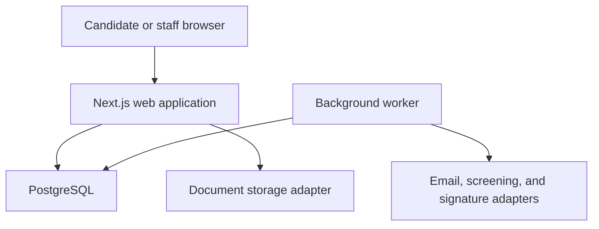
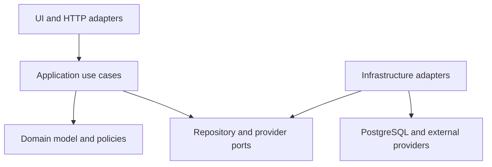
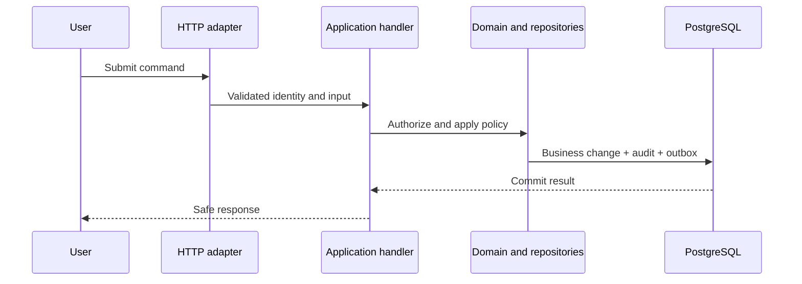
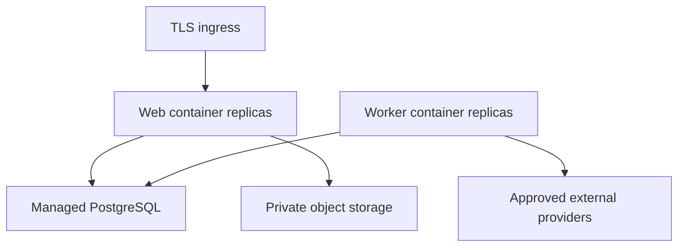

# Release 1 Technical Architecture

## 1. Purpose

This document defines the technical architecture for Release 1 of the PSA Workforce Hiring System. It translates the approved product workflow, permissions, and conceptual data model into implementation boundaries that Claude, Antigravity, and human developers must follow.

Release 1 begins with candidate intake and ends at **Ready for Assignment**. It does not implement client assignment, scheduling, EVV, timesheets, payroll, billing, or leave.

This is an engineering design, not a legal or regulatory determination. Business and compliance rules must remain traceable to approved requirements and must not be invented in code.

## 2. Architecture Decision

Build a **modular monolith** in one TypeScript repository.

- One Next.js web application serves staff and candidate experiences.
- One PostgreSQL database stores transactional data, audit history, and the job queue.
- One separate Node.js worker process handles asynchronous work.
- Business modules have explicit boundaries inside the codebase.
- External services are accessed only through provider interfaces.
- The application runs locally before any cloud platform is selected.



### Why this architecture

The workflow is broad but belongs to one closely related business domain. A modular monolith gives the team:

- One language and deployment model.
- Transactional enforcement of workflow, audit, and outbox changes.
- Fast local development.
- Fewer operational dependencies.
- Clear seams for extracting a service later only if scale or organizational ownership proves that it is needed.

### Explicitly rejected for Release 1

| Alternative | Decision | Reason |
|---|---|---|
| Microservices | Reject | Adds distributed transactions, deployment overhead, and failure modes before there is a proven need. |
| Separate React SPA and API repository | Reject | Duplicates types, build pipelines, and authentication integration for no Release 1 benefit. |
| NoSQL as the primary database | Reject | Workflow constraints, audit relationships, and compliance evidence fit a relational model. |
| Redis-based queue | Defer | PostgreSQL-backed jobs are sufficient initially and avoid another local and production dependency. |
| Direct vendor SDK calls from business modules | Reject | Would couple core workflow rules to replaceable providers. |

## 3. Selected Technology Stack

| Concern | Selection | Rule |
|---|---|---|
| Runtime | Supported Node.js LTS | Pin the chosen version in the repository and CI. |
| Package manager | `pnpm` | Commit `pnpm-lock.yaml`; CI uses frozen lockfile installs. |
| Language | TypeScript, strict mode | No untyped business data; avoid `any`. |
| Web framework | Next.js App Router with React | Server-render by default; use client components only where interaction requires them. |
| Styling/components | Tailwind CSS and shadcn/ui | Components must meet WCAG 2.2 AA expectations. |
| Forms | React Hook Form and Zod | The server must repeat validation; browser validation is not authoritative. |
| Database | PostgreSQL | Use UTC timestamps, foreign keys, checks, unique constraints, and transactions. |
| ORM/migrations | Drizzle ORM and `drizzle-kit` | Commit reviewed SQL migrations. Never use schema push against shared environments. |
| Authentication | Better Auth with Drizzle adapter | Authentication establishes identity; application code owns authorization. |
| Background jobs | `pg-boss` | Run in a separate worker process using the same PostgreSQL instance. |
| Local email | SMTP adapter with Mailpit | No real email is sent from the default local environment. |
| Unit/integration tests | Vitest | Domain tests are fast; repository tests use real PostgreSQL. |
| Component tests | React Testing Library | Test behavior and accessible interactions. |
| End-to-end tests | Playwright | Cover candidate and staff journeys, authorization, and readiness gates. |
| Structured logging | Pino-compatible logger | Redact sensitive fields before serialization. |

Package versions must be selected from current stable releases when implementation begins, pinned by the lockfile, and upgraded deliberately. Do not add experimental packages without an Architecture Decision Record (ADR).

## 4. Runtime Components

### 4.1 Web application

The web process is responsible for:

- Rendering the candidate and staff portals.
- Authenticating sessions.
- Validating commands at trust boundaries.
- Enforcing authorization and record scope.
- Executing synchronous application use cases.
- Serving authorized document upload and download flows.
- Writing audit and outbox records in the same transaction as business changes.

The browser must never connect directly to PostgreSQL, object storage, screening vendors, or the job queue.

### 4.2 Background worker

The worker is a separate process built from the same repository. It handles:

- Transactional outbox dispatch.
- Email notifications and reminders.
- Screening-provider order submission and status polling when required.
- E-signature-provider synchronization.
- Document malware-scan orchestration.
- Expiration and overdue requirement calculations.
- Safe retry of transient provider failures.

Jobs must be idempotent. Every externally visible operation uses an idempotency key and records provider attempt history. A failed job must not silently change a business decision.

### 4.3 PostgreSQL

PostgreSQL is the system of record for:

- Hiring workflow data.
- Role and scoped permission assignments.
- Requirement and decision history.
- Append-only audit events.
- Transactional outbox messages.
- Background job state.

Large document binaries do not belong in PostgreSQL. Store only document metadata, integrity hashes, versions, access classification, and storage keys.

### 4.4 Document storage

Use a `DocumentStorage` port with two implementations:

- `LocalDocumentStorage` for development, writing outside any public web directory.
- `ObjectDocumentStorage` for a future S3-compatible production service.

All downloads pass through an authorization check. Production downloads use short-lived signed access or streamed responses. Storage keys and provider URLs are never treated as authorization.

### 4.5 External providers

Every integration has an application-owned interface and a deterministic fake implementation for development and tests.

| Port | Local/test adapter | Future production adapter |
|---|---|---|
| `EmailProvider` | SMTP to Mailpit | Approved transactional email provider |
| `ScreeningProvider` | Scenario-based fake | Approved background/drug screening vendor |
| `SignatureProvider` | Local test signer | Approved e-signature vendor |
| `DocumentStorage` | Private local directory | S3-compatible object storage |
| `MalwareScanner` | Explicit test result adapter | Approved scanning service |
| `EncryptionProvider` | Local development key | Managed key service/envelope encryption |

Fake adapters must be visually and operationally marked as non-production. Production startup must fail if a fake screening, signature, malware, or encryption adapter is configured.

## 5. Application Layers

Each business module follows the same dependency direction.



### 5.1 Domain layer

Contains:

- Aggregates and value objects.
- Workflow transition rules.
- Classification and readiness policies.
- Requirement evaluation.
- Domain errors and domain events.

It must not import Next.js, React, Drizzle, Better Auth, HTTP types, or vendor SDKs.

### 5.2 Application layer

Contains:

- Commands and queries.
- Use-case handlers.
- Authorization policy calls.
- Transaction boundaries.
- Repository and provider interfaces.
- Audit and outbox coordination.

Application handlers return defined result types. They do not return raw ORM rows or vendor responses.

### 5.3 Infrastructure layer

Contains:

- Drizzle repositories.
- Authentication/session adapter.
- Storage, email, screening, signature, and encryption adapters.
- Job definitions and provider webhooks.
- Logging and telemetry configuration.

### 5.4 UI and delivery layer

Contains:

- Next.js routes and layouts.
- Server and client components.
- Route handlers.
- Form schemas and presentation models.
- Accessible error, loading, empty, and confirmation states.

The UI may request a use case; it may not implement workflow rules or query business tables directly.

## 6. Business Module Boundaries

Release 1 modules are:

| Module | Owns |
|---|---|
| `identity-access` | Accounts, sessions, roles, permission assignments, scope evaluation |
| `organization` | Organization, branch, team, position configuration |
| `candidates` | Person profile, candidate contact details, candidacy identity |
| `applications` | Application versions, answers, submission |
| `recruiting` | Prescreen, interview, selection decisions, communications |
| `classification` | W-2 default, 1099 review request, evidence, approval decision |
| `offers` | Offer/agreement templates, generated offers, acceptance and decline |
| `requirements` | Definitions, applicability, instances, evidence, waivers and expiration |
| `screening` | Background, registry, drug-screen cases, results, adjudication workflow |
| `documents` | Metadata, versions, storage access, signatures, acknowledgments |
| `onboarding` | W-2 and 1099 onboarding checklists and tax/payment records |
| `training` | Courses, assignments, completion, expiration |
| `competency` | Task catalog, evaluations, attempts, restrictions |
| `readiness` | Gate calculation, final compliance review, holds, readiness record |
| `work-items` | Staff tasks, queues, reminders, escalations |
| `notifications` | Templates, deliveries, preferences, retry state |
| `audit` | Append-only audit events and authorized audit queries |
| `admin` | Approved configuration and reference-data management |

### Boundary rules

- A module owns its tables and repository interfaces.
- Other modules use its public application API, not its repository or tables.
- Cross-module reads use a defined query service or purpose-built read model.
- Cross-module changes are coordinated by an application use case and one database transaction when synchronous.
- Asynchronous reactions use committed outbox events.
- Circular module dependencies are prohibited.
- Shared code is limited to genuine technical primitives, not a dumping ground for business logic.

## 7. Command and Query Flow

Every compliance-significant mutation follows this sequence:



The handler must:

1. Authenticate the session.
2. Parse and validate untrusted input.
3. Load the user’s current roles and scopes.
4. Authorize the action and sensitive fields requested.
5. Load the aggregate with its current version.
6. Apply domain transition and readiness rules.
7. Persist the business change, audit event, and outbox event atomically.
8. Return a presentation-safe response.

Commands include an expected record version for optimistic concurrency. Duplicate requests carry an idempotency key where retries are likely.

### HTTP choices

- Use Next.js Route Handlers for JSON endpoints, provider webhooks, uploads, downloads, and compliance-significant commands.
- Server Components may invoke read-only application query services.
- If Server Actions are used for simple forms, they remain thin adapters and call the same application handlers.
- Never place authorization exclusively in middleware, page visibility, or client code.
- Do not expose generic CRUD endpoints for workflow aggregates.

## 8. Authentication and Authorization

### Authentication

- Candidate self-registration uses verified email ownership before sensitive actions.
- Staff accounts are invitation-only.
- Privileged staff must use multifactor authentication before production access.
- High-risk operations may require recent authentication.
- Sessions use secure, HTTP-only, same-site cookies and server-side revocation support.
- Account recovery must not expose whether unrelated candidate records exist.

### Authorization

Better Auth establishes the account and session. The application authorization service evaluates:

- Permission.
- Role assignment validity.
- Organization, branch, team, assigned-record, or audit scope.
- Record relationship for candidate self-service.
- Field sensitivity.
- Separation-of-duties restrictions.
- Required step-up authentication.

Role changes must take effect without waiting for a new login. High-risk decisions record the acting user, effective role/scope, reason, timestamp, and correlation ID.

## 9. Data and Transaction Design

### Migrations

- Drizzle schema definitions live in source control.
- Generated SQL migrations are reviewed and committed.
- CI applies migrations to a clean PostgreSQL database.
- Staging applies the exact migration set before production.
- Destructive or long-running migrations require a written rollout and rollback plan.
- `drizzle-kit push` is permitted only for a disposable developer database.

### Transactions

The following must occur in one transaction:

- State transition and transition history.
- Approval decision and requirement status update.
- Business mutation and append-only audit record.
- Business mutation and transactional outbox record.
- Final review approval and readiness record creation.

### Readiness calculation

`Ready for Assignment` is never a freely editable boolean.

1. The readiness service loads all currently applicable requirement definitions.
2. It evaluates classification, documents, screening, TB, training, competency, holds, and review prerequisites.
3. It returns structured satisfied, unmet, expired, blocked, and not-applicable items.
4. A designated reviewer performs final approval.
5. The approval transaction stores the evaluated requirement snapshot and creates the readiness record.

Any later expiry or disqualifying event creates a hold or readiness-status change through an explicit command and audit event.

### Audit model

Audit events are append-only and include:

- Actor and effective role/scope.
- Action and resource identifiers.
- Timestamp, correlation ID, and request source.
- Approved reason code and safe change summary.
- Before/after values only when allowed by data classification.

Do not duplicate SSNs, document contents, medical details, full screening reports, secrets, or authentication values into audit payloads.

## 10. Security and Privacy Baseline

The detailed security design will be defined in `docs/SECURITY_AND_PRIVACY.md`. The architecture must already support these controls:

- TLS in every nonlocal environment.
- Encryption at rest and field-level encryption for designated restricted values.
- Secrets from environment-specific secret storage, never source control.
- Origin/CSRF protection for state-changing browser requests.
- Content Security Policy and secure response headers.
- Rate limiting for login, recovery, invitation, upload, and public form endpoints.
- File type, size, signature, and malware checks before a document becomes available.
- Private document storage and authorization on every access.
- Log redaction at the logger boundary.
- Separate access rules for identity, financial, screening, medical, and general personnel data.
- Export authorization, purpose capture, audit, and bounded export size.
- Retention by record category, with legal-hold support; no universal delete rule.
- Synthetic data only in local development, tests, demos, and AI prompts.

Candidate-facing responses must not reveal internal adjudication notes, restricted screening details, or other candidates’ existence.

## 11. Background Jobs and Integration Reliability

Use the transactional outbox pattern:

1. A use case writes its business change and an outbox record in one transaction.
2. The worker claims the outbox record.
3. It invokes the provider using an idempotency key.
4. It stores a sanitized attempt result.
5. It marks the outbox item complete or schedules a bounded retry.

Use exponential backoff with jitter for transient failures. Permanent failures move to a review queue and generate an internal work item. Never retry a business denial or an ambiguous high-risk decision automatically.

Provider webhooks must:

- Verify signature and timestamp.
- Store a deduplication identifier.
- Reject replays outside the allowed window.
- Persist only the minimum safe payload.
- Convert provider states into internal states through an explicit mapper.
- Never mark a candidate cleared solely because an unknown provider value was received.

## 12. Repository Layout

```text
/
├── CLAUDE.md
├── AGENTS.md
├── docs/
│   ├── PRODUCT_REQUIREMENTS.md
│   ├── HIRING_WORKFLOW.md
│   ├── ROLE_PERMISSION_MATRIX.md
│   ├── DATA_MODEL.md
│   ├── ARCHITECTURE.md
│   └── adr/
├── src/
│   ├── app/
│   │   ├── (public)/
│   │   ├── (candidate)/
│   │   ├── (staff)/
│   │   └── api/
│   ├── modules/
│   │   └── <module>/
│   │       ├── domain/
│   │       ├── application/
│   │       ├── infrastructure/
│   │       ├── ui/
│   │       └── index.ts
│   ├── shared/
│   │   ├── auth/
│   │   ├── database/
│   │   ├── errors/
│   │   ├── logging/
│   │   └── validation/
│   └── worker/
├── drizzle/
├── tests/
│   ├── integration/
│   ├── e2e/
│   └── fixtures/
├── docker-compose.yml
├── package.json
└── pnpm-lock.yaml
```

Tests closely tied to a domain class or component may be colocated. Cross-module integration and end-to-end tests live under `tests/`.

### Import rules

- `domain` imports only domain code and safe shared primitives.
- `application` may import its domain and port definitions.
- `infrastructure` implements ports and may import framework or vendor code.
- `ui` imports the module’s public application surface, never infrastructure repositories.
- One module imports another only through the other module’s `index.ts` public API.
- Enforce these rules with ESLint boundaries or an equivalent dependency test.

## 13. Local Development Environment

The default local setup is:

- Next.js app on the developer host for fast refresh.
- Worker on the developer host.
- PostgreSQL in Docker Compose.
- Mailpit in Docker Compose.
- Private local document directory using synthetic files.
- Deterministic fake screening and signing adapters.

Expected scripts:

| Command | Purpose |
|---|---|
| `pnpm infra:up` | Start PostgreSQL and Mailpit |
| `pnpm db:migrate` | Apply committed migrations |
| `pnpm db:seed` | Load synthetic development reference data |
| `pnpm dev` | Run the web application |
| `pnpm worker:dev` | Run the background worker |
| `pnpm lint` | Run static lint checks |
| `pnpm typecheck` | Run strict TypeScript validation |
| `pnpm test` | Run unit and component tests |
| `pnpm test:integration` | Test repositories/use cases against PostgreSQL |
| `pnpm test:e2e` | Run Playwright journeys |
| `pnpm build` | Produce the production build |

Configuration is read from environment variables and validated with Zod at startup. Provide a `.env.example` containing names and safe placeholder values only. Never commit `.env` files or secrets.

## 14. Environment and Deployment Shape

Required environments are local, test/CI, staging, and production. Future cloud deployment remains provider-neutral:



Production expectations:

- Web and worker are independently scalable containers built from the same commit.
- PostgreSQL uses managed backups, point-in-time recovery, encrypted connections, and restricted network access.
- Object storage is private, encrypted, versioned where required, and lifecycle-managed by retention class.
- Deployment runs migrations as a controlled release step, not independently from every app replica.
- Health checks distinguish process health from dependency readiness.
- Staging uses sandbox providers and synthetic data; it must never silently target production vendors.

No cloud vendor should be selected until operational, security, budget, and data-location requirements are approved.

## 15. Observability

Every request and job carries a correlation ID. Structured logs include safe operational context such as module, action, result code, duration, and internal record reference.

Never log:

- Passwords, tokens, session cookies, or multifactor secrets.
- SSNs, banking values, identity-document numbers, or document contents.
- Full candidate form submissions.
- Medical, drug-screen, or background-report details.
- Raw provider payloads.

Track metrics for request errors, authorization denials, job failures, provider latency, queue age, overdue requirements, and readiness-gate failures by non-sensitive reason code. Add tracing through an OpenTelemetry-compatible boundary when deployment needs it; business code must not depend on a telemetry vendor.

Security-relevant alerts include repeated login failure, privilege changes, high-volume document access, export activity, webhook verification failure, audit-write failure, and sustained job backlog.

## 16. Testing Architecture

| Level | Focus | Required examples |
|---|---|---|
| Unit | Pure domain policy | State transitions, requirement applicability, W-2/1099 branching, readiness calculation |
| Application | Use-case orchestration | Authorization, transaction behavior, idempotency, audit and outbox creation |
| Integration | Real PostgreSQL and adapters | Constraints, migrations, repository mappings, concurrent updates, job claiming |
| Component | Accessible UI behavior | Validation, keyboard interaction, error and empty states, sensitive-field masking |
| End to end | Complete user journeys | Candidate application, staff review, offer, screening exceptions, training, final readiness |
| Security | Abuse and leakage resistance | Cross-record access, privilege escalation, upload abuse, export control, log redaction |

Ready for Assignment requires a dedicated test matrix proving that every applicable gate blocks approval when missing, failed, expired, disputed, or unauthorized. Tests must also prove that an approved 1099 path does not receive W-2-only requirements and that an unapproved 1099 request cannot proceed.

Use generated synthetic people and provider responses. Never copy production records into a test environment.

## 17. Architecture Decision Records

Create a short ADR under `docs/adr/` when a decision changes or meaningfully extends:

- Application topology or module boundaries.
- Authentication or authorization model.
- Database or migration strategy.
- Storage, encryption, or sensitive-data handling.
- Background processing.
- External provider selection.
- Deployment platform.
- A dependency that becomes foundational across modules.

An ADR contains context, decision, consequences, alternatives, status, date, and approvers. Code must not quietly override this architecture.

## 18. Recommended Build Sequence

Implement vertical slices in this order:

1. Repository foundation, local infrastructure, configuration validation, logging, and CI checks.
2. Authentication, staff invitation, candidate registration, roles, scopes, and audit foundation.
3. Candidate profile, candidacy, application draft, and submission.
4. Staff work queue, prescreen, interview, and selection decision.
5. Classification review and conditional offer/agreement.
6. Requirement engine, documents, signatures, and onboarding.
7. Screening cases, exceptions, adjudication, and disputes.
8. Training, competency, expiration, and restrictions.
9. Final compliance review, readiness gate, holds, notifications, and reports.
10. Security hardening, accessibility verification, migration rehearsal, and Release 1 acceptance tests.

Each slice includes authorization, audit, tests, error states, and documentation. Do not build all database tables first and postpone working behavior.

## 19. Release 1 Architecture Acceptance Criteria

The architecture is correctly implemented when:

- A developer can start the complete local dependency set with documented commands.
- Candidate and staff portals use the same TypeScript application while enforcing separate access boundaries.
- Business workflow rules execute server-side and cannot be bypassed by editing browser requests.
- Module boundary checks pass in CI.
- Every compliance-significant mutation creates its required audit record atomically.
- Provider calls are asynchronous, idempotent, retryable, and replaceable through ports.
- Restricted documents are private and every access is authorized and audited.
- Database migrations reproduce the schema from an empty database.
- The full W-2 and approved-1099 happy paths pass end-to-end tests.
- Negative tests prove classification, screening, training, competency, separation-of-duty, and readiness gates.
- Production cannot start with development-only provider adapters.
- Logs and test artifacts contain no restricted personal data.

## 20. Next Design Document

The next artifact is `docs/UI_FLOW.md`. It will map candidate and staff journeys into routes, screens, page states, actions, and navigation while preserving the module, authorization, and workflow boundaries defined here.
