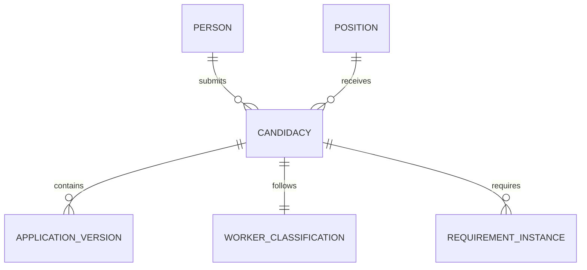
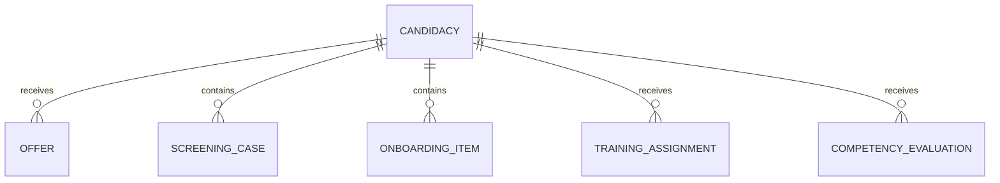
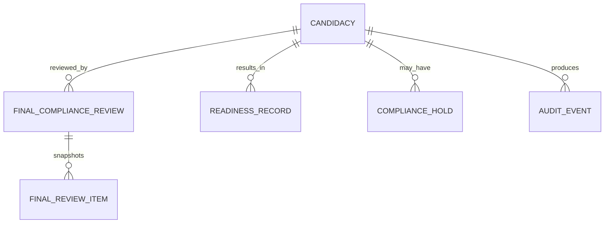

# Conceptual Data Model

## 1. Purpose

This document defines the conceptual relational data model for Release 1 of the PSA Workforce Hiring System. It is designed for PostgreSQL and a single TypeScript application, but it does not select a specific ORM.

The model supports:

- Reusable person identity with multiple candidacies over time.
- Separate W-2 and approved 1099 paths.
- Controlled workflow state transitions.
- Versioned forms, templates, requirements, evidence, and decisions.
- Restricted identity, financial, screening, and medical information.
- Task-level training and competency.
- Calculated and human-approved readiness.
- Role, scope, and field-level authorization.
- Append-only audit events and reliable external-provider work.

## 2. Modeling Conventions

### 2.1 Identifiers

- Use application-generated UUID or ULID primary keys.
- Do not expose sequential database identifiers in public URLs.
- Use separate short human-readable reference numbers where staff need them.
- External-provider identifiers are attributes, never primary keys.

### 2.2 Timestamps

Use timezone-aware UTC timestamps.

Common fields:

- `created_at`
- `created_by_user_id`
- `updated_at`
- `updated_by_user_id`
- `effective_from`
- `effective_to`
- `version`

Use business-effective dates separately from record-creation timestamps.

### 2.3 Optimistic Concurrency

Mutable aggregate roots contain an integer `version` that increments with every accepted command. Commands include the expected version and fail when stale.

### 2.4 Historical Integrity

- Do not overwrite signed, approved, adjudicated, or published records.
- Corrections create a new version, amendment, or superseding record.
- Use `supersedes_id` and `superseded_at` where a chronological chain is needed.
- Avoid hard deletion for business and compliance records.

### 2.5 Enumerations

Stable technical states may use database enums or checked text values. Configurable business categories must use reference tables rather than code enums.

### 2.6 Flexible Data

JSON may be used for:

- Versioned dynamic application answers.
- Provider payload references after sensitive-field filtering.
- Rule configuration.
- Immutable event metadata.

JSON must not replace core relational constraints, authorization fields, searchable statuses, or explicit foreign keys.

## 3. High-Level Relationships

## 4. Identity and Authentication Domain

### 4.1 `user_account`

Represents an authenticated account.

Key fields:

- `id`
- `email_normalized`
- `email_display`
- `account_type`: `CANDIDATE`, `STAFF`, `SERVICE`
- `status`: `INVITED`, `ACTIVE`, `LOCKED`, `DISABLED`, `CLOSED`
- `email_verified_at`
- `last_authenticated_at`
- `disabled_at`
- `disabled_reason_code`
- `auth_provider_subject`
- `version`
- Common timestamps

Constraints:

- Unique normalized email among applicable active accounts, subject to the selected identity-provider design.
- Service accounts may not be used for interactive login.
- Password hashes and multifactor secrets should remain in the selected identity system rather than business tables when possible.

Classification: Restricted Identity and Security.

### 4.2 `staff_profile`

Represents internal staff information linked to a user account.

Key fields:

- `id`
- `user_account_id`
- `employee_reference`
- `display_name`
- `job_title`
- `branch_id`
- `team_id`
- `status`
- `manager_staff_profile_id`
- Common timestamps

### 4.3 `role`

Key fields:

- `id`
- `code`
- `name`
- `description`
- `is_system_role`
- `status`

Initial role codes:

- `CANDIDATE`
- `RECRUITER`
- `HR_SPECIALIST`
- `CLASSIFICATION_REVIEWER`
- `COMPLIANCE_REVIEWER`
- `TRAINER_EVALUATOR`
- `PSA_MANAGER`
- `SYSTEM_ADMINISTRATOR`
- `AUDITOR_READ_ONLY`

### 4.4 `permission`

Key fields:

- `id`
- `code`
- `resource`
- `action`
- `sensitivity_level`
- `description`

### 4.5 `role_permission`

Join table:

- `role_id`
- `permission_id`
- `conditions_json`

### 4.6 `user_role_assignment`

Key fields:

- `id`
- `user_account_id`
- `role_id`
- `scope_type`: `ASSIGNED_RECORDS`, `TEAM`, `BRANCH`, `ORGANIZATION`, `AUDIT_ASSIGNMENT`
- `scope_reference_id`
- `effective_from`
- `effective_to`
- `approved_by_user_id`
- `reason`
- `revoked_at`

Constraints:

- Active privileged assignments require an approver.
- A role removal must take effect without requiring a new login.

### 4.7 `audit_assignment`

Limits an auditor to an approved audit scope.

Key fields:

- `id`
- `auditor_user_id`
- `purpose`
- `scope_definition_json`
- `starts_at`
- `ends_at`
- `approved_by_user_id`
- `status`

## 5. Organization and Position Domain

### 5.1 `organization`

Release 1 may use a single organization row but retains an explicit entity for future separation.

Key fields:

- `id`
- `legal_name`
- `display_name`
- `timezone`
- `status`

### 5.2 `branch`

Key fields:

- `id`
- `organization_id`
- `code`
- `name`
- `timezone`
- `status`

### 5.3 `team`

Key fields:

- `id`
- `branch_id`
- `code`
- `name`
- `status`

### 5.4 `position`

Represents a role being filled.

Key fields:

- `id`
- `organization_id`
- `position_code`
- `title`
- `description_version_id`
- `worker_paths_allowed`: W-2, approved 1099, or both
- `employment_type_options`
- `default_requirement_matrix_version_id`
- `default_training_matrix_version_id`
- `default_competency_profile_version_id`
- `status`
- Common timestamps

### 5.5 `job_description_version`

Key fields:

- `id`
- `position_id`
- `version_number`
- `content`
- `published_at`
- `published_by_user_id`
- `effective_from`
- `effective_to`
- `status`

## 6. Person and Candidacy Domain

### 6.1 `person`

Canonical identity independent of a particular application.

Key fields:

- `id`
- `public_reference`
- `legal_first_name`
- `legal_middle_name`
- `legal_last_name`
- `preferred_name`
- `email_normalized`
- `phone_normalized`
- `date_of_birth_encrypted`
- `address_id`
- `candidate_user_account_id`
- `status`
- `possible_duplicate_flag`
- Common timestamps

Notes:

- Do not store Social Security number in this general table.
- Search views should use minimal normalized fields and masked results.
- Candidate account and person remain separate because a person may exist before account activation.

Classification: Confidential Personnel, with selected restricted fields.

### 6.2 `address`

Key fields:

- `id`
- Encrypted or protected address fields
- `address_type`
- `valid_from`
- `valid_to`

### 6.3 `person_sensitive_identity`

Stores highly restricted identity values separately.

Key fields:

- `person_id`
- `tax_identifier_ciphertext`
- `tax_identifier_last_four`
- `encryption_key_version`
- `updated_at`
- `updated_by_user_id`

Access must be rare, recently authenticated, and audited.

### 6.4 `candidacy`

Aggregate root for one person's application to one position.

Key fields:

- `id`
- `candidate_reference`
- `person_id`
- `position_id`
- `branch_id`
- `source_code`
- `current_stage`
- `candidate_visible_status_code`
- `owner_user_id`
- `proposed_worker_path`: `W2`, `CONTRACTOR`, `UNDECIDED`
- `current_classification_id`
- `started_at`
- `submitted_at`
- `closed_at`
- `closure_reason_code`
- `status`: `ACTIVE`, `ON_HOLD`, `TERMINAL`, `ARCHIVED`
- `version`
- Common timestamps

Constraints:

- Controlled fields change only through domain commands.
- A person may have multiple candidacies.
- Only one candidacy may be marked current for the same person and position when configured.

### 6.5 `candidacy_stage_history`

Append-only transition record.

Key fields:

- `id`
- `candidacy_id`
- `from_stage`
- `to_stage`
- `command_code`
- `actor_user_id`
- `reason_code`
- `internal_comment`
- `candidate_message_template_version_id`
- `occurred_at`
- `correlation_id`

### 6.6 `duplicate_candidate_match`

Key fields:

- `id`
- `person_id_a`
- `person_id_b`
- `match_signals_json`
- `score`
- `status`: `PENDING`, `CONFIRMED_DUPLICATE`, `NOT_DUPLICATE`, `MERGED`
- `reviewed_by_user_id`
- `reviewed_at`
- `merge_record_id`

### 6.7 `person_merge_record`

Records an authorized merge without erasing provenance.

Key fields:

- `id`
- `surviving_person_id`
- `merged_person_id`
- `field_resolution_json`
- `approved_by_user_id`
- `executed_by_user_id`
- `occurred_at`

## 7. Application and Interview Domain

### 7.1 `application_template`

Key fields:

- `id`
- `code`
- `name`
- `status`

### 7.2 `application_template_version`

Key fields:

- `id`
- `application_template_id`
- `version_number`
- `schema_json`
- `validation_rules_json`
- `published_at`
- `published_by_user_id`
- `effective_from`
- `effective_to`

### 7.3 `application_version`

Key fields:

- `id`
- `candidacy_id`
- `template_version_id`
- `version_number`
- `status`: `DRAFT`, `SUBMITTED`, `RETURNED`, `SUPERSEDED`
- `answers_json`
- `completion_percent`
- `candidate_certified_at`
- `submitted_at`
- `returned_at`
- `return_reason_code`
- `return_instructions`
- `supersedes_id`
- Common timestamps

Rules:

- Submitted versions are immutable.
- Returned correction starts a new draft linked to the submitted version.
- Sensitive answers should be stored in protected columns or separate records rather than plain JSON.

### 7.4 `prescreen_review`

Key fields:

- `id`
- `candidacy_id`
- `application_version_id`
- `checklist_version_id`
- `reviewer_user_id`
- `outcome`
- `responses_json`
- `internal_notes`
- `completed_at`
- `version`

### 7.5 `interview`

Key fields:

- `id`
- `candidacy_id`
- `interview_type_code`
- `status`
- `scheduled_start_at`
- `scheduled_end_at`
- `timezone`
- `location_or_meeting_reference`
- `candidate_visible_instructions`
- `cancellation_reason_code`
- Common timestamps

### 7.6 `interview_participant`

- `interview_id`
- `user_account_id`
- `participant_role`
- `attendance_status`

### 7.7 `scorecard_template_version`

Key fields:

- `id`
- `code`
- `version_number`
- `schema_json`
- `published_at`
- `effective_from`
- `effective_to`

### 7.8 `interview_scorecard`

Key fields:

- `id`
- `interview_id`
- `template_version_id`
- `interviewer_user_id`
- `responses_json`
- `total_score`
- `recommendation_code`
- `internal_notes`
- `submitted_at`
- `version`

One interviewer has at most one current submitted scorecard per interview and template version.

### 7.9 `selection_decision`

Key fields:

- `id`
- `candidacy_id`
- `decision`: `SELECTED`, `NOT_SELECTED`, `ADDITIONAL_INTERVIEW`, `ON_HOLD`
- `reason_code`
- `internal_rationale`
- `candidate_message_template_version_id`
- `decided_by_user_id`
- `decided_at`
- `supersedes_id`

## 8. Worker Classification Domain

### 8.1 `worker_classification_review`

Key fields:

- `id`
- `candidacy_id`
- `proposed_path`: `W2`, `CONTRACTOR`
- `status`
- `questionnaire_version_id`
- `responses_json`
- `proposed_by_user_id`
- `proposed_at`
- `assigned_reviewer_user_id`
- `decision`: `W2_APPROVED`, `CONTRACTOR_APPROVED`, `CONTRACTOR_REJECTED`, `MORE_INFORMATION_REQUIRED`
- `restricted_rationale`
- `decided_by_user_id`
- `decided_at`
- `supersedes_id`
- `version`

Constraints:

- Proposer and final reviewer cannot be the same user when separation is required.
- A contractor agreement requires a current `CONTRACTOR_APPROVED` decision.
- One review is current; prior reviews remain immutable.

### 8.2 `classification_evidence`

Links supporting evidence without storing it in the review row.

- `classification_review_id`
- `document_id`
- `evidence_type_code`
- `added_by_user_id`
- `added_at`

## 9. Offer and Agreement Domain

### 9.1 `document_template`

Used for offers, agreements, forms, acknowledgments, and notices.

Key fields:

- `id`
- `code`
- `document_type`
- `name`
- `status`

### 9.2 `document_template_version`

Key fields:

- `id`
- `document_template_id`
- `version_number`
- `content_source`
- `variable_schema_json`
- `published_at`
- `published_by_user_id`
- `effective_from`
- `effective_to`

### 9.3 `offer`

Aggregate root.

Key fields:

- `id`
- `candidacy_id`
- `offer_type`: `W2_CONDITIONAL_OFFER`, `CONTRACTOR_AGREEMENT`
- `status`
- `current_offer_version_id`
- `version`
- Common timestamps

### 9.4 `offer_version`

Key fields:

- `id`
- `offer_id`
- `version_number`
- `template_version_id`
- `classification_review_id`
- `position_id`
- `compensation_terms_json`
- `work_terms_json`
- `generated_document_id`
- `status`
- `approved_by_user_id`
- `approved_at`
- `issued_at`
- `expires_at`
- `withdrawn_at`
- `supersedes_id`

Rules:

- Issued versions are immutable.
- Only the latest eligible issued version may be accepted.
- Contractor versions must link to an approved classification review.

### 9.5 `signature_record`

Key fields:

- `id`
- `document_version_id`
- `signer_person_id`
- `signer_user_account_id`
- `signature_type`
- `provider_reference`
- `signed_at`
- `evidence_hash`
- `ip_address_protected`
- `user_agent_protected`
- `status`

## 10. Configurable Requirements Domain

### 10.1 `requirement_definition`

Defines a reusable requirement category.

Examples:

- Criminal record check.
- Nurse aide/home health aide abuse registry.
- Caregiver misconduct registry.
- Drug screen.
- TB risk assessment.
- W-4.
- I-9.
- Confidentiality acknowledgment.
- Abuse-reporting training.
- Task competency.

Key fields:

- `id`
- `code`
- `name`
- `domain`: `SCREENING`, `ONBOARDING`, `TRAINING`, `COMPETENCY`, `OTHER`
- `data_classification`
- `is_waivable`
- `supports_expiration`
- `status`

### 10.2 `requirement_matrix`

Key fields:

- `id`
- `code`
- `name`
- `status`

### 10.3 `requirement_matrix_version`

Key fields:

- `id`
- `requirement_matrix_id`
- `version_number`
- `effective_from`
- `effective_to`
- `published_by_user_id`
- `published_at`
- `status`

### 10.4 `requirement_rule`

Key fields:

- `id`
- `matrix_version_id`
- `requirement_definition_id`
- `applies_when_json`
- `required`
- `due_offset_days`
- `validity_period_days`
- `blocking_stage`
- `waiver_permission_code`
- `display_order`

Conditions may include position, W-2/1099 path, requested capability, and future branch or jurisdiction. Rules must use a validated condition format, not executable user-entered code.

### 10.5 `requirement_set`

Snapshot generated for a candidacy.

Key fields:

- `id`
- `candidacy_id`
- `matrix_version_id`
- `classification_review_id`
- `position_id`
- `generated_at`
- `generated_by_user_id`
- `supersedes_id`
- `status`

### 10.6 `requirement_instance`

Represents one applicable requirement.

Key fields:

- `id`
- `requirement_set_id`
- `requirement_definition_id`
- `domain_record_type`
- `domain_record_id`
- `status`
- `required`
- `due_at`
- `satisfied_at`
- `expires_at`
- `blocking_stage`
- `waived_by_user_id`
- `waiver_reason`
- `superseded_at`
- `version`

Constraints:

- Waiver fields are permitted only when the definition and actor permission allow it.
- A current required instance must link to its domain evidence or explicitly show why no evidence exists.

## 11. Screening and Restricted Health Domain

Screening and medical tables should be separated logically and, where practical, by database schema or access boundary.

### 11.1 `screening_case`

Aggregate root for one screening requirement.

Key fields:

- `id`
- `candidacy_id`
- `requirement_instance_id`
- `screening_type_code`
- `status`
- `assigned_reviewer_user_id`
- `candidate_visible_status_code`
- `current_order_id`
- `current_result_id`
- `current_disposition_id`
- `version`
- Common timestamps

### 11.2 `screening_authorization`

Key fields:

- `id`
- `screening_case_id`
- `authorization_type`
- `template_version_id`
- `signed_document_version_id`
- `authorized_at`
- `expires_at`
- `status`

### 11.3 `screening_order`

Key fields:

- `id`
- `screening_case_id`
- `provider_code`
- `provider_reference`
- `idempotency_key`
- `ordered_by_user_id`
- `ordered_at`
- `status`
- `appointment_at`
- `canceled_at`
- `version`

Unique constraint on provider and idempotency key.

### 11.4 `screening_result`

Restricted record.

Key fields:

- `id`
- `screening_case_id`
- `screening_order_id`
- `result_version`
- `provider_status_code`
- `received_at`
- `effective_date`
- `expires_at`
- `restricted_summary_code`
- `raw_payload_storage_reference`
- `report_document_id`
- `content_hash`
- `supersedes_id`

Avoid copying full provider payloads into general application tables or logs.

### 11.5 `screening_disposition`

Key fields:

- `id`
- `screening_case_id`
- `screening_result_id`
- `decision`: `CLEARED`, `ADDITIONAL_INFORMATION`, `PRE_ADVERSE`, `FINAL_ADVERSE`, `RETEST`
- `restricted_reason_code`
- `restricted_rationale`
- `decided_by_user_id`
- `decided_at`
- `second_approver_user_id`
- `second_approved_at`
- `supersedes_id`

### 11.6 `adverse_action_case`

Key fields:

- `id`
- `screening_case_id`
- `status`
- `pre_adverse_notice_document_id`
- `pre_adverse_sent_at`
- `response_due_at`
- `candidate_response_received_at`
- `dispute_opened_at`
- `dispute_resolved_at`
- `final_decision`
- `final_notice_document_id`
- `final_notice_sent_at`
- `closed_at`
- `assigned_reviewer_user_id`
- `version`

### 11.7 `tb_clearance_record`

Restricted medical record separated from general screening fields.

Key fields:

- `id`
- `screening_case_id`
- `assessment_date`
- `assessment_provider_type`
- `risk_result_code`
- `follow_up_required`
- `follow_up_type_code`
- `follow_up_result_code`
- `medical_clearance_status`
- `cleared_at`
- `expires_at`
- `supporting_document_id`
- `reviewed_by_user_id`
- `reviewed_at`

Store only information necessary for the employment clearance workflow.

## 12. Document Domain

### 12.1 `document`

Logical document identity.

Key fields:

- `id`
- `owner_person_id`
- `document_category_code`
- `data_classification`
- `retention_class_code`
- `current_version_id`
- `status`
- Common timestamps

### 12.2 `document_version`

Key fields:

- `id`
- `document_id`
- `version_number`
- `storage_provider_code`
- `storage_object_key`
- `original_file_name_protected`
- `media_type`
- `size_bytes`
- `content_hash`
- `malware_scan_status`
- `uploaded_by_user_id`
- `uploaded_at`
- `finalized_at`
- `supersedes_id`
- `encryption_key_version`

Rules:

- Do not place storage URLs directly in business responses.
- Generate short-lived authorized access links.
- A clean malware-scan state is required before ordinary download or review.

### 12.3 `document_link`

Polymorphic linking table implemented with validated target types.

Key fields:

- `id`
- `document_id`
- `target_type`
- `target_id`
- `purpose_code`
- `created_at`

Alternatively, use explicit join tables where the ORM and schema design favor stronger foreign keys.

### 12.4 `document_access_event`

Append-only record for restricted document activity.

Key fields:

- `id`
- `document_id`
- `document_version_id`
- `actor_user_id`
- `action`: `VIEW`, `DOWNLOAD`, `PRINT`, `EXPORT`
- `purpose_code`
- `occurred_at`
- `request_id`
- `ip_address_protected`

## 13. Onboarding Domain

### 13.1 `onboarding_packet`

Key fields:

- `id`
- `candidacy_id`
- `requirement_set_id`
- `worker_path`
- `status`
- `assigned_at`
- `completed_at`
- `version`

### 13.2 `onboarding_item`

Key fields:

- `id`
- `onboarding_packet_id`
- `requirement_instance_id`
- `item_type_code`
- `status`
- `assigned_at`
- `due_at`
- `submitted_document_id`
- `submitted_at`
- `reviewed_by_user_id`
- `reviewed_at`
- `review_decision`
- `return_reason_code`
- `candidate_instructions`
- `approved_version_id`
- `version`

### 13.3 `payment_account`

Restricted financial data for the applicable worker path.

Key fields:

- `id`
- `person_id`
- `account_holder_name_protected`
- `bank_name_protected`
- `account_type`
- `routing_number_ciphertext`
- `account_number_ciphertext`
- `account_last_four`
- `verification_status`
- `effective_from`
- `effective_to`
- `encryption_key_version`

No ordinary list or search response may return full routing or account values.

## 14. Training Domain

### 14.1 `training_course`

Key fields:

- `id`
- `code`
- `name`
- `category_code`
- `status`

### 14.2 `training_course_version`

Key fields:

- `id`
- `training_course_id`
- `version_number`
- `content_reference`
- `duration_minutes`
- `assessment_required`
- `passing_score`
- `validity_period_days`
- `published_at`
- `effective_from`
- `effective_to`

### 14.3 `training_matrix_version`

Key fields:

- `id`
- `code`
- `version_number`
- `rules_json`
- `published_at`
- `effective_from`
- `effective_to`

### 14.4 `training_assignment`

Key fields:

- `id`
- `candidacy_id`
- `requirement_instance_id`
- `course_version_id`
- `status`
- `assigned_at`
- `due_at`
- `completed_at`
- `expires_at`
- `current_attempt_id`
- `version`

### 14.5 `training_attempt`

Key fields:

- `id`
- `training_assignment_id`
- `attempt_number`
- `started_at`
- `completed_at`
- `score`
- `result`
- `trainer_user_id`
- `certificate_document_id`
- `attestation_at`
- `supersedes_id`

Attempts are append only.

## 15. Competency and Capability Domain

### 15.1 `competency_task`

Key fields:

- `id`
- `code`
- `name`
- `category_code`
- `status`

### 15.2 `competency_task_version`

Key fields:

- `id`
- `competency_task_id`
- `version_number`
- `evaluation_method_json`
- `passing_criteria_json`
- `validity_period_days`
- `published_at`
- `effective_from`
- `effective_to`

### 15.3 `competency_profile_version`

Defines tasks expected for a position or capability profile.

Key fields:

- `id`
- `code`
- `version_number`
- `published_at`
- `effective_from`
- `effective_to`

### 15.4 `competency_profile_task`

- `competency_profile_version_id`
- `competency_task_version_id`
- `required`
- `conditions_json`
- `display_order`

### 15.5 `competency_evaluation`

Key fields:

- `id`
- `candidacy_id`
- `requirement_instance_id`
- `task_version_id`
- `evaluator_user_id`
- `evaluation_method_code`
- `scheduled_at`
- `evaluated_at`
- `result`
- `restriction_code`
- `restricted_notes`
- `employee_attested_at`
- `evaluator_signed_at`
- `expires_at`
- `supersedes_id`
- `status`
- `version`

### 15.6 `remediation_plan`

Key fields:

- `id`
- `competency_evaluation_id`
- `assigned_by_user_id`
- `instructions`
- `due_at`
- `status`
- `completed_at`
- `reevaluation_id`

### 15.7 `capability_profile`

Snapshot of tasks the worker is currently approved to perform.

Key fields:

- `id`
- `candidacy_id`
- `profile_version_id`
- `status`: `PROPOSED`, `APPROVED`, `RESTRICTED`, `SUPERSEDED`
- `effective_from`
- `effective_to`
- `approved_by_user_id`
- `approved_at`
- `supersedes_id`

### 15.8 `capability_profile_item`

- `capability_profile_id`
- `competency_task_version_id`
- `competency_evaluation_id`
- `approval_status`
- `restriction_code`
- `effective_from`
- `expires_at`

## 16. Final Review, Readiness, and Hold Domain

### 16.1 `final_compliance_review`

Aggregate root.

Key fields:

- `id`
- `candidacy_id`
- `status`
- `review_snapshot_version`
- `requirement_set_id`
- `classification_review_id`
- `capability_profile_id`
- `evidence_fingerprint`
- `started_by_user_id`
- `started_at`
- `primary_reviewer_user_id`
- `primary_decision`
- `primary_decided_at`
- `secondary_reviewer_user_id`
- `secondary_decision`
- `secondary_decided_at`
- `returned_at`
- `return_summary`
- `completed_at`
- `version`

### 16.2 `final_review_item`

Immutable snapshot row.

Key fields:

- `id`
- `final_compliance_review_id`
- `requirement_instance_id`
- `requirement_code`
- `result_status`
- `evidence_record_type`
- `evidence_record_id`
- `evidence_version`
- `expires_at`
- `blocking`
- `snapshot_at`

### 16.3 `readiness_evaluation`

Stores every automated evaluation result.

Key fields:

- `id`
- `candidacy_id`
- `trigger_event_code`
- `eligible`
- `blocking_requirements_json`
- `warnings_json`
- `requirement_matrix_version_id`
- `evidence_fingerprint`
- `evaluated_at`
- `evaluator_version`

### 16.4 `readiness_record`

Key fields:

- `id`
- `candidacy_id`
- `final_compliance_review_id`
- `readiness_evaluation_id`
- `status`: `ACTIVE`, `CLOSED`, `REVOKED`, `SUPERSEDED`
- `effective_from`
- `effective_to`
- `closed_reason_code`
- `approved_by_user_id`
- `second_approved_by_user_id`
- `capability_profile_id`
- `requirement_matrix_version_id`
- `evidence_fingerprint`
- `version`

Constraints:

- Partial unique index permits at most one active readiness record per candidacy.
- Approval requires a current eligible evaluation with the same evidence fingerprint.

### 16.5 `compliance_hold`

Key fields:

- `id`
- `candidacy_id`
- `hold_type_code`
- `blocking`
- `internal_reason`
- `candidate_message_template_version_id`
- `placed_by_user_id`
- `placed_at`
- `review_due_at`
- `resolved_by_user_id`
- `resolved_at`
- `resolution`
- `status`: `ACTIVE`, `RESOLVED`, `CANCELED`
- `version`

## 17. Work Queue and Responsibility Domain

### 17.1 `work_item`

Represents an actionable staff or candidate task.

Key fields:

- `id`
- `candidacy_id`
- `work_type_code`
- `target_record_type`
- `target_record_id`
- `assigned_user_id`
- `assigned_team_id`
- `candidate_action_required`
- `status`: `OPEN`, `IN_PROGRESS`, `BLOCKED`, `COMPLETED`, `CANCELED`
- `priority`
- `due_at`
- `completed_at`
- `completion_event_id`
- `version`

Rules:

- Completing the business action should complete its work item transactionally.
- A work item is not the source of truth for the underlying compliance result.

### 17.2 `timer_definition`

- `id`
- `code`
- `start_event_code`
- `duration_expression`
- `reminder_policy_json`
- `stop_event_codes_json`
- `status`
- `version`

### 17.3 `timer_instance`

- `id`
- `timer_definition_id`
- `candidacy_id`
- `target_record_type`
- `target_record_id`
- `started_at`
- `due_at`
- `status`
- `reminder_count`
- `stopped_at`

## 18. Notification Domain

### 18.1 `message_template`

- `id`
- `code`
- `audience`: `CANDIDATE`, `STAFF`, `BOTH`
- `channel`
- `status`

### 18.2 `message_template_version`

- `id`
- `message_template_id`
- `version_number`
- `subject_template`
- `body_template`
- `allowed_variables_json`
- `published_at`
- `effective_from`
- `effective_to`

### 18.3 `notification`

- `id`
- `event_id`
- `recipient_user_id`
- `channel`
- `template_version_id`
- `rendered_content_reference`
- `status`
- `scheduled_at`
- `sent_at`
- `failed_at`
- `failure_code`
- `idempotency_key`

Never store restricted source values in rendered email or ordinary in-app messages.

### 18.4 `notification_attempt`

- `id`
- `notification_id`
- `attempt_number`
- `provider_code`
- `provider_reference`
- `started_at`
- `completed_at`
- `outcome`
- `error_code`

## 19. Audit, Outbox, and Integration Domain

### 19.1 `audit_event`

Append-only business audit event.

Key fields:

- `id`
- `organization_id`
- `candidacy_id`
- `actor_user_id`
- `actor_type`
- `event_name`
- `target_type`
- `target_id`
- `occurred_at`
- `reason_code`
- `correlation_id`
- `request_id`
- `source`
- `metadata_json`
- `previous_record_version`
- `new_record_version`
- `integrity_hash`

Do not place unrestricted sensitive report content in `metadata_json`.

### 19.2 `security_event`

Separate security telemetry.

- `id`
- `user_account_id`
- `event_name`
- `outcome`
- `risk_code`
- `occurred_at`
- `request_id`
- Protected network/device metadata

### 19.3 `outbox_event`

Supports reliable asynchronous processing.

Key fields:

- `id`
- `aggregate_type`
- `aggregate_id`
- `aggregate_version`
- `event_type`
- `payload_json`
- `created_at`
- `available_at`
- `processed_at`
- `attempt_count`
- `last_error_code`
- `status`

The state change, audit append, and outbox insert occur in one database transaction.

### 19.4 `integration_request`

Key fields:

- `id`
- `provider_code`
- `operation_code`
- `target_type`
- `target_id`
- `idempotency_key`
- `request_reference`
- `status`
- `requested_at`
- `completed_at`
- `response_reference`
- `error_code`
- `retry_count`

Unique constraint on provider, operation, and idempotency key.

### 19.5 `webhook_receipt`

- `id`
- `provider_code`
- `provider_event_id`
- `event_type`
- `received_at`
- `signature_valid`
- `payload_storage_reference`
- `processed_at`
- `processing_status`
- `error_code`

Unique provider event ID prevents duplicate processing.

## 20. Export and Retention Domain

### 20.1 `export_job`

- `id`
- `requested_by_user_id`
- `approved_by_user_id`
- `purpose_code`
- `record_scope_json`
- `field_set_code`
- `format`
- `status`
- `requested_at`
- `completed_at`
- `expires_at`
- `output_document_id`
- `record_count`

### 20.2 `retention_class`

- `code`
- `name`
- `default_retention_rule_json`
- `destruction_requires_approval`
- `status`

### 20.3 `retention_assignment`

- `id`
- `record_type`
- `record_id`
- `retention_class_code`
- `retention_start_at`
- `eligible_for_disposition_at`
- `status`

### 20.4 `legal_or_compliance_hold`

- `id`
- `record_scope_json`
- `reason`
- `placed_by_user_id`
- `placed_at`
- `released_by_user_id`
- `released_at`
- `status`

This retention hold is different from an operational `compliance_hold` on a candidacy.

## 21. Sensitive-Data Placement Matrix

| Data | Primary storage | Search behavior | Ordinary API behavior |
| --- | --- | --- | --- |
| Name/contact | `person` | Authorized normalized search | Return only permitted fields |
| Date of birth | Protected person field | Avoid broad search | Mask or omit |
| Tax identifier | `person_sensitive_identity` | Last-four exact match only if authorized | Omit; reveal only through special command |
| I-9/identity image | Restricted `document` | Metadata only | Short-lived authorized link |
| Bank account | `payment_account` | No general search | Masked last four only |
| Interview notes | `interview_scorecard` | Staff-scoped search only | Never candidate visible |
| Classification rationale | `worker_classification_review` | Specialist search only | Restricted response schema |
| Criminal/registry report | `screening_result` plus restricted document | Status/reference only | Content only through restricted endpoint |
| Drug-screen result | Restricted screening records | Status only | Candidate-safe status; specialist detail |
| TB/medical evidence | `tb_clearance_record` plus restricted document | Clearance status only | Specialist detail only |
| Audit metadata | `audit_event` | Authorized filtered search | Redact restricted values |

## 22. Key Constraints and Indexes

### 22.1 Uniqueness and Current-Record Constraints

- Unique active `user_account.email_normalized` as required by identity design.
- Unique `position.position_code` within organization.
- Unique template version number within each template.
- Unique current offer version per offer.
- Unique current classification review per candidacy.
- Unique current requirement set per candidacy.
- Unique provider order idempotency key.
- Unique provider webhook event ID.
- One active readiness record per candidacy.
- One active blocking hold of the same type and target unless duplicates are intentionally allowed.
- One current capability profile per candidacy.

Use partial unique indexes where the database supports them.

### 22.2 Foreign-Key Behavior

- Default to `RESTRICT` for compliance and historical parents.
- Avoid cascading delete across candidacy, screening, document, decision, readiness, and audit records.
- Use controlled archival or retention processes instead of deletion cascades.
- `SET NULL` may be used for optional user references after account closure only when actor identity is preserved in audit metadata.

### 22.3 Query Indexes

Initial indexes should support:

- Candidate queue by stage, owner, status, and age.
- Work items by assignee/team, status, due date, and priority.
- Requirements by candidacy, domain, status, due date, and expiration.
- Screening cases by assigned reviewer and status.
- Training and competency by due date, status, and expiration.
- Holds by candidacy and active status.
- Audit events by candidacy, target, actor, event, and occurred time.
- Notifications and outbox records by status and availability time.

Indexes must not expose restricted values through unsafe search features.

## 23. Transaction Boundaries

The following must execute atomically:

### 23.1 Workflow Transition

- Validate actor permission and record scope.
- Validate expected aggregate version.
- Validate transition prerequisites.
- Update aggregate state.
- Append stage history.
- Complete or create relevant work items.
- Append audit event.
- Insert outbox events.

### 23.2 Requirement Regeneration

- Close or supersede the current requirement set.
- Create new requirement-set snapshot.
- Create requirement instances.
- Reconcile reusable evidence explicitly.
- Mark affected downstream reviews stale.
- Recalculate readiness.
- Append audit and outbox events.

### 23.3 Final Readiness Approval

- Lock or version-check candidacy and final review.
- Re-run readiness evaluation.
- Verify evidence fingerprint matches the current review snapshot.
- Verify approval and separation-of-duties rules.
- Close prior readiness if applicable.
- Create active readiness record.
- Update candidacy projection.
- Append audit event.
- Insert notification outbox events.

### 23.4 Requirement Expiration

- Mark requirement expired.
- Recalculate readiness.
- Close active readiness if blocked.
- Create compliance hold.
- Create work item.
- Append audit and outbox events.

## 24. Read Models and Projections

Use dedicated query projections when necessary, but do not treat them as sources of truth.

Recommended projections:

- `candidate_portal_summary`
- `staff_candidate_queue`
- `candidate_requirement_summary`
- `compliance_review_queue`
- `expiring_requirements_dashboard`
- `candidacy_timeline`
- `readiness_blocker_summary`

Each projection must apply authorization and field redaction. A materialized view or cached projection must be refreshed or invalidated after relevant events.

## 25. Local Development Data

Seed data must be synthetic and clearly labeled.

Include scenarios for:

- Successful W-2 candidate.
- Approved 1099 candidate.
- Rejected contractor classification converted to W-2.
- Incomplete application.
- Screening review required.
- Screening dispute pending.
- Returned onboarding document.
- Failed competency awaiting remediation.
- Ready worker with upcoming expiration.
- Readiness revoked by expiration.

Never seed real Social Security numbers, bank numbers, identity images, reports, medical documents, emails, phone numbers, or addresses.

## 26. Migration Rules

- Every schema change uses a version-controlled migration.
- Prefer expand-and-contract changes for production compatibility.
- Do not drop or rename a populated field in the same deployment that stops reading it.
- Backfills must be restartable and observable.
- New non-null columns on populated tables require a safe default or staged backfill.
- Enum changes require compatibility analysis.
- Changes affecting sensitivity, retention, or authorization require documentation review.
- Migration tests must cover fresh database creation and upgrade from the previous supported schema.

## 27. Data-Model Test Requirements

Tests must prove:

- Foreign-key and uniqueness constraints enforce intended invariants.
- Two active readiness records cannot exist for one candidacy.
- An issued offer version cannot be modified.
- Submitted application versions remain immutable.
- Screening results and dispositions preserve version history.
- Requirement regeneration does not silently reuse incompatible evidence.
- Candidate queries cannot load another person's records.
- Restricted response schemas omit protected fields.
- Duplicate webhook and integration requests do not duplicate business actions.
- Stale aggregate versions reject concurrent changes.
- Expiration closes readiness and creates a compliance hold transactionally.
- Audit and outbox records are written with the business change.
- Archive or retention processes do not cascade-delete protected history.

## 28. Open Data Decisions

- UUID versus ULID identifier standard.
- ORM and migration framework.
- Whether restricted domains use separate PostgreSQL schemas.
- Field-level encryption library and key-management approach.
- File metadata database versus object-storage provider.
- Exact normalized-search fields used for duplicate detection.
- Retention class and disposition schedule by record category.
- Whether multi-organization support is enabled or dormant in Release 1.
- Final dual-approval configuration for classification and readiness.
- Reporting strategy for audit-sized event volumes.

## 29. Next Specification

The next document is `docs/ARCHITECTURE.md`. It will select and define:

- TypeScript application framework.
- Module boundaries.
- PostgreSQL access and migration tooling.
- Authentication and authorization implementation.
- Local file, email, signature, and screening adapters.
- Background jobs and outbox processing.
- Testing stack.
- Local startup and repository structure.
