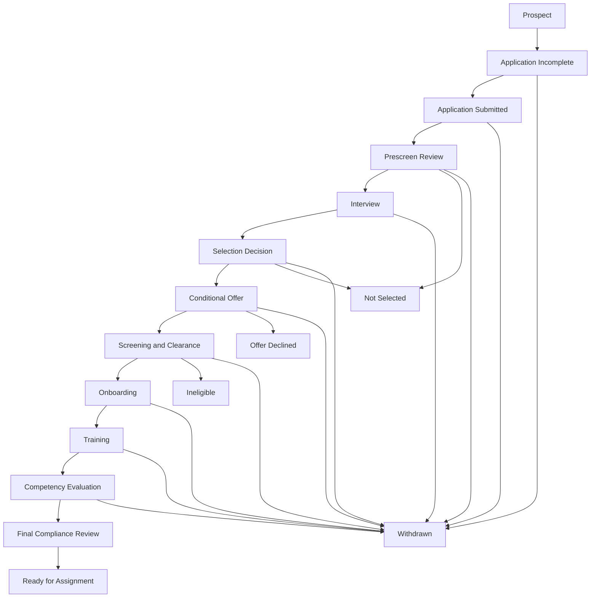
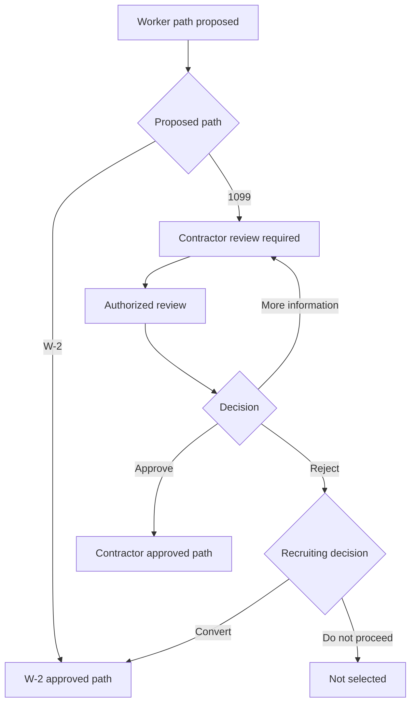
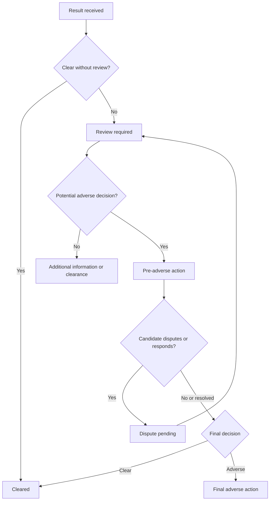

# Hiring Workflow Specification

## 1. Purpose

This document defines the executable Release 1 workflow for the PSA Workforce Hiring System. It translates the product requirements into controlled states, commands, gates, exception paths, candidate-visible messages, and audit events.

Release 1 begins when a prospect or application record is created and ends when the worker becomes Ready for Assignment or reaches a terminal state. Client assignment is outside this workflow.

## 2. Workflow Design Principles

1. Do not use one status field to represent every activity.
2. Maintain one high-level candidate stage and separate sub-workflow statuses for classification, offer, screening, onboarding, training, competency, and final review.
3. Change state only through named commands with authorization and prerequisite checks.
4. Never allow direct database or user-interface editing of controlled status fields.
5. Preserve every decision, prior version, reviewer, timestamp, and reason.
6. Candidate-visible status is a separate projection and must not expose internal or restricted information.
7. Readiness is calculated from requirements and finalized through an authorized human approval.
8. Expiration, revocation, or invalidation of a required item can remove readiness.
9. Commands that may be retried must be idempotent.
10. Every successful or rejected compliance-significant command produces an audit event.

## 3. Aggregate Model

The workflow is composed of the following aggregates or closely controlled modules:

| Component | Purpose |
| --- | --- |
| Person | Canonical identity for a human who may apply more than once |
| Candidacy | One application for one position or hiring cycle |
| Worker Classification | Proposed and approved W-2 or 1099 path |
| Offer | Versioned conditional offer or contractor agreement process |
| Requirement Set | Applicable checklist generated for the candidacy |
| Screening Case | Screening orders, evidence, reviews, and dispositions |
| Onboarding Packet | Forms, acknowledgments, tax/payment items, and reviews |
| Training Assignment | Required course or orientation work |
| Competency Evaluation | Task-specific evaluation and remediation history |
| Final Compliance Review | Snapshot of requirements used for readiness approval |
| Readiness | Current readiness result and any compliance hold |
| Audit Event | Append-only record of significant activity |

The high-level stage is a summary of workflow progress. Sub-workflow records remain the source of truth for detailed decisions.

## 4. High-Level Workflow



The diagram shows the normal path. Holds, returned items, remediation, disputes, reactivation, and classification branches are defined below.

## 5. High-Level Stage Definitions

### 5.1 Prospect

Entry:

- Staff creates a prospect, or
- A person begins self-registration but has not started a formal application.

Permitted activity:

- Record minimal contact and position interest.
- Send or resend a candidate invitation.
- Detect possible duplicate people.

Exit:

- Candidate activates access and starts an application.
- Staff closes the prospect as not proceeding.

### 5.2 Application Incomplete

Entry:

- A candidate begins an application.

Permitted activity:

- Save drafts.
- Upload requested application attachments.
- Correct validation errors.
- Request assistance.

Exit gate:

- All required application fields are valid.
- Required application attachments are present.
- Candidate certification is accepted.
- Candidate submits the application.

### 5.3 Application Submitted

Entry:

- Candidate successfully submits a valid application.

System actions:

- Freeze the submitted application version.
- Record certification and submission time.
- Assign a review owner or place the item in the unassigned queue.
- Send candidate confirmation.

Exit:

- Staff accepts it for prescreen review.
- Staff returns it for correction, returning the high-level stage to Application Incomplete while preserving the submitted version.

### 5.4 Prescreen Review

Entry:

- Staff accepts a submitted application for review.

Permitted outcomes:

- Pass and invite to interview.
- Request additional information.
- Not selected.
- Place on hold.

Exit gate for Interview:

- Required prescreen questions are completed.
- Reviewer and review date are recorded.
- Candidate meets configured minimum requirements or an authorized exception is documented.

### 5.5 Interview

Entry:

- Prescreen outcome is Pass.

Permitted activity:

- Schedule, reschedule, or cancel interviews.
- Complete one or more versioned scorecards.
- Record interviewer recommendations.
- Record candidate no-show and determine rescheduling eligibility.

Exit gate:

- Required interviews are completed or formally waived by an authorized role.
- Required scorecards are complete.
- The candidacy is submitted for selection decision.

### 5.6 Selection Decision

Entry:

- Interview requirements are complete.

Permitted outcomes:

- Selected.
- Not selected.
- Additional interview required.
- On hold.

Exit gate for Conditional Offer:

- Selection is approved by an authorized user.
- Proposed position and compensation inputs are complete.
- Proposed worker path is recorded.
- If 1099 is proposed, classification review is initiated; contractor documentation remains blocked until approval.

### 5.7 Conditional Offer

Entry:

- Selection outcome is Selected.

Permitted activity:

- Prepare a W-2 conditional offer.
- Complete classification review before preparing a 1099 agreement.
- Approve, issue, revise, withdraw, expire, accept, or decline an offer.

Exit gate for Screening and Clearance:

- Current offer or agreement is accepted.
- Required authorization and disclosure steps needed to initiate screening are complete.
- Worker classification is final.

### 5.8 Screening and Clearance

Entry:

- Offer or agreement is accepted and required screening authorizations are complete.

Permitted activity:

- Generate applicable screening requirements.
- Order or record screening activity.
- Receive results.
- Conduct restricted review.
- Manage pre-adverse, dispute, final-adverse, retest, or additional-information paths.

Exit gate for Onboarding:

- Every required screening item has a current approved disposition.
- No required screening case is pending, disputed, expired, failed, or review required.
- No active compliance hold blocks progress.

### 5.9 Onboarding

Entry:

- Screening gate passes.

Permitted activity:

- Generate the W-2 or approved 1099 onboarding checklist.
- Assign forms, disclosures, acknowledgments, and document requests.
- Submit, review, approve, reject, return, or replace items.

Exit gate for Training:

- Every required onboarding item is approved or has a valid authorized waiver where permitted.
- No required onboarding document is expired.
- Required signatures and document versions are preserved.

### 5.10 Training

Entry:

- Onboarding gate passes.

Permitted activity:

- Generate training assignments.
- Complete courses, assessments, and acknowledgments.
- Record failure, remediation, waiver where permitted, or expiration.

Exit gate for Competency Evaluation:

- Every mandatory general training assignment has a current passing or otherwise permitted disposition.
- Capability-specific training is complete for capabilities being requested.

### 5.11 Competency Evaluation

Entry:

- Prerequisite training is complete.

Permitted activity:

- Evaluate each requested personal-service task.
- Pass, fail, restrict, or require supervision.
- Assign remediation and reevaluation.

Exit gate for Final Compliance Review:

- Each task in the proposed capability profile has a current passing evaluation.
- No required reevaluation is pending.
- Evaluator identity, date, method, and attestations are recorded.

### 5.12 Final Compliance Review

Entry:

- All automated prerequisite evaluators return provisionally complete.

Permitted outcomes:

- Approve Ready for Assignment.
- Return to a prior stage with specific deficiencies.
- Place on compliance hold.
- Mark ineligible if authorized and supported.

Exit gate for Ready for Assignment:

- Readiness evaluator returns no blocking requirement.
- Designated reviewer completes the final checklist.
- Required final approval count is met.

### 5.13 Ready for Assignment

Entry:

- Final compliance approval is granted.

System actions:

- Record readiness effective time.
- Record the requirement and checklist versions used.
- Record the approved capability profile.
- Notify authorized staff and send the approved candidate-facing message.

Exit:

- Release 1 ends for a newly ready worker.
- A later expiration, revocation, invalidation, or authorized hold changes readiness to Compliance Hold.

## 6. Terminal and Exception States

### 6.1 Withdrawn

- Initiated by the candidate or authorized staff acting on a documented candidate request.
- Requires effective date and reason category.
- Stops open tasks and unsent reminders.
- Does not delete records.
- Reactivation requires authorization and reevaluation of expired requirements.

### 6.2 Not Selected

- Used for recruiting decisions before an accepted offer.
- Requires reason category and authorized decision maker.
- Candidate receives approved external wording, not internal notes.
- Reconsideration creates a new decision or authorized reactivation event.

### 6.3 Offer Declined

- Recorded from candidate action or documented staff-assisted action.
- Closes the current offer version and open downstream tasks.
- A later offer requires a new version and authorized reactivation.

### 6.4 Ineligible

- Used only by an authorized role after an applicable process and final decision.
- Requires decision category, effective date, reviewer, and access-restricted rationale.
- Candidate receives only approved external communication.
- The system must not expose protected or restricted reasoning to unauthorized users.

### 6.5 On Hold

On Hold pauses normal progression without creating a final decision.

Required fields:

- Hold category.
- Internal reason.
- Candidate-facing message or visibility setting.
- Start date.
- Review date or expiration when applicable.
- Owner.

Removing a hold requires an authorized command and reevaluation of prerequisites.

### 6.6 Archived

- Used for administratively closed historical records.
- Archiving does not delete or anonymize the record.
- Records under an active dispute, investigation, retention hold, or required follow-up may not be archived.

## 7. Worker Classification Sub-Workflow

### 7.1 Classification States

- `NOT_PROPOSED`
- `W2_PROPOSED`
- `CONTRACTOR_REVIEW_REQUIRED`
- `CONTRACTOR_REVIEW_IN_PROGRESS`
- `MORE_INFORMATION_REQUIRED`
- `W2_APPROVED`
- `CONTRACTOR_APPROVED`
- `CONTRACTOR_REJECTED`
- `SUPERSEDED`

### 7.2 Classification Flow



### 7.3 Classification Rules

- W-2 is the default proposed path.
- Recruiters may propose but not automatically approve a 1099 path.
- Contractor-specific documents remain unavailable until `CONTRACTOR_APPROVED`.
- Changing an approved path creates a new classification decision and supersedes the prior decision.
- Changing classification recalculates offer, onboarding, tax/payment, insurance, and readiness requirements.
- A classification change after document signature may require withdrawal and replacement of documents.
- The classification decision itself never waives PSA screening, training, competency, or readiness requirements.

## 8. Offer Sub-Workflow

### 8.1 Offer States

- `NOT_STARTED`
- `DRAFT`
- `PENDING_INTERNAL_APPROVAL`
- `APPROVED`
- `ISSUED`
- `VIEWED`
- `ACCEPTED`
- `DECLINED`
- `EXPIRED`
- `WITHDRAWN`
- `SUPERSEDED`

### 8.2 Offer Rules

- Only an approved document template version may be used.
- Issuing a document freezes its content and variables.
- A revised document creates a new version; it does not modify the issued version.
- Only the latest eligible issued version may be accepted.
- A contractor agreement requires `CONTRACTOR_APPROVED`.
- Acceptance records signer, signed version, timestamp, and signature evidence.
- An expired, withdrawn, or superseded version cannot be accepted.
- Offer acceptance does not mean the candidate is cleared to provide services.

## 9. Screening Requirement Sub-Workflow

### 9.1 Requirement Instance States

- `NOT_STARTED`
- `AWAITING_CANDIDATE_AUTHORIZATION`
- `READY_TO_ORDER`
- `ORDERED`
- `APPOINTMENT_REQUIRED`
- `IN_PROGRESS`
- `RESULT_RECEIVED`
- `REVIEW_REQUIRED`
- `CLEARED`
- `ADDITIONAL_INFORMATION_REQUIRED`
- `PRE_ADVERSE_ACTION`
- `DISPUTE_PENDING`
- `FINAL_ADVERSE_ACTION`
- `RETEST_REQUIRED`
- `EXPIRED`
- `CANCELED`
- `WAIVED`

`WAIVED` is available only for requirements explicitly configured as legally and operationally waivable and only to authorized users. Required nonwaivable checks must not expose that command.

### 9.2 Normal Screening Flow

1. Generate requirement from the effective requirement matrix.
2. Obtain required authorization.
3. Order or schedule the check.
4. Receive the result.
5. Restrict result access to authorized reviewers.
6. Record reviewer disposition.
7. Mark Cleared only after approval.

### 9.3 Review and Adverse-Action Flow



### 9.4 Screening Rules

- The system tracks evidence and decisions but does not make an autonomous legal adjudication.
- Candidate-facing messages must not expose internal result details unless an approved process specifically provides them.
- A result with `REVIEW_REQUIRED`, `PRE_ADVERSE_ACTION`, or `DISPUTE_PENDING` blocks progression.
- A new test or corrected report creates a new result version.
- Manual entries require source, date, recorder, reviewer, and supporting evidence.
- A required screening item must be current when readiness is evaluated.

## 10. Onboarding Item Sub-Workflow

### 10.1 Onboarding Item States

- `NOT_ASSIGNED`
- `ASSIGNED`
- `IN_PROGRESS`
- `SUBMITTED`
- `REVIEW_REQUIRED`
- `APPROVED`
- `RETURNED_FOR_CORRECTION`
- `REJECTED`
- `EXPIRED`
- `WAIVED`
- `SUPERSEDED`

### 10.2 Onboarding Loop

1. Requirement is assigned.
2. Candidate completes or uploads the item.
3. Candidate submits the item.
4. Staff reviews it.
5. Staff approves it or returns it with candidate-visible instructions.
6. A corrected submission creates a new version.
7. Approval applies only to the reviewed version.

### 10.3 Onboarding Rules

- W-2 and approved 1099 paths use separate requirement templates.
- Restricted documents use restricted storage and permissions.
- A reviewer may not silently replace candidate-submitted content.
- Version, signer, submission, review, and approval history must remain available.
- Rejected and returned items block the applicable onboarding gate.

## 11. Training Sub-Workflow

### 11.1 Training States

- `NOT_ASSIGNED`
- `ASSIGNED`
- `IN_PROGRESS`
- `COMPLETED_PENDING_RESULT`
- `PASSED`
- `FAILED`
- `REMEDIATION_REQUIRED`
- `EXPIRED`
- `WAIVED`
- `CANCELED`

### 11.2 Training Rules

- The effective training matrix generates assignments.
- Completion alone does not imply passing when an assessment is required.
- Failure creates a remediation or reassignment path.
- Retraining creates a new attempt.
- Expired mandatory training blocks readiness or the affected capability.
- Dementia-specific eligibility remains unavailable until its configured initial training requirement passes.

## 12. Competency Sub-Workflow

### 12.1 Competency States

- `NOT_SCHEDULED`
- `SCHEDULED`
- `IN_PROGRESS`
- `PASSED`
- `PASSED_WITH_RESTRICTION`
- `FAILED`
- `REMEDIATION_REQUIRED`
- `REEVALUATION_REQUIRED`
- `EXPIRED`
- `REVOKED`

### 12.2 Competency Rules

- Competency is recorded per task, not as one general checkbox.
- A task cannot enter the approved capability profile without a current passing result.
- `PASSED_WITH_RESTRICTION` is not treated as unrestricted capability.
- Remediation and reevaluation preserve the original evaluation.
- An evaluator records evaluation method, date, result, restrictions, evidence, and required attestations.
- Revocation immediately removes the affected task from current capability and may place readiness on hold.

## 13. Final Compliance Review Sub-Workflow

### 13.1 Review States

- `NOT_READY_FOR_REVIEW`
- `READY_FOR_REVIEW`
- `IN_REVIEW`
- `RETURNED_WITH_DEFICIENCIES`
- `APPROVED`
- `DENIED`
- `SUPERSEDED`

### 13.2 Review Snapshot

Starting final review creates a snapshot containing:

- Candidate and candidacy identifiers.
- Worker-classification decision identifier.
- Requirement-matrix version.
- Applicable screening and onboarding requirement identifiers.
- Training and competency requirements.
- Current result and expiration for every requirement.
- Proposed capability profile.
- Active holds.
- Reviewer and review start time.

If a source item changes before approval, the snapshot becomes stale and must be refreshed or superseded before final approval.

## 14. Ready for Assignment Calculation

Readiness contains two parts:

1. Automated eligibility evaluation.
2. Authorized final approval.

### 14.1 Automated Evaluation

The evaluator must return:

- `eligible`: boolean.
- `blockingRequirements`: complete list.
- `warnings`: nonblocking list.
- `evaluatedAt`: timestamp.
- `requirementMatrixVersion`: identifier.
- `evidenceVersion`: version or hash of evaluated inputs.

Conceptual logic:

```text
eligible =
  candidacy is active
  AND no blocking hold exists
  AND classification is W2_APPROVED or CONTRACTOR_APPROVED
  AND current offer/agreement is ACCEPTED
  AND all required screening items are CLEARED and current
  AND all required onboarding items are APPROVED and current
  AND all mandatory training is PASSED and current
  AND every task in the proposed capability profile has a current passing competency
  AND no adverse, dispute, remediation, or reevaluation process is open
```

### 14.2 Final Approval

Final approval is permitted only when:

- Automated `eligible` is true.
- The review snapshot is current.
- The reviewer has the required permission.
- The reviewer completes the final checklist and attestation.
- Any configured second approval is complete.

### 14.3 Readiness Record

An approved readiness record stores:

- Effective timestamp.
- Approver or approvers.
- Final-review identifier.
- Classification decision identifier.
- Requirement-matrix version.
- Evidence version.
- Capability profile.
- Warnings acknowledged by the reviewer.

### 14.4 Automatic Loss of Readiness

The system reevaluates readiness when:

- A required item expires.
- A result is revoked or corrected.
- Worker classification changes.
- An accepted offer or agreement is withdrawn or superseded.
- Mandatory training expires.
- Competency is revoked or expires.
- A blocking compliance hold is created.

If the worker no longer qualifies:

1. Current readiness is closed with reason and timestamp.
2. Readiness changes to Compliance Hold.
3. Blocking requirements are recorded.
4. Authorized staff are notified.
5. A new final review is required after remediation.

## 15. High-Level Transition Commands

| Command | From | To | Authorized role | Minimum gate |
| --- | --- | --- | --- | --- |
| `start_application` | Prospect | Application Incomplete | Candidate, Recruiter | Valid candidacy and access |
| `submit_application` | Application Incomplete | Application Submitted | Candidate | Required fields, attachments, certification |
| `return_application` | Application Submitted | Application Incomplete | Recruiter, HR | Return reason and instructions |
| `begin_prescreen` | Application Submitted | Prescreen Review | Recruiter | Assigned reviewer |
| `pass_prescreen` | Prescreen Review | Interview | Recruiter | Complete checklist |
| `request_prescreen_information` | Prescreen Review | On Hold | Recruiter | Missing-information reason |
| `schedule_interview` | Interview | Interview | Recruiter | Eligible candidate and interviewer |
| `submit_for_selection` | Interview | Selection Decision | Recruiter | Required interviews complete |
| `select_candidate` | Selection Decision | Conditional Offer | Authorized recruiter/manager | Decision, position, compensation inputs |
| `require_additional_interview` | Selection Decision | Interview | Authorized recruiter/manager | Documented reason |
| `issue_offer` | Conditional Offer | Conditional Offer | HR, authorized approver | Approved current document; classification rule satisfied |
| `accept_offer` | Conditional Offer | Conditional Offer | Candidate | Eligible issued version |
| `begin_screening` | Conditional Offer | Screening and Clearance | HR, Compliance | Accepted offer/agreement and authorizations |
| `complete_screening_gate` | Screening and Clearance | Onboarding | Compliance | All required screening items cleared/current |
| `complete_onboarding_gate` | Onboarding | Training | HR, Compliance | All required items approved/current |
| `complete_training_gate` | Training | Competency Evaluation | Trainer, Compliance | All mandatory training passed/current |
| `complete_competency_gate` | Competency Evaluation | Final Compliance Review | Evaluator, Compliance | All required task competencies passed/current |
| `begin_final_review` | Final Compliance Review | Final Compliance Review | Compliance | Automated evaluator provisionally eligible |
| `approve_readiness` | Final Compliance Review | Ready for Assignment | Compliance/PSA Manager | Current snapshot; no blockers; approvals complete |
| `return_with_deficiencies` | Final Compliance Review | Prior applicable stage | Compliance | Specific deficiencies and owner |
| `place_hold` | Any active stage | On Hold | Authorized staff | Hold category, reason, owner, review date |
| `remove_hold` | On Hold | Recalculated stage | Authorized staff | Hold resolution and prerequisite reevaluation |
| `withdraw_candidacy` | Any nonterminal stage | Withdrawn | Candidate, authorized staff | Documented request and reason |
| `not_select` | Prescreen/Selection | Not Selected | Recruiter/Manager | Decision and reason category |
| `mark_offer_declined` | Conditional Offer | Offer Declined | Candidate, HR | Current offer and evidence of decision |
| `mark_ineligible` | Applicable review stage | Ineligible | Authorized Compliance/Manager | Completed applicable process and final decision |
| `reactivate_candidacy` | Eligible terminal/hold state | Recalculated stage | Authorized Manager | Reason, policy allows, requirements regenerated |

## 16. Returned Work and Rollback Rules

- Returning an item does not erase a completed stage or historical evidence.
- The high-level stage moves to the earliest stage containing a current blocking deficiency.
- Later sub-workflow records remain present but may become stale or blocked.
- Correcting a deficiency triggers recalculation of downstream applicability and freshness.
- A change to classification, position, or capability profile may invalidate offer, onboarding, training, or competency items.
- The system must display which downstream records were invalidated and why.
- A staff user may not use rollback to avoid an adverse-action, dispute, or audit process.

## 17. Candidate-Visible Status Mapping

Internal statuses must map to approved plain-language candidate messages.

| Internal state | Candidate-facing label | Candidate-facing guidance |
| --- | --- | --- |
| Prospect | Invitation sent | Create your account to begin |
| Application Incomplete | Application in progress | Complete the remaining sections |
| Application Submitted | Application received | No action unless contacted |
| Prescreen Review | Application under review | No action currently required |
| Interview | Interview step | Schedule or attend your interview |
| Selection Decision | Review in progress | A decision is being finalized |
| Conditional Offer | Offer step | Review the available document or action |
| Screening and Clearance | Pre-employment requirements | Complete only the actions shown in your portal |
| Onboarding | Onboarding | Complete the listed forms and documents |
| Training | Training | Complete assigned training by the due date |
| Competency Evaluation | Skills evaluation | Follow scheduling instructions |
| Final Compliance Review | Final review | No action unless an item is returned |
| Ready for Assignment | Ready for assignment | Your pre-assignment requirements are complete |
| On Hold | Action or review pending | Follow the specific approved message |
| Withdrawn | Application withdrawn | Contact the agency if this is incorrect |
| Not Selected | Application closed | Display approved disposition communication |
| Offer Declined | Offer declined | Contact the agency if recorded incorrectly |
| Ineligible | Process closed | Display only approved final communication |

Detailed screening results, internal notes, reviewer deliberations, and protected reasons are never derived directly into the candidate label.

## 18. Timers, Reminders, and Escalations

Timers are configurable and do not automatically create an adverse decision.

Supported timer types:

- Invitation not activated.
- Application inactive.
- Application awaiting review.
- Interview not scheduled.
- Offer awaiting response.
- Screening authorization incomplete.
- Screening result delayed.
- Onboarding item overdue.
- Training overdue.
- Competency evaluation not scheduled.
- Final review pending.
- Requirement nearing expiration.
- Hold review due.

Each timer rule defines:

- Start event.
- Duration.
- Reminder recipients.
- Candidate-visible template if applicable.
- Internal escalation recipient.
- Maximum reminder count.
- Stop events.

## 19. Notifications by Workflow Event

Minimum notification events include:

- Candidate invitation created.
- Application submitted.
- Application returned.
- Interview requested, scheduled, rescheduled, or canceled.
- Offer issued, revised, nearing expiration, accepted, declined, or withdrawn.
- Candidate action required for screening.
- Onboarding item assigned, returned, approved, or overdue.
- Training assigned, failed, due, or completed.
- Competency scheduled, failed, or remediation assigned.
- Final deficiency returned.
- Ready for Assignment approved.
- Compliance hold placed or resolved.

Notifications must reference the required portal action rather than include restricted data.

## 20. Audit Events

Minimum audit event names include:

- `person.created`
- `candidate.invited`
- `candidate.account_activated`
- `application.started`
- `application.submitted`
- `application.returned`
- `prescreen.completed`
- `interview.scheduled`
- `interview.scorecard_submitted`
- `selection.recorded`
- `classification.proposed`
- `classification.review_started`
- `classification.decided`
- `offer.created`
- `offer.approved`
- `offer.issued`
- `offer.accepted`
- `offer.declined`
- `screening.authorization_received`
- `screening.ordered`
- `screening.result_received`
- `screening.disposition_recorded`
- `screening.pre_adverse_started`
- `screening.dispute_opened`
- `screening.final_adverse_recorded`
- `onboarding.item_assigned`
- `onboarding.item_submitted`
- `onboarding.item_reviewed`
- `training.assigned`
- `training.attempt_recorded`
- `competency.evaluation_recorded`
- `competency.remediation_assigned`
- `final_review.started`
- `final_review.returned`
- `readiness.approved`
- `readiness.revoked`
- `hold.placed`
- `hold.removed`
- `candidacy.withdrawn`
- `candidacy.reactivated`
- `record.exported`
- `restricted_document.accessed`

Every event records actor, action, target, occurred-at time, request or correlation identifier, source, before/after references where appropriate, and reason when required.

## 21. Concurrency and Idempotency Rules

- Commands include the expected current version of the target aggregate.
- A stale command is rejected and the user is asked to refresh.
- Provider order commands use a stable idempotency key.
- Repeated candidate submission does not create multiple application versions after the first successful submission.
- Repeated acceptance does not create duplicate signatures or transitions.
- Only one current final compliance review may be active per candidacy.
- Only one current readiness record may be active per worker engagement.
- Concurrent final approvals must not bypass configured approval count or separation of duties.

## 22. Minimum Workflow Test Scenarios

### 22.1 Successful W-2 Path

- Candidate completes every stage.
- W-2 classification is final.
- Requirements pass.
- Final reviewer approves readiness.

Expected result: one active Ready for Assignment record and complete audit history.

### 22.2 Successful Approved 1099 Path

- Recruiter proposes 1099.
- Contractor agreement remains blocked before approval.
- Authorized reviewer approves classification.
- Contractor requirements generate.
- All common PSA requirements and contractor-specific requirements pass.

Expected result: Ready for Assignment with approved contractor classification linked.

### 22.3 Rejected 1099 Converted to W-2

- Contractor review is rejected.
- Authorized user converts proposed path to W-2.
- Contractor documents remain unavailable.
- W-2 offer and onboarding requirements generate.

Expected result: workflow continues without retaining contractor documents as current.

### 22.4 Missing Screening Requirement

- All items except one required registry check are approved.

Expected result: screening gate and final readiness are blocked with the exact missing requirement.

### 22.5 Screening Dispute

- Result enters potential adverse path.
- Candidate disputes the result.

Expected result: progression remains blocked; candidate sees approved dispute guidance; internal detail remains restricted.

### 22.6 Returned Onboarding Document

- Candidate submits an incomplete document.
- HR returns it.
- Candidate submits a corrected version.

Expected result: both versions remain; only the corrected version may be approved.

### 22.7 Failed Competency and Remediation

- Candidate fails a required task evaluation.
- Remediation is assigned.
- Candidate later passes reevaluation.

Expected result: original failure remains; current capability is based on the later passing record.

### 22.8 Expiration After Readiness

- A required item expires after readiness approval.

Expected result: readiness closes, compliance hold is created, staff are notified, and a new final review is required after renewal.

### 22.9 Unauthorized Transition

- Recruiter attempts final readiness approval.

Expected result: command is rejected and audited; readiness remains unchanged.

### 22.10 Duplicate Command

- The same external order or candidate submission is sent twice.

Expected result: one business action occurs and the duplicate receives the original outcome.

## 23. Implementation Notes for Claude and Antigravity

- Represent commands and transition guards in the domain layer.
- Use enums or constrained value objects for controlled states.
- Do not put readiness logic only in front-end components.
- Store high-level stage as a projection that can be recalculated from sub-workflows when necessary.
- Keep internal and candidate-visible status mapping explicit.
- Return structured blocker codes plus user-safe messages.
- Use database transactions for state change, requirement update, outbox event, and audit append.
- Use an outbox or equivalent reliable mechanism for notifications and external-provider work.
- Treat external results as untrusted input requiring validation and authorized review.

## 24. Next Specification

The next document is `docs/ROLE_PERMISSION_MATRIX.md`. It will define:

- Which role can view each information category.
- Which role can execute each workflow command.
- Field-level access for restricted information.
- Separation-of-duties rules.
- Candidate versus staff visibility.
- Export, override, configuration, and audit permissions.
