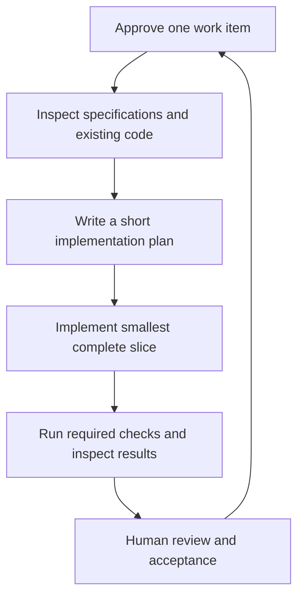
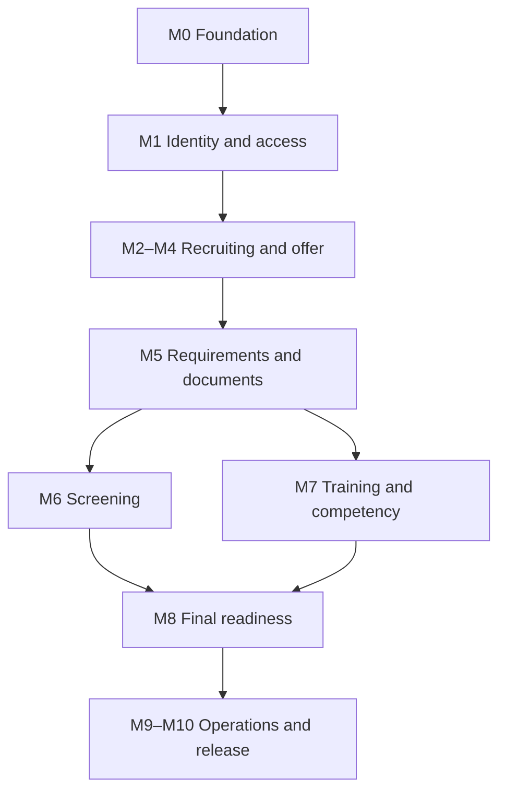

# Release 1 Implementation Plan

## 1. Purpose

This document converts the approved PSA Workforce Hiring System specifications into an ordered implementation roadmap for Claude, Antigravity, and human reviewers.

The plan builds one local-first TypeScript modular monolith from candidate intake through **Ready for Assignment**.

It is intentionally incremental. An agent must implement only the currently approved work item, verify it, and stop for review before advancing to the next item.

## 2. Approved Release Boundary

Release 1 includes:

- Candidate and staff authentication.
- Candidate intake and application.
- Prescreening, interviewing, and selection.
- W-2 default classification and approval-gated 1099 classification.
- Conditional offer or approved contractor agreement.
- Background, registry, drug-screen, TB, and other configured screening tracking.
- W-2 or approved-1099 onboarding.
- Orientation and training.
- Task-level competency evaluation.
- Final compliance review.
- Ready-for-Assignment approval, holds, audit, notifications, dashboards, and required reports.

Release 1 excludes:

- Client intake and service agreements.
- Client assignment or worker matching.
- Scheduling and EVV.
- Timesheets and payroll.
- Client billing or insurance claims.
- Leave administration.
- Native mobile applications.

Do not create placeholder UI, routes, database tables, or APIs for excluded capabilities unless an approved architecture task explicitly requires a neutral extension point.

## 3. Required Reading Order

Before implementation, every coding agent must read:

1. `CLAUDE.md`
2. `AGENTS.md`
3. `docs/PRODUCT_REQUIREMENTS.md`
4. `docs/HIRING_WORKFLOW.md`
5. `docs/ROLE_PERMISSION_MATRIX.md`
6. `docs/DATA_MODEL.md`
7. `docs/ARCHITECTURE.md`
8. `docs/UI_FLOW.md`
9. `docs/SECURITY_AND_PRIVACY.md`
10. `docs/TEST_STRATEGY.md`
11. This implementation plan.

For a small task, the agent may reread only the directly relevant specifications after confirming it already understands the global rules. Security, permissions, workflow gates, and Release 1 scope always remain applicable.

## 4. Delivery Method

### 4.1 Vertical slices

Each slice should include, where relevant:

- Domain rule.
- Application command/query.
- Authorization policy.
- PostgreSQL schema/migration.
- Repository implementation.
- Route/server adapter.
- Candidate or staff UI.
- Audit event.
- Outbox/notification behavior.
- Unit, integration, component, and focused E2E tests.
- Documentation update.

Do not build every database table first and postpone working behavior.

### 4.2 One task at a time

The execution loop is:



An agent must not automatically begin the next work item after completing the current one.

### 4.3 Change size

A normal work item should:

- Have one primary user or system outcome.
- Touch the minimum number of modules required for a complete behavior.
- Be reviewable in one pull request.
- Include its tests and migration.
- Avoid unrelated refactoring.

Split a task when it mixes multiple independent decisions, introduces several new providers, or cannot be safely reviewed as one unit.

## 5. Work-Item Statuses

Use these statuses:

| Status | Meaning |
|---|---|
| Proposed | Described but not yet approved for implementation |
| Ready | Requirements, dependencies, and acceptance criteria are clear |
| In Progress | One owner/agent is actively implementing |
| In Review | Implementation and evidence are ready for review |
| Blocked | A named decision or dependency prevents progress |
| Accepted | Acceptance criteria and required checks passed |
| Deferred | Intentionally postponed with reason |

Only Ready items may move to In Progress.

## 6. Definition of Ready

A work item is Ready only when:

- It has a stable ID, title, outcome, and scope.
- The relevant specification sections are linked.
- Dependencies are Accepted.
- Actor, permission, and record scope are identified.
- Data classification is identified.
- Success, invalid, unauthorized, stale, and duplicate behaviors are defined.
- Audit and notification effects are defined.
- Acceptance tests are listed.
- Any required legal/compliance decision is approved.
- No unresolved choice would materially change the implementation.

If these conditions are not met, the agent should document the blocker rather than invent a rule.

## 7. Definition of Done

A work item is Done only when:

- Acceptance criteria pass.
- Strict typecheck, lint, relevant tests, and production build pass.
- Authorization is enforced server-side.
- Audit behavior is verified.
- Transaction and idempotency behavior are tested where applicable.
- Error, empty, loading, stale, and denied states are handled.
- Sensitive data does not appear in logs, responses, fixtures, or artifacts.
- Migration works from a clean database when schema changes exist.
- Accessibility checks appropriate to the UI pass.
- Documentation and traceability are updated.
- No unrelated Release 1 scope was added.
- Human reviewer accepts the result.

## 8. Milestone Overview

| Milestone | Outcome | Depends on |
|---|---|---|
| M0 | Repository and local engineering foundation | Approved specifications |
| M1 | Identity, authentication, authorization, and audit foundation | M0 |
| M2 | Candidate intake and submitted application | M1 |
| M3 | Staff queue, prescreen, interview, and selection | M2 |
| M4 | Worker classification and conditional offer | M3 |
| M5 | Requirement engine, documents, signatures, and onboarding | M4 |
| M6 | Screening, adjudication, dispute, and clearance | M5 foundation |
| M7 | Training and competency | M5 foundation |
| M8 | Final compliance review and Ready for Assignment | M4–M7 |
| M9 | Notifications, reports, administration, and operational completeness | M1–M8 |
| M10 | Security, accessibility, performance, recovery, UAT, and release | M0–M9 |

Some M6 and M7 work may proceed independently after the shared requirement/document foundation is accepted, but final integration remains ordered.

## 9. Milestone M0 — Repository Foundation

### Goal

A new developer can start the local application, database, worker, and test services using documented commands. CI can build and test an empty functional skeleton without production credentials.

### Work items

#### M0.1 Initialize the TypeScript application

Deliver:

- Next.js App Router application.
- Strict TypeScript configuration.
- `pnpm` package management and lockfile.
- ESLint, formatting, and import-boundary foundation.
- Tailwind CSS and approved component foundation.
- Initial public, candidate, and staff route groups with nonfunctional safe landing pages.
- Node version pin.

Acceptance:

- `pnpm install`, `pnpm lint`, `pnpm typecheck`, and `pnpm build` pass.
- No excluded business capability is scaffolded.
- No secrets or real personal data exist.

#### M0.2 Local infrastructure

Deliver:

- Docker Compose PostgreSQL and Mailpit.
- Environment schema validation with safe `.env.example`.
- Local private document directory configuration.
- Health/readiness checks for local dependencies.
- `pnpm infra:up` and related scripts.

Acceptance:

- A developer can start/stop local dependencies predictably.
- Application fails with a clear safe error when required configuration is missing.
- Test and production environment names cannot use local provider credentials accidentally.

#### M0.3 Database and migration foundation

Deliver:

- Drizzle configuration.
- Migration directory and first technical schema.
- Database connection lifecycle.
- Migration and synthetic seed scripts.
- Clean-database migration integration test.

Acceptance:

- `pnpm db:migrate` reproduces schema from empty PostgreSQL.
- `drizzle-kit push` is not used in CI/shared environments.
- Application and migration identities are logically separated in configuration.

#### M0.4 Test foundation

Deliver:

- Vitest projects/configuration.
- React Testing Library.
- PostgreSQL integration-test harness.
- Playwright configuration.
- Synthetic fixture factory foundation.
- Standard test scripts from `docs/TEST_STRATEGY.md`.

Acceptance:

- One example at each selected test level passes.
- Browser authentication artifacts and test output are ignored.
- CI fails on skipped critical tests or real-data canary patterns.

#### M0.5 Logging, errors, and correlation

Deliver:

- Structured logger with allowlisted context and redaction.
- Correlation ID middleware/helper.
- Domain/application/public error mapping.
- Safe error page and request reference.
- Tests proving designated sensitive canaries are not logged.

Acceptance:

- No request body is logged by default.
- User-facing errors contain no stack trace, SQL, provider payload, or sensitive data.

#### M0.6 CI baseline

Deliver a pipeline running frozen install, secret scan, lint, typecheck, unit/component tests, migration/integration tests, build, and critical smoke E2E.

Acceptance:

- A clean clone can pass CI.
- CI receives no production-capable credentials.
- Artifacts have bounded retention and synthetic content.

### M0 exit gate

- All M0 items accepted.
- Local setup completed by a second person from documentation.
- `ADR-0001` records the modular-monolith stack and development topology.

## 10. Milestone M1 — Identity, Access, and Audit

### Goal

Candidates and invited staff can authenticate, but access to every page/action is denied unless role, scope, sensitivity, and workflow conditions allow it.

### Work items

#### M1.1 Account and authentication schema

- Integrate Better Auth with Drizzle.
- Candidate and invitation-only staff account types.
- Verified email workflow.
- Disabled/locked states.
- Session storage and revocation.

#### M1.2 Candidate registration and recovery

- Candidate registration from invitation/public position.
- Verification and generic recovery.
- Token expiration/single-use tests.
- Candidate security page and session termination.

#### M1.3 Staff invitation and MFA

- Staff invitation lifecycle.
- Required production MFA policy.
- Recovery/reset administrative process.
- Recent-authentication primitive.

#### M1.4 Roles, permissions, and scopes

- Role, permission, role-permission, and role-assignment persistence.
- Organization/branch/team/assigned-record scopes.
- Central authorization service.
- Separation-of-duty policy interface.
- Immediate role-revocation behavior.

#### M1.5 Route and field authorization

- Candidate/staff route guards as convenience only.
- Server-side object/action/field checks.
- Safe denial/not-found behavior.
- Restricted field serialization helpers.

#### M1.6 Append-only audit foundation

- Audit event schema/repository/service.
- Actor/effective role/scope/correlation context.
- Atomic audit helper for business transactions.
- Authorized audit query projection.

#### M1.7 Authentication and authorization test matrix

- Candidate cross-record denial.
- Cross-branch staff denial.
- Role, scope, field, state, recent-authentication, and separation cases.
- Administrator business-record denial.
- Auditor assignment boundaries.

### M1 exit gate

- Candidate and staff can authenticate locally.
- Privileged staff MFA path works in test mode.
- Authorization matrix tests pass.
- Account, role, sensitive-access, and denial audit events are correct.

## 11. Milestone M2 — Candidate Intake and Application

### Goal

A candidate can create one valid candidacy, complete a multi-section application, upload safe supporting documents, certify it, and submit an immutable application version.

### Work items

#### M2.1 Organization, branch, position, and hiring cycle

- Minimal configuration entities.
- Published/open/closed position behavior.
- Public position list/detail.
- Authorized staff configuration screens.

#### M2.2 Person and candidacy

- Canonical person and candidacy aggregate.
- Candidate ownership link.
- Human-readable candidate reference.
- Duplicate-suspicion service without data disclosure.
- Prospect and Application Incomplete stages.

#### M2.3 Candidate portal shell

- Candidate navigation.
- Candidate-visible status projection.
- Next-action card and task list foundation.
- Accessible/mobile shell.

#### M2.4 Application draft

- Versioned application template/sections.
- Draft answers and section completion.
- Autosave/manual save with optimistic version.
- Candidate-safe validation.
- Staff-assisted action audit when permitted.

#### M2.5 Application attachments

- Document metadata/version model.
- Local private storage adapter.
- Quarantine/validation/test malware-scanner flow.
- Authorized upload/download.
- Document access audit.

#### M2.6 Review, certification, and submission

- Whole-application validation.
- Versioned certification/attestation.
- Frozen submitted version.
- Submission receipt.
- Application Submitted stage and staff queue item.
- Confirmation notification through Mailpit.

#### M2.7 Return and correction loop

- Staff selects exact fields/sections.
- Candidate-visible correction reason.
- Candidate creates a corrected version.
- Prior submitted version preserved.
- Resubmission and audit/notification.

### M2 exit gate

- Candidate happy path and returned-item E2E pass on mobile viewport.
- Candidate A cannot view Candidate B through routes, files, or APIs.
- Submitted application version is immutable.
- Restricted data is absent from logs and test artifacts.

## 12. Milestone M3 — Recruiting and Selection

### Goal

Scoped staff can process submitted applications through prescreen, interview, and an authorized selection decision while candidates see only approved status and actions.

### Work items

#### M3.1 Staff dashboard and unified work queue

- Assigned/team/unassigned filters.
- Stage, due date, branch, position, worker-path, and exception filters.
- Bounded pagination and stable ordering.
- Safe candidate summary fields.
- Assignment and ownership actions.

#### M3.2 Candidate workspace shell

- Stable summary header.
- Permission-aware tabs.
- Overview timeline, blockers, next action, and active hold indicator.
- No record-count leakage from inaccessible tabs.

#### M3.3 Application review and prescreen

- Accept submitted application for review.
- Structured prescreen questions/results.
- Additional-information and hold paths.
- Pass or Not Selected decision.
- Authorized exception with reason.

#### M3.4 Interview scheduling

- Schedule/reschedule/cancel.
- Interviewer assignment.
- Candidate view/confirmation/request change.
- Timezone-safe notifications.
- No-show behavior.

#### M3.5 Interview scorecard

- Versioned scorecard template.
- Draft and signed submission.
- Immutable submitted scorecard and amendment.
- Restricted candidate visibility.

#### M3.6 Selection decision

- Selected, Not Selected, Additional Interview, or On Hold.
- Position and proposed compensation/payment inputs.
- Proposed worker path only—not final 1099 decision.
- Candidate-visible outcome and notification.

### M3 exit gate

- Recruiter journey from queue to selected candidate passes.
- Wrong-scope users and candidates cannot see scorecards/notes.
- Controlled stages cannot be edited directly.
- Terminal and hold paths preserve reason and audit history.

## 13. Milestone M4 — Classification and Offer

### Goal

W-2 remains the default path. A proposed 1099 candidate receives contractor documents only after an independent authorized review. The correct approved offer/agreement can be issued and signed.

### Work items

#### M4.1 Worker-classification aggregate

- Proposal, review request, evidence, decision, rationale, and history.
- Pending, Approved, Rejected, Routed to W-2, and terminal outcomes.
- W-2 default and mutual exclusivity.

#### M4.2 Classification review UI and separation of duties

- Structured analysis form.
- Supporting documents.
- Reviewer-only decision.
- Proposer/self-approval block.
- Optional dual-approval capability.
- Candidate sees only approved path label.

#### M4.3 Offer/agreement templates

- Versioned templates and variables.
- Separate approved W-2 and 1099 templates.
- Effective date/publication controls.
- Exact preview rendering.

#### M4.4 Offer preparation and approval

- Draft, submit for approval, approve, revise, and supersede.
- Compensation/term authorization.
- 1099 agreement generation blocked until classification approval.
- Optional dual approval by configured threshold.

#### M4.5 Issue and candidate response

- Issue with expiration.
- Candidate review/download/question.
- Accept/sign or decline.
- Expired, withdrawn, and superseded version protection.
- Signature evidence through local adapter.

### M4 exit gate

- W-2 and approved-1099 offer journeys pass.
- Pending/rejected 1099 cannot generate or display contractor agreement.
- Same engagement cannot be active as both paths.
- Signed version, template version, signer, timestamp, and audit are preserved.

## 14. Milestone M5 — Requirements, Documents, and Onboarding

### Goal

The system generates the correct versioned requirement set and lets candidates submit and staff review W-2 or approved-1099 onboarding evidence without losing history.

### Work items

#### M5.1 Requirement definition and applicability

- Versioned requirement definitions.
- Worker type, position, capability, branch, and effective-date applicability.
- Required/optional/non-waivable behavior.
- Requirement publication impact preview.

#### M5.2 Requirement instances and evidence

- Generate idempotently for candidacy.
- Link evidence/version/status/dates.
- Pending, Submitted, Approved, Returned, Failed, Expired, Waived, Not Applicable.
- Structured blocker codes.

#### M5.3 Document/signature hardening

- Production-shaped storage port.
- Version/replacement chain.
- Safe preview/download.
- Signature adapter contract.
- Reauthentication for restricted access.

#### M5.4 Candidate onboarding checklist

- Correct W-2/1099 tasks.
- Save, submit, sign, upload, and replace.
- Plain-language next action.
- Mobile and accessibility behavior.

#### M5.5 Staff onboarding review

- Status groups and due dates.
- Authorized approve/return/reject.
- Waiver only when permitted and independently authorized.
- Expiration and reminder scheduling.

#### M5.6 Restricted identity and financial records

- Field/document classification enforcement.
- Masked display.
- Field-level encryption adapter integration.
- Access audit and export restriction.

### M5 exit gate

- Requirement generation is deterministic and version aware.
- W-2 and approved-1099 checklists differ correctly.
- Returned/replaced documents preserve history.
- Restricted fields are inaccessible to recruiters and ordinary views.

## 15. Milestone M6 — Screening and Clearance

### Goal

Authorized staff can initiate and review required screening cases, manage exceptions and disputes, and produce an approved internal disposition without exposing restricted details.

### Work items

#### M6.1 Screening case model

- Screening type, order, provider reference, status, result version, disposition, expiration.
- Background, registry, drug-screen, TB/medical categories.
- Restricted storage and access rules.

#### M6.2 Screening provider port and deterministic fake

- Order, status, result-reference, cancellation where supported.
- Scenario controls for success, pending, timeout, error, unknown, duplicate, and out-of-order events.
- Contract tests and idempotency.

#### M6.3 Authorization/disclosure gate

- Current approved authorization before ordering.
- Exact template/version/signature evidence.
- Separate candidate instructions.

#### M6.4 Provider webhook/polling

- Signature, timestamp, replay, and deduplication.
- Normalized status mapping.
- Unknown state becomes Review Required.
- Minimum safe payload storage.

#### M6.5 Restricted compliance review

- Status-only views for recruiter/ordinary HR.
- Restricted case view for compliance.
- Result intake separate from disposition.
- Optional dual review.

#### M6.6 Pre-adverse, dispute, and final action

- Approved notice package generation.
- Candidate portal action and delivery evidence.
- Configured waiting period.
- Dispute tracking and updated report version.
- Final clearance/adverse action by authorized reviewer.

#### M6.7 Screening clearance gate

- Every applicable item current and approved.
- Pending, disputed, failed, expired, unknown, or hold blocks progress.
- Safe staff/candidate messages.

### M6 exit gate

- Provider and exception contract suites pass.
- Unauthorized roles cannot obtain raw screening/medical data.
- Approved legal/compliance UAT confirms configured notices and timing.
- Screening failures never silently advance workflow.

## 16. Milestone M7 — Training and Competency

### Goal

The system assigns required training and records signed task-level competency outcomes, remediation, restrictions, and capability eligibility.

### Work items

#### M7.1 Training catalog and requirement mapping

- Versioned course/orientation definitions.
- Worker/position/capability applicability.
- Due, validity, expiration, passing, and remediation rules.

#### M7.2 Training assignment and candidate experience

- Generate assignments.
- Candidate Required/Scheduled/Completed/Remediation views.
- Completion evidence and assessment result.
- External training completion contract if introduced.

#### M7.3 Staff training administration

- Schedule session.
- Record attendance/result.
- Import approved evidence.
- Assign remediation.
- Amendment rather than silent edit.

#### M7.4 Competency task catalog

- Versioned personal-service tasks and evaluation criteria.
- Prerequisite training.
- Evidence/signature requirements.
- Capability grouping including dementia eligibility.

#### M7.5 Competency evaluation

- Evaluator assignment.
- Pass, Fail/Remediation, Restricted, or Supervision-required outcome where configured.
- Signed immutable evaluation and amendment.
- Candidate-safe result.

#### M7.6 Capability profile

- Calculate permitted/restricted tasks.
- Expiration and reevaluation.
- No capability without required current training/competency.

### M7 exit gate

- Training and competency happy/remediation paths pass.
- Candidate cannot self-record results.
- Invalid/unassigned evaluator cannot sign outcome.
- Expired or failed evidence blocks applicable capability/readiness.

## 17. Milestone M8 — Final Review and Readiness

### Goal

An authorized compliance reviewer sees a calculated, explainable readiness result and may approve Ready for Assignment only when every applicable gate passes.

### Work items

#### M8.1 Readiness policy engine

- Load applicable requirement set and authoritative evidence.
- Produce Satisfied, Missing, Expired, Failed, Pending Review, Disputed, Not Applicable, and Blocked outcomes.
- Structured safe blocker codes/messages.
- Dedicated decision-matrix tests.

#### M8.2 Compliance hold

- Scoped hold types and blocking behavior.
- Authorized place/remove with reason.
- Candidate-visible safe message.
- Expiration/automatic review date where configured.

#### M8.3 Final review workspace

- Grouped readiness results.
- Authorized links to blocking evidence.
- Return deficiency to owner.
- Fresh calculation.
- No editable readiness checkbox/status.

#### M8.4 Final approval

- Recent authentication.
- Single or configured dual approval.
- Separation of duties.
- Transaction-time recalculation.
- Requirement/evidence snapshot.
- Atomic final review, readiness, audit, and outbox.

#### M8.5 Readiness maintenance

- Effective/current readiness record.
- Upcoming expiration alert.
- Expiration/revocation creates configured hold/readiness change.
- Approved capability/restriction summary.
- Candidate-safe Ready-for-Assignment status.

### M8 exit gate

- Full readiness decision matrix passes.
- Concurrency test proves changed requirement blocks stale approval.
- W-2 and 1099 end-to-end paths reach readiness only through valid gates.
- No client-assignment action exists.

## 18. Milestone M9 — Operational Completeness

### Goal

The agency can administer approved configuration, communicate with candidates, monitor work, and produce scoped Release 1 reports without unsafe manual workarounds.

### Work items

#### M9.1 Notification templates and delivery

- Versioned candidate/staff templates.
- SMTP/Mailpit provider and job retries.
- Minimal sensitive content.
- Preference and mandatory-notice behavior.
- Delivery history.

#### M9.2 Work-item reminders and escalation

- Due/overdue tasks.
- Owner/team escalation.
- Idempotent scheduled jobs.
- Disabled/terminal record suppression.

#### M9.3 Dashboards and reports

- Pipeline/stage aging.
- Outstanding actions.
- Expiring requirements.
- Training/competency completion.
- Ready-for-Assignment roster/restrictions.
- Scoped audit report.

#### M9.4 Controlled export

- Separate permission and recent authentication.
- Purpose, date/scope bounds, redaction.
- CSV injection defense.
- Secure delivery, expiration, and audit.

#### M9.5 Administration

- Users/roles/scopes.
- Positions/hiring cycles.
- Requirements/templates.
- Training/competency catalogs.
- Reference data.
- Integration health without secrets.
- Auditor assignments.

#### M9.6 Retention and legal-hold foundation

- Versioned category policies.
- Calculated eligible-disposal dates.
- Legal hold block.
- Dry-run/disposition review.
- Disposal adapter workflow and certificate.

### M9 exit gate

- Operations can complete Release 1 with no spreadsheet required for system-tracked requirements.
- Reports and exports enforce viewer scope and field permissions.
- Administration changes are effective-dated, previewed where required, and audited.

## 19. Milestone M10 — Release Hardening

### Goal

Release 1 meets its security, privacy, accessibility, performance, recovery, operational, and business acceptance gates.

### Work items

#### M10.1 Full regression and traceability

- Map every approved requirement to tests.
- Resolve gaps and skipped critical tests.
- Run clean full suite and archive evidence.

#### M10.2 Security verification

- OWASP ASVS-based review.
- Automated scans.
- Independent penetration test.
- Resolve Critical/High findings or block release.

#### M10.3 Privacy/compliance verification

- Data inventory and classification review.
- Approved retention schedule.
- FCRA/template/timing approval.
- HIPAA applicability decision.
- Log/export/artifact leakage checks.

#### M10.4 Accessibility verification

- Automated scan.
- Keyboard testing.
- Screen-reader review.
- Mobile/reflow/zoom.
- Fix release-blocking issues.

#### M10.5 Performance and reliability

- Approved capacity profile.
- Queue/search/readiness/document tests.
- Provider outage and worker restart.
- Alert and runbook verification.

#### M10.6 Migration and recovery rehearsal

- Staging deployment from clean environment.
- Prior-version migration rehearsal when applicable.
- Database/document restore.
- Recovery-point/time evidence.

#### M10.7 UAT and release approval

- Role-based UAT scripts.
- Candidate representative journey.
- Compliance final-review reconstruction.
- Known defect/risk review.
- Authorized sign-off.

### M10 exit gate

Every release criterion in `docs/TEST_STRATEGY.md` and production gate in `docs/SECURITY_AND_PRIVACY.md` is satisfied.

## 20. Cross-Cutting Epics

These are not postponed to the end. Every milestone implements its applicable portion.

### XC-1 Authorization

- Role, scope, field, workflow state, and separation checks.
- Candidate ownership and no existence disclosure.
- Representative direct HTTP/file/export denial tests.

### XC-2 Audit and traceability

- Named audit event for every significant command.
- Atomic write with business change.
- Safe summaries and correlation.

### XC-3 Accessibility

- Semantic components.
- Keyboard/focus behavior.
- Error announcement and status text.
- Mobile candidate flow.

### XC-4 Privacy and redaction

- Minimum data.
- Restricted serialization.
- No sensitive logs/artifacts.
- Purpose and retention metadata.

### XC-5 Reliability

- Idempotency.
- Optimistic concurrency.
- Provider timeout/error behavior.
- Outbox and bounded retries.

### XC-6 Documentation

- Update specifications when approved behavior changes.
- ADR for material architecture decisions.
- Runbook for operational behavior.
- Traceability update.

## 21. Dependency Rules



Rules:

- Do not implement candidate business records before candidate ownership/authorization design exists.
- Do not implement screening UI before restricted-data authorization exists.
- Do not implement 1099 agreement issuance before classification approval exists.
- Do not implement readiness approval before requirement, screening, training, competency, hold, and audit sources are authoritative.
- Do not connect a production provider before its port, fake, contract suite, security review, and approved business process exist.

## 22. Architecture Decision Record Plan

Create ADRs only when the decision is needed:

| ADR | Decision | Target milestone |
|---|---|---|
| ADR-0001 | Modular monolith and selected TypeScript stack | M0 |
| ADR-0002 | Authentication/session/MFA configuration | M1 |
| ADR-0003 | Authorization policy and scope evaluation | M1 |
| ADR-0004 | Document storage, scanning, and encryption | M2/M5 |
| ADR-0005 | Requirement rule representation | M5 |
| ADR-0006 | Screening provider selection/integration | M6 |
| ADR-0007 | E-signature provider selection | M4/M5 |
| ADR-0008 | Production hosting, key management, and observability | M10 or earlier procurement |

Do not write an ADR that pretends an unresolved vendor or cloud decision is final.

## 23. Open Decisions and Blockers

Track unresolved decisions in the project issue system or a reviewed decision register. Initial items include:

- Final approved application questions and attachments.
- Positions/capabilities offered by the agency.
- Staff branch/team scope model.
- Authorized classification reviewer(s) and dual-approval policy.
- Offer/agreement templates and approval thresholds.
- Exact W-2 and approved-1099 onboarding requirements.
- Approved screening types/providers, legal notices, timing, and adjudication policy.
- Drug-screen/TB/medical requirements and authorized reviewers.
- Training catalog, validity periods, and passing rules.
- Competency task catalog and evaluators.
- Final readiness approver(s) and dual-approval policy.
- Retention schedule and legal-hold owners.
- Production cloud, email/SMS, storage, key, and monitoring providers.
- Browser support and performance/recovery objectives.

An implementation item that depends on one of these decisions remains Blocked; build a replaceable interface only when the architecture already requires one.

## 24. Risk Register

| Risk | Early control | Owner |
|---|---|---|
| Scope expands into payroll/scheduling | Release boundary checks in every review | Product owner |
| 1099 becomes a recruiter-selected shortcut | Independent classification workflow and tests | HR/legal |
| Sensitive screening/medical leakage | Separate permissions, views, storage classification, canary tests | Security/compliance |
| Readiness becomes a manual checkbox | Central policy engine and transaction-time recalculation | Engineering/compliance |
| Provider coupling delays progress | Ports plus deterministic local adapters | Engineering |
| AI generates broad/unreviewed changes | One-task execution packet and stop-for-review rule | Technical lead |
| Too many E2E tests become flaky | Rule coverage at domain/application levels | QA/engineering |
| Configuration changes invalidate active cases | Version/effective-date model and impact preview | Product/compliance |
| Audit/logging captures sensitive content | Allowlisted schemas and leakage tests | Security |
| Unknown legal rule is encoded as fact | Open-decision register and counsel approval gates | Legal/compliance |

## 25. Agent Execution Packet

Give Claude or Antigravity one work item using this template:

```markdown
# Work Item: <ID> — <Title>

## Outcome
<One observable user/system result.>

## In Scope
- <Included behavior>

## Out of Scope
- <Explicit exclusions>

## Required Reading
- `CLAUDE.md`
- `AGENTS.md`
- <Relevant specification sections>

## Dependencies
- <Accepted work-item IDs>

## Actor and Authorization
- Actor: <role>
- Scope: <record/branch/team>
- Sensitive data: <classification>
- Separation rule: <if applicable>

## Business Rules
1. <Rule>

## Acceptance Criteria
1. Given <state>, when <action>, then <result>.
2. Unauthorized <actor> is denied safely.
3. Repeated/stale submission behaves <result>.
4. Required audit/outbox behavior occurs.

## Required Tests
- Unit: <cases>
- Integration: <cases>
- Component/E2E: <cases>
- Security/access: <cases>

## Validation Commands
- `pnpm lint`
- `pnpm typecheck`
- <Targeted tests>
- `pnpm build`

## Stop Condition
Implement only this work item. Report changed files, migrations, tests, command results, assumptions, and remaining blockers. Do not begin the next item.
```

## 26. Standard Agent Prompt

Use this prompt after filling in an execution packet:

```text
Read CLAUDE.md, AGENTS.md, the attached work item, and every referenced specification before editing.

Inspect the current repository and tests. State any assumptions or blockers. If the work item is Ready, provide a short implementation plan and implement the smallest complete vertical slice.

Preserve all existing user changes. Enforce authorization and workflow rules on the server. Use synthetic data only. Add the required tests, run the listed validation commands, and update documentation/traceability when behavior changes.

When finished, report:
1. Outcome delivered.
2. Files and migrations changed.
3. Tests added.
4. Exact validation results.
5. Security/privacy considerations.
6. Assumptions or remaining blockers.

Do not implement any other backlog item and do not expand Release 1.
```

## 27. Review Checklist

The reviewer asks:

- Does the change produce the stated outcome?
- Is it within Release 1?
- Are domain rules in the correct layer?
- Is every entry point authorized server-side?
- Are role, scope, field, state, and separation rules correct?
- Are restricted values encrypted/masked/redacted as required?
- Are transaction, concurrency, and idempotency safe?
- Are audit and outbox records correct and atomic?
- Are errors safe and actionable?
- Are UI states accessible and mobile-appropriate where required?
- Are success and negative tests meaningful?
- Do migrations preserve history and work from a clean database?
- Did logs, fixtures, and artifacts remain synthetic and nonsensitive?
- Were specifications/ADRs updated only when necessary?

## 28. Demonstration Scenarios

At every milestone review, demonstrate with synthetic records:

### Scenario A — W-2 happy path

- Candidate completes application.
- Staff prescreens/interviews/selects.
- Candidate accepts W-2 offer.
- W-2 requirements activate.
- Screening, onboarding, training, and competency complete.
- Authorized reviewer grants readiness.

### Scenario B — Approved 1099 happy path

- Recruiter proposes 1099.
- Agreement remains blocked.
- Independent reviewer approves classification.
- Contractor agreement and requirements activate.
- W-2-only tasks do not appear.
- Candidate reaches readiness after applicable gates.

### Scenario C — Safety/exception path

- Screening is disputed or requirement expires.
- Workflow/readiness blocks with exact reason.
- Unauthorized user cannot see restricted details.
- Resolution creates new evidence/version and audit history.
- Stale approval cannot succeed.

## 29. Progress Reporting

Maintain a milestone summary using this format:

| Work item | Status | Evidence | Blocker/decision |
|---|---|---|---|
| M0.1 | Accepted | PR/commit and CI run | — |
| M0.2 | In Review | Local setup evidence | Awaiting second-person check |

Do not use a percentage based only on task count. Report accepted user outcomes, test evidence, open risks, and decisions.

## 30. Initial Execution Order

The first approved sequence should be:

1. M0.1 Initialize the TypeScript application.
2. M0.2 Local infrastructure.
3. M0.3 Database and migration foundation.
4. M0.4 Test foundation.
5. M0.5 Logging, errors, and correlation.
6. M0.6 CI baseline.
7. Review the M0 exit gate before beginning M1.

Do not send Claude the entire milestone as one coding request. Start with M0.1 only.

## 31. Implementation Plan Acceptance Criteria

This plan is ready for use when:

- Every Release 1 capability belongs to one milestone.
- Excluded capabilities are explicitly absent.
- Dependencies prevent premature screening, contractor agreements, or readiness implementation.
- Every milestone has a user/system outcome and exit gate.
- Cross-cutting authorization, audit, privacy, accessibility, and reliability work is continuous.
- Legal/vendor decisions remain explicit blockers rather than invented assumptions.
- Agents receive one bounded work item with tests and stop conditions.
- The first work item is small enough to implement and review independently.

## 32. Next Project Artifact

The next artifact is `docs/tasks/M0.1_INITIALIZE_APPLICATION.md`. It will be the first execution packet, containing exact repository setup scope, file expectations, acceptance criteria, validation commands, and the prompt to give Claude or Antigravity. No application code should be generated until that packet is reviewed and approved.
