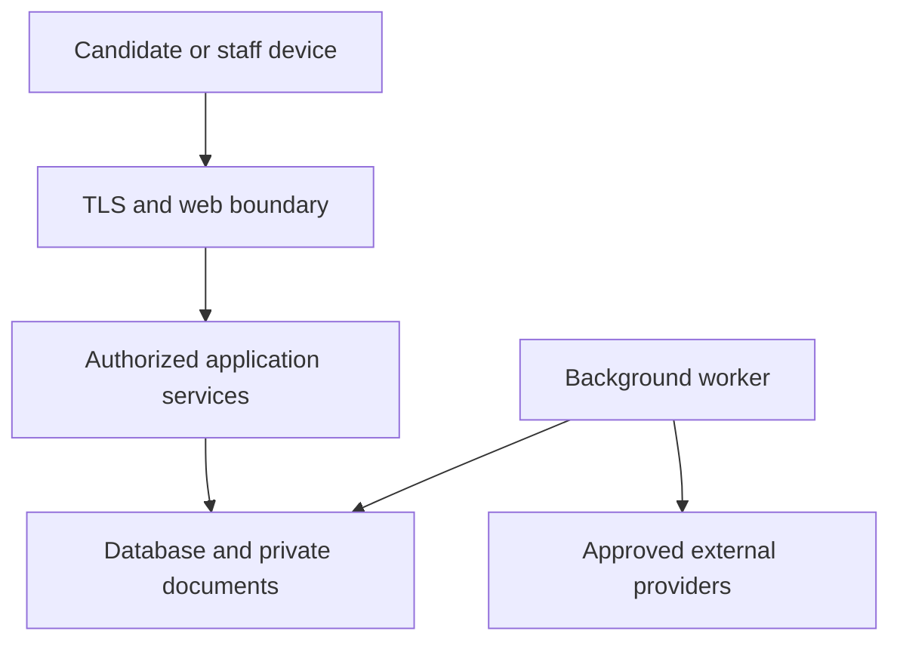
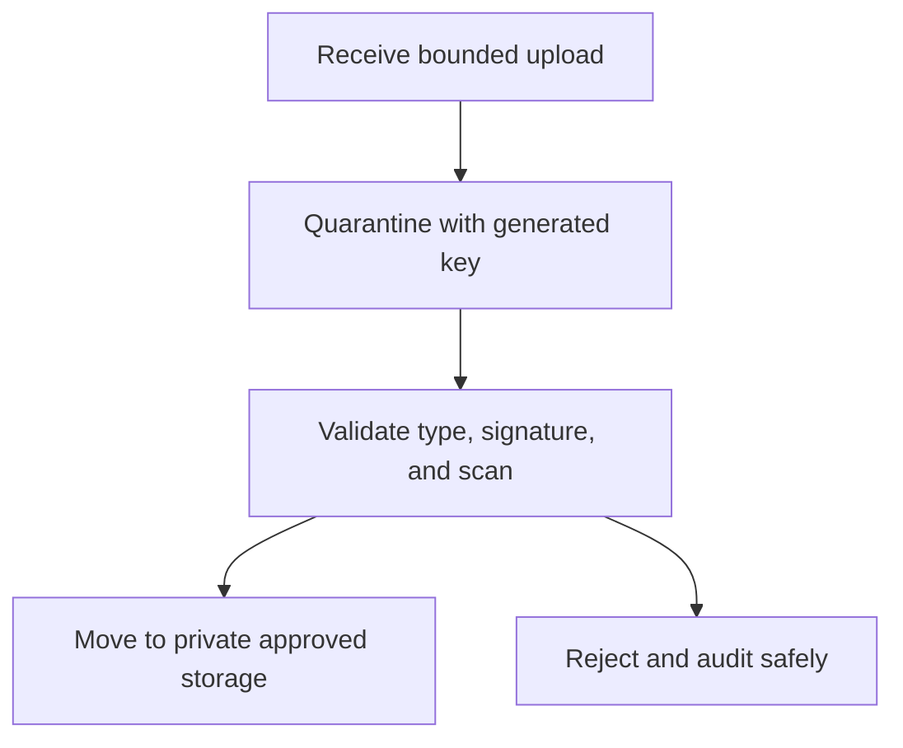
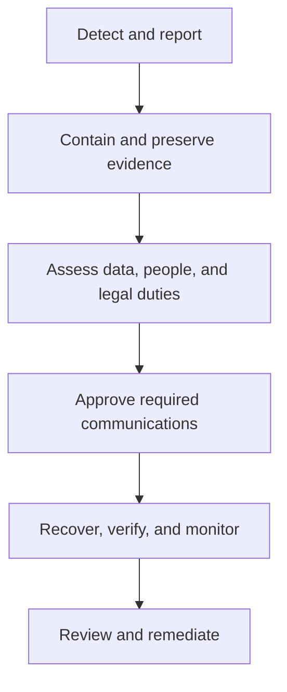

# Security and Privacy Specification

## 1. Purpose

This document defines the security, privacy, data-handling, retention, and incident-response requirements for Release 1 of the PSA Workforce Hiring System.

The system processes high-sensitivity employment information for W-2 candidates and separately approved 1099 contractors. Release 1 begins at candidate intake and ends at **Ready for Assignment**.

This document is an engineering specification, not legal advice. Before production launch, qualified Kentucky employment/privacy counsel and the agency’s compliance leadership must approve:

- Applicable laws and contractual duties.
- Required screening disclosures and notices.
- Worker-specific retention schedules.
- Whether the agency or any integration is subject to HIPAA in a particular capacity.
- Incident-notification decision procedures.

## 2. Security Objectives

The system must preserve:

- **Confidentiality:** only authorized people and services can access information.
- **Integrity:** records, approvals, evidence, and workflow decisions cannot be silently altered.
- **Availability:** authorized users can complete time-sensitive hiring actions.
- **Accountability:** significant access and decisions are attributable and auditable.
- **Privacy:** personal information is collected and used only for approved purposes.
- **Safety:** no worker becomes Ready for Assignment by bypassing a required gate.

Security follows NIST Cybersecurity Framework 2.0 concepts: Govern, Identify, Protect, Detect, Respond, and Recover. Application verification should target OWASP ASVS Level 2 as the default Release 1 baseline, with stricter controls for authentication, restricted data, files, audit, and administrative operations.

## 3. Compliance Position and Legal Review Gates

### 3.1 Employment records and HIPAA

Do not label the entire application “HIPAA compliant” merely because it stores TB, drug-screen, or other health-related employment records.

HHS explains that the HIPAA Privacy Rule applies to covered entities and generally does not protect employment records held in an employer capacity, even when those records contain health information. However, a provider, health plan, business-associate relationship, or other operating model may create separate obligations.

Before production:

1. Document the agency’s HIPAA status and relevant business relationships.
2. Identify whether any provider sends protected health information and under what authorization or legal basis.
3. Execute required agreements if a covered-entity/business-associate relationship exists.
4. Apply this specification’s restricted-medical controls regardless of whether HIPAA applies.

The architecture must be capable of stronger HIPAA-specific controls if the approved legal analysis requires them.

### 3.2 Medical-information confidentiality

Applicant and worker medical information must be segregated from general personnel records. The system treats TB, medical clearance, accommodation-related data, and drug-screen medical information as **Restricted Screening and Medical**.

Access is limited to designated compliance users with a business need. Recruiters and ordinary HR views receive only safe statuses such as Pending, Action Needed, Cleared, Not Cleared, or Review Required.

### 3.3 Consumer reports and background screening

When the agency obtains a consumer report from a consumer reporting agency for an employment-related decision, the workflow must support approved FCRA processes, including:

- Standalone disclosure and documented authorization before ordering where required.
- Preservation of the exact disclosure/authorization version.
- Pre-adverse notice package before an adverse decision when required.
- Candidate access to the report and applicable summary of rights.
- A review/dispute opportunity and tracked waiting period established by policy/counsel.
- Final adverse-action notice with required provider information and rights.
- Secure disposal when retention is no longer required.

Legal counsel must approve templates and applicability for both W-2 and 1099 paths. The system does not determine that question from worker label alone.

### 3.4 Kentucky breach notification

The incident plan must include a legal assessment under KRS 365.732 and any other applicable law. Kentucky’s statute addresses notice to affected Kentucky residents when unencrypted personally identifiable information was, or is reasonably believed to have been, acquired by an unauthorized person.

The software must preserve the evidence needed to determine:

- What information was affected.
- Whether it was encrypted and whether keys were compromised.
- Which individuals and states were involved.
- When discovery, containment, and assessment occurred.
- Which vendors or authorities were notified.

The application must not automatically decide whether legal notification is required.

## 4. Data Inventory and Classification

Every database field, document type, event payload, report column, and provider attribute must have an owner, purpose, classification, retention class, and allowed audience.

| Classification | Examples | Default controls |
|---|---|---|
| Public | Published position, agency contact information | Integrity protection; public read |
| Internal | Workflow configuration, aggregate operational metrics | Authenticated staff; no public access |
| Confidential Personnel | Applications, employment history, interview notes, compensation, training | Scoped staff access; encryption; audited export |
| Restricted Identity and Financial | SSN/TIN, I-9, identity document, banking, tax forms, signature evidence | Field/document-level authorization; encryption; masking; access audit; recent authentication |
| Restricted Screening and Medical | Background reports, registry results, drug screen, TB, medical clearance, disputes | Separate logical files; specialty-role access; no general search; access audit; export restriction |
| Security and Audit Restricted | Password/session material, recovery state, access logs, security events | Security-service access; immutable/protected logs; never exposed to business users |

### Prohibited storage

Do not store:

- Plaintext passwords, MFA secrets, recovery tokens, or session cookies.
- Full payment-card data.
- Provider secrets in database configuration tables.
- Raw restricted provider payloads unless an approved requirement proves they are necessary.
- Candidate documents in a public web directory.
- Sensitive values in URLs, analytics, logs, crash reports, test recordings, source code, or AI prompts.

## 5. Privacy Principles

### 5.1 Purpose limitation

Each collection point states why information is needed and how it will be used. A field collected for screening or onboarding may not be repurposed for marketing, model training, employee monitoring, or unrelated analytics without a separately approved legal and privacy basis.

### 5.2 Data minimization

- Collect only information required for the approved hiring step.
- Delay high-risk collection until it is needed.
- Prefer a provider’s disposition or verification token over a full report when sufficient.
- Do not collect identity documents during initial application unless approved requirements require it.
- Do not ask for an entire medical record when a narrower status or document is sufficient.
- Avoid duplicating SSN/TIN, banking, screening, or medical values across tables.

### 5.3 Transparency and consent

The candidate portal must preserve:

- Privacy notice version and acceptance time.
- Disclosure, authorization, and consent versions.
- Signer identity and authentication context.
- Material notice changes and re-acceptance when required.
- Revocation/withdrawal requests and their effect.

Consent must not be bundled where a standalone disclosure or authorization is required.

### 5.4 Accuracy and correction

Candidates can correct drafts directly. After submission or approval, corrections use a controlled request, amendment, or replacement so prior versions remain intact.

Screening disputes are tracked separately from ordinary profile corrections. The application must not let staff edit a provider’s report to “fix” disputed information.

### 5.5 No production data in development or AI systems

Production personal information must never be copied into:

- Local development databases.
- Automated test fixtures.
- Screenshots or demo recordings.
- Issue trackers without approved redaction.
- Claude, Antigravity, or other AI prompts and context files.
- Public error-reporting or analytics services.

Use deterministic synthetic candidates and documents. If production debugging is unavoidable, use an approved time-limited support process with minimum access and full auditing.

## 6. Threat Model

### 6.1 Protected assets

- Candidate identities and contact information.
- SSNs/TINs, I-9 records, identity images, and signatures.
- Tax and banking documents.
- Background, registry, drug-screen, TB, and medical records.
- Classification, offer, compensation, and adjudication decisions.
- Training, competency, and readiness evidence.
- Authentication/session secrets.
- Audit history, encryption keys, backups, and provider credentials.

### 6.2 Threat actors

- Unauthenticated external attacker.
- Candidate attempting to access another candidate.
- Staff exceeding role or record scope.
- Privileged administrator abusing technical access.
- Compromised staff/candidate account.
- Malicious or vulnerable third-party provider.
- Malware embedded in an upload.
- Accidental disclosure through logs, exports, email, or support activity.
- Developer dependency, build, or deployment compromise.

### 6.3 Primary abuse cases

| Abuse case | Required defense |
|---|---|
| Enumerate candidate accounts | Generic authentication/recovery responses; rate limits |
| Change a URL to open another record | Object-level server authorization on every request |
| Recruiter opens a medical report | Field/document classification and specialty-role check |
| Administrator approves readiness | Separation of technical and business authority |
| Edit status directly | Named commands and domain transition policies |
| Reuse expired signing link | One-time, expiring, audience-bound token and current-version check |
| Upload executable content as PDF | Allowlist, signature detection, size limit, quarantine, scan, safe serving |
| Replay provider webhook | Signature, timestamp, nonce/event deduplication, idempotency |
| Export all candidates | Separate export permission, scope, purpose, bounds, audit, secure delivery |
| Hide action by changing audit data | Append-only records and protected audit access |
| Use stale approval page | Optimistic concurrency and transaction-time gate recalculation |
| Production starts with fake screening | Startup configuration validation and fail closed |

### 6.4 Trust boundaries



Data is untrusted whenever it crosses a boundary, including data returned by an approved provider.

## 7. Identity and Authentication

### 7.1 Account rules

- Staff accounts are invitation-only.
- Candidate accounts require verified email ownership before sensitive actions.
- Account identifiers are application-generated and nonsequential.
- Normalize email for comparison while preserving a display value.
- Service accounts cannot perform interactive login.
- Disabled accounts and revoked role assignments take effect immediately.

### 7.2 Password authentication

If passwords are supported:

- Store only hashes produced by a modern adaptive password-hashing algorithm supported by the authentication library.
- Allow long passphrases and paste/password-manager use.
- Do not impose arbitrary composition rules that encourage predictable passwords.
- Reject known-compromised passwords using an approved privacy-preserving check.
- Do not require periodic rotation without evidence of compromise or a policy/legal requirement.
- Rate-limit login and recovery by account, network indicators, and risk signals without enabling denial-of-service against a user.

Authentication-library configuration and password parameters require a security review and must not be reimplemented in business code.

### 7.3 Multifactor authentication

- MFA is required for privileged staff in production.
- Prefer phishing-resistant WebAuthn/passkeys for staff.
- TOTP may be an approved fallback.
- SMS is recovery/fallback only if risk acceptance permits it; it is not the preferred factor.
- MFA reset requires verified identity, documented reason, notification, and audit.
- Recovery codes are hashed or strongly protected and shown only once.

### 7.4 Reauthentication

Recent authentication is required for configured high-risk actions, including:

- Viewing or downloading identity/financial/medical/screening documents.
- Changing MFA or recovery settings.
- Exporting restricted information.
- Approving classification, screening disposition, or Ready for Assignment.
- Changing privileged roles/scopes.
- Using break-glass access.

### 7.5 Account recovery

- Recovery responses do not reveal whether an unrelated email has an account.
- Tokens are random, hashed at rest, single use, purpose bound, and short lived.
- Successful recovery revokes existing sessions as configured.
- Staff recovery follows a stronger support process than candidate recovery.
- Recovery events notify the account through an independent verified channel when practical.

## 8. Session Security

- Use secure, HTTP-only, same-site cookies.
- Rotate the session identifier after login, MFA, privilege change, and recovery.
- Never store session tokens in browser local storage.
- Enforce idle and absolute timeouts by account type and risk.
- Warn users before timeout and protect saved drafts.
- Revoke sessions after account disable, password reset, suspected compromise, or critical role change.
- Let users view and terminate other active sessions where supported.
- Validate origin/CSRF protection on state-changing browser requests.
- Do not accept authentication tokens in URLs.
- Limit concurrent privileged sessions if agency policy requires it.

## 9. Authorization and Separation of Duties

Every request evaluates:

```text
authenticated
AND account active
AND permission granted
AND record within scope
AND field/document classification allowed
AND workflow state permits command
AND separation-of-duties rule passes
AND recent authentication present when required
```

### Required controls

- Deny by default.
- Enforce object-, action-, and field-level authorization on the server.
- Load current roles/scopes for sensitive actions rather than trusting stale client/session claims.
- Apply authorization to page rendering, API responses, files, search, reports, exports, jobs, and provider callbacks.
- Prevent candidates from accessing internal notes and other records.
- Prevent administrators from gaining ordinary business-record authority through technical role alone.
- Compare actor identifiers, not only role names, for two-person approval.
- Redact unauthorized fields before serialization.
- Test direct requests to hidden routes and fields.

### Break-glass access

If implemented, break-glass access requires:

- An approved emergency purpose.
- Strong reauthentication.
- Narrow record/data scope.
- Short automatic expiration.
- Reason and incident/ticket reference.
- Immediate alert to compliance/security.
- Separate post-event review.

Break-glass access cannot approve classification, screening disposition, competency, or readiness.

## 10. Application and API Security

- Validate all untrusted input with allowlisted schemas at the application boundary.
- Use parameterized database access through the ORM/repositories.
- Encode output for its HTML, URL, CSV, JSON, or document context.
- Apply a restrictive Content Security Policy and security headers.
- Validate redirect destinations against an allowlist.
- Restrict CORS; browser clients should use same-origin endpoints by default.
- Rate-limit authentication, invitations, recovery, public application, uploads, downloads, webhooks, and exports.
- Use generic external errors and internal correlation IDs.
- Bound pagination, search terms, report ranges, and export sizes.
- Protect against CSV/formula injection in exports.
- Do not deserialize arbitrary code or accept user-defined templates/scripts.
- Deny server-side requests to arbitrary URLs; provider destinations are configured allowlisted endpoints.
- Recalculate authorization and business gates at command execution time.
- Use idempotency keys for retried commands and provider operations.

## 11. Document and Upload Security

### 11.1 Upload pipeline



### 11.2 Required controls

- Allowlist file categories, extensions, MIME types, and file signatures by task.
- Apply per-file and per-request size limits.
- Generate storage keys; never use the candidate filename as a filesystem path.
- Normalize display names and remove control/path characters.
- Quarantine until malware and validation checks succeed.
- Reject archives unless an approved use case requires and safely inspects them.
- Reject active content and executable formats by default.
- Re-encode images or documents when an approved safe-processing pipeline exists.
- Store outside the public web root in private object storage.
- Attach classification, owner, version, hash, scan state, and retention class.
- Prevent preview/download until scan status is Approved.
- Set safe download headers and a non-executable content type.
- Authorize every preview/download and audit restricted-document access.
- Use short-lived signed delivery or authorized streaming; never permanent public URLs.
- Prevent a replaced document from silently erasing the prior compliance version.

Local development uses synthetic documents and an explicit test scanner. Production startup fails if the test scanner is configured.

## 12. Database Security

- Use dedicated application, migration, backup, and read-only operational identities.
- Grant the application only required schema privileges.
- Restrict database network access to approved application/worker paths.
- Require encrypted connections outside the developer machine.
- Enforce foreign keys, unique constraints, checks, and transactions.
- Do not expose the database to candidate devices or the public internet.
- Encrypt managed database storage and backups.
- Log privileged schema/role changes through infrastructure controls.
- Review SQL migrations for data exposure, destructive change, and rollback impact.
- Separate restricted-data read models from general search and dashboard queries.

## 13. Encryption and Key Management

### In transit

- Require modern TLS in staging and production.
- Redirect or reject plaintext HTTP.
- Validate provider certificates.
- Use mutually authenticated or signed provider connections when supported.

### At rest

- Use platform-managed encryption for database, object storage, backups, and logs.
- Add application/field-level encryption for designated SSN/TIN, banking, identity, and other approved restricted fields.
- Store only masked/search tokens separately when a business function requires lookup.
- Never implement custom cryptographic algorithms.

### Key lifecycle

- Production keys live in an approved key-management service, not environment files or the database.
- Separate keys by environment and purpose.
- Limit decrypt permission to the exact application role.
- Record administrative key use without recording plaintext.
- Define rotation, revocation, backup, recovery, and compromise procedures.
- Keep old key versions available only as long as required to decrypt retained records.
- Treat loss of encrypted data plus its usable key as potential plaintext exposure during incident assessment.

## 14. Secrets Management

- Secrets are injected from environment-specific secret storage.
- `.env.example` contains names and safe placeholders only.
- Never commit `.env`, keys, certificates, tokens, or provider credentials.
- Prevent secrets from entering logs, error trackers, screenshots, test output, or AI context.
- Use separate credentials for local, test, staging, and production.
- Scope provider credentials to minimum operations.
- Rotate on personnel/vendor change and immediately after suspected disclosure.
- CI uses short-lived workload credentials where the platform supports them.
- Automated secret scanning blocks commits and builds containing likely secrets.

## 15. Screening and Medical Data Controls

### Screening

- Store provider report references separately from general candidate data.
- Allow recruiters and ordinary HR users to see status only.
- Restrict raw reports and adjudication to designated compliance users.
- Record who viewed, downloaded, entered, or decided a restricted screening item.
- Separate provider result ingestion from human disposition.
- Map unknown provider states to Review Required.
- Preserve pre-adverse, dispute, and final-action evidence as versioned records.
- Do not include report contents in email/SMS or ordinary audit descriptions.

### Drug screening, TB, and medical records

- Maintain a separate restricted medical document category and authorization policy.
- Prefer fitness/clearance status and validity dates over unnecessary clinical details.
- Prevent these fields from appearing in recruiting search, dashboards, general exports, or candidate communications.
- Release only candidate-appropriate status/instructions.
- Require a narrower permission for download than for viewing a safe status.
- Track expiration without copying medical content into reminder jobs.

## 16. External Provider and Webhook Security

Before onboarding a provider, document:

- Data categories and purpose.
- Data location and subprocessors.
- Encryption and identity controls.
- Retention and deletion commitments.
- Incident-notification terms.
- Audit/assurance evidence.
- Availability, support, and exit/export process.
- Contractual responsibility for candidate requests and legal notices.

Provider integration rules:

- Use adapters; business modules do not import vendor SDKs directly.
- Send the minimum required data.
- Use unique credentials per environment.
- Sign and verify webhooks with timestamp/replay protection.
- Deduplicate provider event identifiers.
- Sanitize and bound payloads before parsing/storage.
- Store a safe normalized result, not an unrestricted raw payload by default.
- Use idempotency keys for orders and signatures.
- Quarantine ambiguous responses for human review.
- Disable sandbox endpoints/credentials in production and production endpoints in local/staging.

## 17. Logging, Monitoring, and Audit

### Operational logs

Use structured allowlisted fields such as:

- Timestamp.
- Severity.
- Environment/service/module.
- Route template or job type.
- Correlation ID.
- Non-secret actor/account reference.
- Safe internal record reference.
- Result/error code.
- Duration.

Never log:

- Passwords, MFA material, sessions, tokens, or authorization headers.
- SSNs/TINs, banking values, identity-document numbers, or full addresses.
- Application request/response bodies containing personal information.
- Background, drug-screen, TB, or medical details.
- Document contents or signed provider URLs.
- Encryption keys or raw provider payloads.

Redaction must occur before log serialization. Logging failure must not expose data to the user or silently bypass a required business audit.

### Business audit history

Audit records are append-only and include actor, effective role/scope, action, resource reference, safe change summary, reason code, timestamp, correlation ID, and outcome.

Audit events are required for:

- Login/recovery/MFA/security changes.
- Role and scope changes.
- Candidate/application create, submit, return, correct, and withdraw.
- Classification, offer, screening, onboarding, training, competency, hold, and readiness decisions.
- Restricted document view/download/export.
- Template/requirement publication.
- Break-glass access.
- Retention, legal hold, archive, and deletion operations.

### Monitoring and alerts

Alert on:

- Repeated authentication failure or recovery abuse.
- Privilege assignment and MFA reset.
- Cross-record authorization denials or enumeration patterns.
- High-volume restricted access or export.
- Malware detection.
- Webhook verification failure/replay.
- Production use of an unapproved adapter.
- Audit-write failure.
- Backup failure or recovery-test failure.
- Sustained background-job backlog.
- Unexpected configuration or schema change.

## 18. Retention, Legal Hold, and Disposal

### 18.1 Policy model

Do not implement one global retention period. Each record/document category has:

- Legal/policy authority.
- Trigger event.
- Retention duration or formula.
- Review date.
- Disposition action.
- Legal-hold behavior.
- Responsible owner.
- Approved exceptions.

### 18.2 Initial retention classes

| Class | Examples | Release 1 behavior |
|---|---|---|
| Recruiting | Application, interview, selection | Retain by approved applicant/personnel policy |
| Classification | W-2/1099 analysis and decision | Retain with worker engagement and defense requirements |
| FCRA screening | Report, authorization, adverse-action evidence | Counsel-approved FCRA/employment schedule and secure disposal |
| Medical | TB, drug screen, medical clearance | Separate confidential schedule; no general personnel merge |
| I-9 | Form and supporting copies if retained | Formula based on hire/termination dates |
| Tax/payment | W-4/W-9 and payment setup | Tax/accounting schedule |
| Training/competency | Completion and evaluation evidence | Workforce/compliance schedule |
| Audit/security | Business audit and security logs | Purpose-specific schedule; protected from ordinary deletion |
| Unfinished prospect | Minimal contact/invitation | Short approved inactivity window |

USCIS states Form I-9 must be retained for three years after hire or one year after employment ends, whichever is later. Store the formula, relevant dates, and calculated eligible-disposal date; do not hard-code a single number for every I-9.

### 18.3 Legal hold

- A legal hold suspends normal deletion for defined records.
- Only designated users may create, change, or release a hold.
- Hold scope, reason, authority, date, custodian, and release approval are audited.
- Users must not be able to infer confidential investigation details from the hold label.
- Backups and provider copies must be addressed in the hold procedure.

### 18.4 Disposal

- Disposal is an approved background job, not an ordinary delete button.
- Verify eligibility and absence of active holds immediately before disposal.
- Delete or cryptographically render unreadable data across primary storage, derived search/read models, exports, and provider copies as required.
- Account for backup expiration rather than attempting unsafe ad hoc backup edits.
- Preserve a minimal non-sensitive disposal certificate/audit record.
- Consumer-report information must be disposed of securely so it cannot be practically read or reconstructed.
- Failed or partial disposal creates a security/compliance work item.

## 19. Candidate Privacy Requests

The system should support controlled intake and tracking of requests to:

- Access candidate-provided information.
- Correct inaccurate information.
- Obtain candidate copies of signed documents.
- Exercise screening-report dispute rights through the appropriate process.
- Ask about use/retention of personal information.
- Request deletion where legally and operationally permitted.

The system does not promise deletion when retention law, legal hold, fraud/security need, or defense of claims requires preservation. Identity verification and authorized redaction occur before releasing records.

## 20. Backups, Availability, and Recovery

- Encrypt backups and restrict backup-administration roles.
- Define production recovery point and recovery time objectives before launch.
- Use managed point-in-time recovery for PostgreSQL where available.
- Protect object/document versions according to retention requirements.
- Test database and document restoration on a scheduled basis.
- Restore tests use isolated environments and restricted access.
- Verify application/database/document consistency after recovery.
- Record backup, restore, and recovery-test results.
- Do not treat replication as a backup.
- Maintain a documented degraded-mode process for time-sensitive candidate notices and screening disputes.

## 21. Incident Response

### 21.1 Incident lifecycle



### 21.2 Required incident procedure

1. Record a secure incident reference and discovery time.
2. Assign incident commander, security lead, legal/privacy lead, and communications owner.
3. Preserve evidence without copying restricted data into ordinary tickets or chat.
4. Contain compromised sessions, credentials, providers, or infrastructure.
5. Determine affected systems, records, fields, individuals, states, encryption, and key status.
6. Assess contractual and legal notification duties, including Kentucky law where applicable.
7. Coordinate vendor, insurer, law-enforcement, regulatory, and individual communications through authorized leadership/counsel.
8. Recover from verified clean state and increase monitoring.
9. Document root cause, control failures, corrective actions, and deadlines.
10. Test changes and close only after approved review.

Never send breach notices automatically based only on an application alert. Do not delay internal escalation while waiting for certainty.

## 22. Infrastructure and Environment Security

### Local development

- Synthetic data only.
- PostgreSQL and Mailpit bound to local interfaces where practical.
- Fake providers clearly marked.
- No production credentials or connections.
- Private local document directory outside the public web root.

### CI/test

- Ephemeral test databases and synthetic fixtures.
- No secrets in test output/artifacts.
- Restricted artifact retention.
- Dependency, secret, lint, type, migration, and security tests.
- Pull requests from untrusted sources do not receive production-capable secrets.

### Staging

- Production-like controls with synthetic data.
- Sandbox provider accounts only.
- Separate identities, keys, storage, database, and domains.
- Restricted staff access and audit enabled.

### Production

- Private database/storage paths.
- Least-privilege workload identities.
- Managed keys/secrets and encrypted backups.
- Web application firewall/rate controls where appropriate.
- Central security logs and alerting.
- Controlled deployment and migration identity.
- No debug mode, source maps containing secrets, test endpoints, fake adapters, or sample accounts.
- Administrative access through approved MFA-protected channels.

## 23. Secure Development Lifecycle

### Before coding

- Link each feature to approved requirements and data classifications.
- Identify abuse cases and authorization tests.
- Determine audit and retention effects.
- Review new external data flows and dependencies.

### During coding

- Use typed boundaries and centralized authorization.
- Keep secrets and personal data out of fixtures and prompts.
- Add positive, negative, cross-record, stale-version, and audit tests.
- Use approved provider/storage interfaces.
- Avoid custom authentication, encryption, signature, and file-parsing code when maintained libraries/services exist.

### Pull-request checks

- Peer review required for authentication, authorization, migrations, restricted data, crypto, provider webhooks, files, audit, and retention changes.
- Automated lint, strict typecheck, tests, build, migration-from-empty, dependency audit, secret scan, and module-boundary checks.
- Security-significant changes include a threat/abuse-case note.
- Generated AI code receives the same review as human-written code.

### Dependency and supply-chain controls

- Pin dependencies with the lockfile.
- Review direct packages for maintenance, license, security history, and necessity.
- Minimize packages, especially file parsers and authentication extensions.
- Enable automated vulnerability alerts and scheduled updates.
- Produce a software bill of materials for production releases when tooling is established.
- Sign or attest release artifacts where the deployment platform supports it.
- Prevent package lifecycle scripts from receiving unnecessary secrets.

## 24. AI-Assisted Development Rules

Claude, Antigravity, and other coding assistants must:

- Read `CLAUDE.md`, `AGENTS.md`, and relevant specifications before editing.
- Use synthetic examples only.
- Never receive production candidate data, documents, credentials, logs, or screenshots.
- Never invent a compliance rule or mark a legal question resolved.
- Preserve server-side authorization and workflow gates.
- Add tests for unauthorized and cross-record access.
- Avoid logging or returning sensitive values for debugging.
- Flag security-sensitive assumptions for human review.
- Not add telemetry, external APIs, packages, or cloud services without approval.

Prompt history and generated code must be treated as potentially retained outside the runtime environment. Do not place confidential business material in prompts unless the agency has approved that provider and use.

## 25. Security Testing Requirements

Before production, verify:

- Candidate A cannot access Candidate B by URL, search, API, file, export, or timing/error difference.
- Recruiters cannot access restricted screening/medical content.
- Administrators cannot perform business approvals.
- Revoked roles and disabled accounts lose access immediately.
- MFA and recent-authentication gates operate on high-risk actions.
- Login, recovery, invitation, upload, and export abuse is rate-limited.
- CSRF, XSS, SQL injection, open redirect, SSRF, path traversal, and CSV injection defenses.
- Uploaded files cannot execute or become public before approval.
- Provider webhook signatures, timestamps, and replay controls.
- Unknown provider states fail safely.
- Sensitive values are absent from logs, traces, errors, analytics, email, and test artifacts.
- Audit records are generated atomically and cannot be modified by ordinary users.
- Backups can restore database plus document consistency.
- Production refuses test adapters and missing security configuration.
- Ready-for-Assignment approval cannot bypass expired, failed, disputed, missing, or unauthorized requirements.

Perform an independent penetration test before production use and after material changes to identity, authorization, file handling, provider integrations, or infrastructure.

## 26. Production Security Gate

Production deployment is blocked until:

- Legal/compliance applicability review is recorded.
- Data inventory, classification, and approved retention schedule are complete.
- Threat model and privacy review are approved.
- Authentication, MFA, recovery, authorization, and separation-of-duty tests pass.
- Production secrets, keys, database, documents, backups, monitoring, and incident contacts are configured.
- Provider contracts and security reviews are approved.
- FCRA/adverse-action templates and workflow timing are approved where applicable.
- Medical/screening separation is verified.
- Vulnerability scanning and independent penetration testing have no unresolved critical/high findings without formal risk acceptance.
- Backup restoration and incident tabletop exercises are completed.
- Candidate privacy notice and support/escalation processes are published.
- Production contains no synthetic default accounts, fake adapters, or unrestricted support access.

## 27. Required Decision Register

The following decisions remain open until an authorized owner records them:

| Decision | Owner | Required before |
|---|---|---|
| HIPAA applicability and relationships | Legal/compliance | Production data design approval |
| FCRA applicability/templates for each worker path | Employment counsel/HR | Screening provider integration |
| Exact retention schedule by record class | Legal/HR/compliance | Production launch |
| MFA and session timeout policy | Security/management | Staff pilot |
| Field-level encryption list | Security/data owner | Production migration |
| Approved file types and maximum sizes | Security/business owners | Upload implementation |
| Production hosting and data location | Management/security | Infrastructure build |
| Email/SMS content and provider | Privacy/operations | Notification integration |
| Screening/e-signature/storage vendors | Management/legal/security | Vendor implementation |
| Incident contacts and insurance notice duties | Leadership/legal | Production launch |
| Recovery point/time objectives | Business owner/engineering | Production launch |

## 28. Authoritative References

Use current versions at implementation and legal-review time:

- [NIST Cybersecurity Framework 2.0](https://www.nist.gov/cyberframework).
- [NIST SP 800-63-4 Digital Identity Guidelines](https://pages.nist.gov/800-63-4/).
- [NIST Privacy Framework](https://www.nist.gov/privacy-framework).
- [OWASP Application Security Verification Standard](https://owasp.org/www-project-application-security-verification-standard/) and [Cheat Sheet Series](https://cheatsheetseries.owasp.org/).
- FTC guidance, [Using Consumer Reports: What Employers Need to Know](https://www.ftc.gov/business-guidance/resources/using-consumer-reports-what-employers-need-know).
- HHS guidance, [Employers and Health Information in the Workplace](https://www.hhs.gov/hipaa/for-individuals/employers-health-information-workplace/index.html).
- EEOC guidance, [Health Care Workers and the Americans with Disabilities Act](https://www.eeoc.gov/laws/guidance/health-care-workers-and-americans-disabilities-act).
- [USCIS I-9 Central retention guidance](https://www.uscis.gov/i-9-central/form-i-9-resources/handbook-for-employers-m-274/100-retaining-form-i-9).
- [Kentucky Revised Statutes KRS 365.732](https://apps.legislature.ky.gov/law/statutes/statute.aspx?id=43326).

Project documentation must cite the exact approved legal sources and versioned agency templates when requirements are configured. A link in this document is not a substitute for legal approval.

## 29. Security and Privacy Acceptance Criteria

This specification is satisfied when:

- Every stored field/document has classification, purpose, owner, and retention class.
- Candidate, staff, administrator, service, and provider trust boundaries are enforced.
- Restricted identity, financial, screening, and medical information is encrypted, masked, segregated, and audited.
- Candidates cannot access internal or other-candidate information.
- Staff permissions enforce role, record scope, field sensitivity, workflow state, and separation of duties.
- Authentication, MFA, sessions, recovery, and high-risk reauthentication meet approved policy.
- Files are quarantined, validated, scanned, stored privately, and served only after authorization.
- Provider calls/webhooks are authenticated, minimized, idempotent, and replay resistant.
- Logs and analytics exclude personal and secret data.
- Audit history is append-only and written atomically with significant changes.
- Retention and legal holds are category specific and approved.
- Incident and Kentucky breach-assessment procedures are documented and tested.
- Production data never enters development, tests, demos, or AI prompts.
- Production cannot start with insecure or test-only configuration.

## 30. Next Design Document

The next artifact is `docs/TEST_STRATEGY.md`. It will translate product, workflow, permission, architecture, UI, security, privacy, and readiness requirements into automated and manual test layers, test data, traceability, environments, and release gates.
