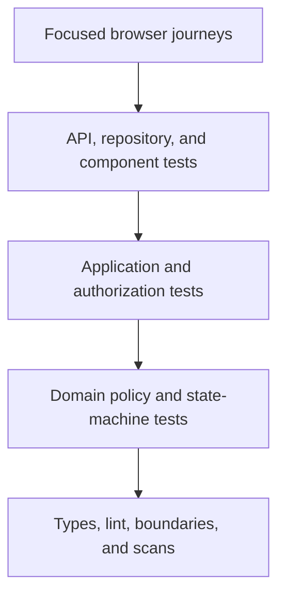

# Release 1 Test Strategy

## 1. Purpose

This document defines how Release 1 of the PSA Workforce Hiring System will be verified from candidate intake through **Ready for Assignment**.

It translates the product requirements, hiring workflow, role/permission matrix, data model, architecture, UI flow, and security/privacy specification into executable tests, manual reviews, evidence, and release gates.

Release 1 testing does not cover client assignment, scheduling, EVV, timesheets, payroll, billing, or leave except to prove that those capabilities are not exposed.

## 2. Quality Objectives

The test program must prove that:

1. Candidates can complete the approved hiring journey without staff re-entering their information.
2. W-2 and approved 1099 paths receive the correct requirements.
3. A proposed or rejected 1099 path cannot bypass classification approval.
4. Workflow stages change only through authorized commands and satisfied gates.
5. Ready for Assignment cannot be granted while any applicable requirement is missing, failed, expired, disputed, blocked, or unauthorized.
6. Candidates can access only their own candidate-facing information.
7. Staff access is limited by role, record scope, field sensitivity, workflow state, and separation of duties.
8. Restricted identity, financial, screening, and medical information is not exposed through UI, APIs, logs, exports, errors, or test artifacts.
9. Compliance-significant changes create complete, immutable audit evidence.
10. Provider failures, duplicate requests, stale pages, retries, and concurrent decisions fail safely.
11. Candidate and staff workflows are accessible and usable on supported devices.
12. A clean database can be migrated, seeded with synthetic data, and used to run the full test suite reproducibly.

## 3. Testing Principles

- Test business risk, not only code paths.
- Put most rule combinations in fast domain/application tests.
- Use a real PostgreSQL instance for repository, transaction, constraint, migration, and concurrency behavior.
- Mock only true boundaries; do not mock the domain under test.
- Keep browser tests focused on critical user journeys and integration seams.
- Test unauthorized, invalid, stale, repeated, and exceptional behavior alongside success behavior.
- Assert observable outcomes: state, audit, outbox, safe response, and absence of data leakage.
- Use semantic and accessible UI queries that resemble user interaction.
- Keep each test independent and deterministic.
- Use synthetic data only.
- Treat flaky tests as defects, not normal noise.

## 4. Test Traceability

Every testable requirement uses a stable identifier from the source specification.

### Traceability sources

| Source | Examples |
|---|---|
| Product requirements | `PRD-AUTH-001`, workflow use cases, success measures |
| Workflow | Stage entry/exit gate, command, exception path |
| Permissions | Role/action cell, scope, field access, separation-of-duty rule |
| Data model | Constraint, versioning rule, relationship, sensitive classification |
| Architecture | Transaction, module boundary, adapter, migration, job behavior |
| UI flow | Route, action, page state, confirmation, accessibility behavior |
| Security/privacy | Control, abuse case, retention, audit, production gate |

### Test case metadata

Each durable automated or manual test records:

- Test ID.
- Requirement/control IDs.
- Risk category.
- Worker path: W-2, approved 1099, both, or not applicable.
- Actor/role and record scope.
- Preconditions and synthetic fixture.
- Action.
- Expected business state.
- Expected audit/outbox effects.
- Expected forbidden effects or non-disclosures.
- Test level and automation status.

Use readable IDs such as:

```text
WF-APP-SUBMIT-001
AUTH-CANDIDATE-OBJECT-002
CLASS-1099-SOD-003
READY-BLOCK-EXPIRED-TB-004
SEC-UPLOAD-MALWARE-005
```

Maintain `tests/traceability/requirements.json` after implementation begins. CI validates that every Release 1 requirement marked testable maps to at least one active test or approved manual verification.

## 5. Test Levels and Tools

| Level | Tooling | Primary purpose | Typical speed |
|---|---|---|---|
| Static | TypeScript, ESLint, boundary rules, secret/dependency scanners | Prevent unsafe shapes and dependency violations | Seconds |
| Domain unit | Vitest | Pure policies, state transitions, requirement/readiness rules | Milliseconds |
| Application/service | Vitest | Authorization, orchestration, idempotency, audit/outbox behavior | Milliseconds–seconds |
| Repository/integration | Vitest + real PostgreSQL | Constraints, transactions, migrations, concurrency, mappings | Seconds |
| Component | React Testing Library + Vitest | Accessible forms, page states, masking, confirmation behavior | Seconds |
| API/contract | Vitest/HTTP harness | Request validation, safe responses, webhooks, provider contracts | Seconds |
| End to end | Playwright | Critical candidate/staff workflows in a real browser | Minutes |
| Accessibility | Semantic component tests + axe-compatible scan + manual review | WCAG 2.2 AA expectations | Mixed |
| Security | Automated checks + OWASP-based manual testing + penetration test | Abuse resistance and data protection | Mixed |
| Performance/recovery | Purpose-built scripts and operational exercises | Capacity, queues, backup/restore, degraded behavior | Scheduled |
| User acceptance | Structured scripts | Business correctness and terminology | Before release |

Versions are pinned by `pnpm-lock.yaml`. Test APIs must be checked against the current official documentation when the stack is initialized or upgraded.

## 6. Test Portfolio Shape

The portfolio should be broad at the fast layers and narrow at the browser layer.



Do not duplicate every rule combination in Playwright. For example, the readiness decision table belongs primarily in unit/application integration tests; Playwright proves that representative blockers and approvals are displayed and enforced end to end.

## 7. Test Environments

### 7.1 Developer environment

- Local application and worker.
- Docker PostgreSQL and Mailpit.
- Local private document storage.
- Deterministic fake screening, signature, malware, email, and encryption adapters.
- Synthetic seeded data.

### 7.2 Unit/component environment

- Node or DOM simulation as required.
- Fixed clock, timezone, random source, and UUID generator where relevant.
- No network access.
- No shared mutable fixture state.

### 7.3 Integration environment

- Real supported PostgreSQL version.
- Fresh database/schema per test worker or isolated transaction/schema strategy.
- Actual committed migrations.
- Real job queue tables.
- Fake external adapters at application ports.

SQLite or an in-memory database may not substitute for PostgreSQL integration tests.

### 7.4 End-to-end environment

- Production build or an explicitly controlled test build.
- Web and worker processes.
- Real PostgreSQL.
- Private test document storage.
- Mailpit or captured email provider.
- Deterministic provider scenarios.
- Isolated browser/account state per test or worker.

### 7.5 Staging

- Production-like infrastructure.
- Synthetic data only.
- Sandbox providers only.
- Used for UAT, accessibility/manual review, migration rehearsal, monitoring verification, backup restore, and penetration testing.

No test environment may silently connect to a production provider, database, storage bucket, email/SMS account, or encryption key.

## 8. Synthetic Test Data

### 8.1 Data rules

- Use obviously synthetic names, addresses, emails, SSNs/TINs, bank values, documents, and provider results.
- Use reserved/example domains and non-deliverable test destinations.
- Do not use real candidate documents as templates.
- Make generated data reproducible from a known seed.
- Label every environment and fixture as synthetic.
- Prevent fixtures from satisfying production validation accidentally where a regulator/provider supplies official test values.

### 8.2 Required personas

Create reusable personas for:

- Candidate A with a W-2 path.
- Candidate B with an approved 1099 path.
- Candidate C with pending classification.
- Candidate D with a screening dispute.
- Candidate E with expired TB/training evidence.
- Recruiter scoped to Branch 1.
- Recruiter scoped to Branch 2.
- HR specialist.
- Classification reviewer.
- Compliance reviewer.
- Trainer/evaluator.
- PSA manager.
- System administrator without business-record permission.
- Assigned read-only auditor.
- Unassigned/out-of-scope auditor.

### 8.3 Builders

Prefer typed fixture builders over large shared JSON files:

```text
CandidateBuilder
CandidacyBuilder
RequirementSetBuilder
ScreeningCaseBuilder
TrainingAssignmentBuilder
CompetencyEvaluationBuilder
ReadinessScenarioBuilder
RoleScopeBuilder
```

Builders expose valid defaults. A test overrides only the fact relevant to the scenario. Invalid records that the database would reject must be created only through explicit low-level test helpers.

## 9. Clock, Timezone, and Randomness

Tests must control:

- Current UTC time.
- Candidate/staff display timezone.
- Offer and invitation expiration.
- Requirement due/expiration dates.
- FCRA review/dispute windows configured by approved policy.
- Session idle/absolute timeout.
- Job retry schedule and backoff.
- Random identifiers and idempotency keys when assertions require determinism.

Test daylight-saving transitions and date-only business rules separately. Do not use arbitrary sleeps; advance a fake clock or wait for an observable condition.

## 10. Static Verification

Every pull request runs:

- Strict TypeScript typecheck.
- ESLint and formatting checks.
- Module-boundary/import rules.
- No direct infrastructure imports from domain code.
- No cross-module table/repository access outside approved APIs.
- Migration consistency and generated-schema checks.
- Secret scanning.
- Dependency vulnerability/license checks according to policy.
- Prohibited test-data pattern checks.
- Build verification.

Static checks must detect direct logging of designated sensitive field names and use of development adapters in production configuration where practicable.

## 11. Domain Unit Tests

Domain tests cover pure behavior without database, network, framework, or UI dependencies.

### Required domains

- Workflow state machine.
- Requirement applicability.
- Worker classification decisions.
- Offer state/version rules.
- Screening case transitions.
- Onboarding requirement status.
- Training expiration and remediation.
- Competency outcomes and capability restrictions.
- Compliance holds.
- Final readiness calculation.
- Candidate-visible status projection.

### State-machine test pattern

For every named command, test:

- Valid source state and successful target state.
- Invalid source state.
- Missing prerequisite.
- Unauthorized actor supplied to the application layer.
- Duplicate/repeated command.
- Stale expected version.
- Required reason missing.
- Historical record preserved.
- Candidate-visible status after the transition.

Use table-driven tests for state/command combinations. No test should mutate a status field directly to simulate a valid business action unless it is explicitly constructing a fixture.

## 12. Application-Service Tests

Application tests verify a use case with repositories/provider ports represented by controlled fakes or spies.

Every compliance-significant command must assert:

- Input schema accepted/rejected correctly.
- Current identity, roles, and scopes are evaluated.
- Separation of duties is enforced.
- Aggregate version is checked.
- Domain policy is called.
- Business change is persisted only on success.
- Audit event is written with safe fields.
- Outbox event is written when asynchronous work is needed.
- Provider is not called before transaction commit.
- Candidate/staff response is field filtered.
- Retry with same idempotency key does not duplicate the effect.
- A failed command leaves no partial business/audit/outbox state.

## 13. PostgreSQL and Migration Tests

### 13.1 Migrations

CI must:

1. Create an empty PostgreSQL database.
2. Apply all committed migrations in order.
3. Validate the expected schema.
4. Run the integration suite.
5. Test approved rollback/forward-recovery procedures for release migrations that need them.

For upgrades, also migrate representative synthetic data from the prior released schema.

### 13.2 Constraints

Verify database enforcement for:

- Unique active account/email rules.
- Foreign keys and required relationships.
- One active classification for the engagement.
- Mutually exclusive W-2 and 1099 engagement state.
- Version and supersession integrity.
- Allowed technical enum/check values.
- Append-only audit protections available at the data layer.
- Provider-event and idempotency-key uniqueness.
- Requirement/evidence version relationships.

### 13.3 Transactions

Inject failures at each transaction step and prove rollback of:

- State change plus transition history.
- Decision plus requirement result.
- Business change plus audit event.
- Business change plus outbox event.
- Final review plus readiness record.

### 13.4 Concurrency

Run real concurrent requests for:

- Two reviewers approving the same item.
- Candidate resubmission while staff returns the prior version.
- Offer acceptance while staff withdraws/supersedes it.
- Requirement expiration while final approval is submitted.
- Role revocation during a high-risk action.
- Duplicate webhook/job delivery.

Exactly one valid outcome may commit; the loser receives a safe stale/conflict response.

## 14. Repository Tests

Each repository test verifies:

- Domain-to-row and row-to-domain mapping.
- Sensitive fields are encrypted/decrypted through the approved adapter.
- Unauthorized query methods do not exist on general repositories.
- Soft archive/supersession behavior.
- UTC timestamp precision and date semantics.
- Pagination, stable ordering, and scoped filtering.
- No N+1 or unbounded result behavior on primary lists.
- Optimistic version update predicate.
- Safe behavior when related data is absent, expired, or superseded.

## 15. Component Tests

Use React Testing Library and interact through accessible roles, labels, names, and visible text. Use `data-testid` only when a user-observable query is impractical.

Every important form/component tests:

- Keyboard operation and focus order.
- Visible/programmatic label.
- Required/optional instructions.
- Client validation and server-returned validation.
- Error summary linked to fields.
- Save/loading/disabled state.
- Stale version response preserving user input.
- Empty, denied, error, and success state.
- Masking of restricted values.
- Status conveyed with text, not color alone.
- Confirmation dialog with action/consequence details.
- Focus restoration after dialog close.
- Mobile/responsive behavior where component structure changes.

Snapshots may support stable semantic output but may not replace behavioral assertions.

## 16. API and Route-Handler Tests

For every endpoint or server action, verify:

- Authentication requirement.
- Current account status.
- CSRF/origin behavior for browser mutations.
- Permission, scope, field, state, and separation-of-duty checks.
- Schema validation and bounded inputs.
- Safe error mapping.
- No sensitive fields in response.
- Correct cache-control headers for personal/restricted data.
- Idempotency behavior where applicable.
- Rate-limit policy for abuse-sensitive routes.
- Audit behavior for allowed and required denied events.

Object-level authorization tests must change only the record identifier while keeping a valid authenticated session and prove denial without record-existence disclosure.

## 17. Authentication and Session Tests

Test:

- Candidate registration and email verification.
- Staff invitation-only activation.
- Generic sign-in/recovery responses.
- Password policy and compromised-password rejection when configured.
- MFA enrollment, challenge, recovery code, reset, and required staff enforcement.
- Session rotation after login, MFA, recovery, and privilege change.
- Idle/absolute timeout.
- Sign out and revoke-other-sessions.
- Account disable and role revocation invalidating access.
- Recent-authentication requirement for high-risk actions.
- Recovery token purpose, expiration, single use, and storage protection.
- Cookies use required security attributes.
- No token appears in URL, logs, analytics, or rendered errors.

End-to-end authentication state files are synthetic secrets. Store them only in ignored test-output directories, never commit them, and isolate state by role/test worker.

## 18. Authorization Test Matrix

Automate the role/permission matrix using a reusable authorization harness.

For each protected action, evaluate at least:

| Scenario | Expected result |
|---|---|
| Correct role and record scope | Allow if all other conditions pass |
| Correct role, wrong branch/team | Deny |
| Correct role, unassigned record under assigned-only scope | Deny |
| Wrong role, correct record scope | Deny |
| Role expired/revoked | Deny immediately |
| Field classification not granted | Return redacted/deny field |
| Workflow state disallows action | Deny with safe business error |
| Same actor violates separation of duties | Deny |
| Recent authentication absent | Challenge/deny |
| Candidate owns a different record | Deny without existence disclosure |
| System administrator requests business data | Deny/support process only |
| Auditor outside approved assignment | Deny |

Run matrix tests at policy level and representative HTTP/file/export levels to prove the policy is consistently applied.

## 19. Candidate Journey Tests

### Critical Playwright journey: W-2 candidate

1. Accept valid invitation or open position.
2. Create account and verify email.
3. Start application and save drafts.
4. Upload safe synthetic attachment.
5. Review, certify, and submit.
6. Receive correction request and resubmit one field.
7. Review/schedule interview.
8. Receive, review, and accept approved W-2 conditional offer.
9. Complete screening authorization and candidate actions.
10. Complete W-2 onboarding items.
11. Complete assigned training.
12. View competency status.
13. View final-review status.
14. View Ready-for-Assignment candidate summary after staff approval.

Assertions include accessible navigation, next-action accuracy, notification delivery, safe status wording, version history, and absence of internal/restricted fields.

### Candidate exception journeys

- Expired invitation and resend.
- Duplicate active application.
- Returned application section.
- Interview reschedule and no-show flow.
- Expired/withdrawn/superseded offer cannot be signed.
- Offer decline.
- Screening action required without report detail.
- Pre-adverse/dispute candidate actions when configured.
- Rejected onboarding document and replacement.
- Training remediation.
- Application withdrawal and reactivation request.
- Active hold with approved candidate message.

## 20. Staff Journey Tests

### Critical Playwright journey: staff W-2 flow

1. Recruiter opens prioritized queue.
2. Reviews submitted application and completes prescreen.
3. Schedules interview and submits scorecard.
4. Authorized user records selection.
5. Prepares, approves, and issues offer with required separation.
6. Compliance/HR processes screening and onboarding through permitted views.
7. Trainer records training and competency evidence.
8. Compliance reviewer opens final review and sees calculated requirements.
9. Reviewer resolves a blocker and refreshes calculation.
10. Authorized reviewer grants Ready for Assignment.

### Critical Playwright journey: approved 1099 flow

1. Recruiter proposes 1099.
2. Contractor agreement remains unavailable.
3. Different authorized reviewer evaluates and approves classification.
4. 1099 agreement becomes available.
5. Candidate receives contractor-specific onboarding requirements.
6. W-2-only requirements are not assigned.
7. Screening, training, competency, and final review complete.
8. Ready for Assignment is granted only after all applicable requirements pass.

### Staff exception journeys

- Wrong-branch recruiter denied record.
- Recruiter sees screening status but not report.
- Administrator cannot approve business decision.
- Classification proposer cannot self-approve.
- Dual approval rejects same-user second approval.
- Screening unknown provider state becomes Review Required.
- Final review shows exact missing/expired requirements.
- Stale approval page fails after requirement changes.
- Hold placement/removal requires reason and authorized role.
- Restricted export requires permission, purpose, bounds, and audit.

## 21. Workflow Transition Matrix

Create one table-driven test suite from the canonical transition definition. Each transition tests:

- Source stage.
- Command.
- Target stage.
- Permitted roles.
- Required records/requirements.
- Candidate-visible status/message.
- Audit event type.
- Outbox/notification behavior.
- Invalid source-state result.
- Repeated-command result.

The suite must include terminal and exception states: Withdrawn, Not Selected, Offer Declined, Screening Review Required, Pre-Adverse Action, Dispute Pending, Ineligible, On Hold, and Archived.

No transition is considered implemented until it has positive and negative automated coverage.

## 22. Worker Classification Tests

Test at minimum:

- W-2 is the default path.
- Recruiter proposal of 1099 does not finalize classification.
- Pending 1099 blocks contractor agreement and readiness.
- Proposal author cannot approve their own proposal.
- Approval captures reviewer, rationale, date, and supporting evidence.
- Rejection can route to W-2 or end consideration only through an explicit decision.
- Approved 1099 activates the correct requirement set.
- W-2 and 1099 cannot both be active for one engagement.
- Reclassification creates history and recalculates requirements.
- A requirement from the prior path is resolved according to approved migration rules, not silently deleted.
- Audit and candidate-facing worker-path label are correct.

## 23. Ready-for-Assignment Decision Matrix

Ready for Assignment receives dedicated domain, application, integration, authorization, concurrency, and representative E2E tests.

### Required gate cases

| Gate | Passing case | Blocking cases |
|---|---|---|
| Classification | Final W-2 or approved 1099 | Pending, rejected without W-2 routing, conflicting active classification |
| Offer/agreement | Current required version accepted/signed | Draft, unapproved, issued, expired, withdrawn, declined, superseded |
| W-2 identity/work authorization | Complete and approved when applicable | Missing, returned, expired/reverification required |
| Tax/payment documents | Applicable items complete | Missing, rejected, superseded without approved current version |
| Criminal screening | Required current case approved | Not ordered, pending, review required, disputed, failed, expired |
| Abuse/registry checks | Every applicable registry approved | Missing, pending, match review, failed, expired |
| Drug screen | Applicable current disposition approved | Not scheduled, pending, retest, review required, failed, expired |
| TB/medical | Current permitted clearance | Missing, pending review, expired, unauthorized evidence |
| Policies/acknowledgments | Current applicable versions signed | Missing, old required version, returned |
| Training | Every mandatory assignment current/passing | Not started, incomplete, failed, remediation, expired |
| Competency | Each requested task has valid passing outcome | Missing, failed, restricted, expired, unsigned, invalid evaluator |
| Dementia capability | Current required training/evaluation | Capability requested with missing/expired prerequisite |
| Holds | No active blocking hold | Any active applicable hold |
| Final review | Authorized current approval(s) | Missing, same-user dual approval, stale calculation, unauthorized reviewer |

### Readiness invariants

Assert that:

- Readiness is calculated, never directly edited.
- Not-applicable is produced only by an approved applicability rule.
- A manual waiver cannot satisfy a non-waivable requirement.
- Every blocker contains a safe machine code and user-appropriate explanation.
- Final approval recalculates gates inside the transaction.
- The requirement snapshot and evidence versions are stored.
- Audit and readiness records commit atomically.
- A repeated approval is idempotent.
- Later expiration/revocation creates the configured hold/readiness change.
- Candidate sees a safe status; staff sees authorized detail.

### Pairwise and property testing

In addition to enumerated cases, generate combinations of requirement states to prove that readiness is true if and only if every applicable required gate passes and authorized final approval is present. Use constrained property-based tests if the chosen library is approved; otherwise use generated table cases.

## 24. Screening and Adverse-Action Tests

Use only synthetic reports and provider scenarios.

Test:

- Order blocked until current disclosure/authorization exists.
- Exact disclosure and authorization version retained.
- Duplicate order request creates one provider order.
- Provider success, pending, error, timeout, malformed, unknown, duplicate, and out-of-order events.
- Raw report unavailable to unauthorized roles.
- Human disposition separate from provider result.
- Pre-adverse package includes configured approved artifacts.
- Candidate receives candidate-visible notice/action without internal notes.
- Dispute pauses final adverse action as configured.
- Updated provider report creates a new version.
- Final action requires authorized user and required preceding steps.
- Notices, timestamps, delivery attempts, and audit evidence preserved.
- Retention/disposal job respects legal hold.

Legal/compliance owners must execute manual acceptance scripts against approved FCRA templates and policy timing before production.

## 25. Document and File Tests

Test files include:

- Allowed small PDF/image.
- Wrong extension with executable signature.
- Allowed extension with wrong MIME/signature.
- Oversized file.
- Empty/truncated/corrupt file.
- Malicious synthetic antivirus test file approved for security testing.
- Filename with traversal, control, Unicode, and very long values.
- Duplicate content and duplicate submission.
- Password-protected/archive file when prohibited.
- File that passes validation but fails scanning.

Assert quarantine, generated storage key, safe filename handling, hash/version metadata, scan state, private storage, authorized download, safe headers, audit event, replacement history, and retention class.

No browser test video, trace, or screenshot may contain unmasked restricted data.

## 26. Background Jobs and Outbox Tests

For each job type, test:

- Business transaction writes one outbox event.
- Worker claims an event once under concurrency.
- Duplicate delivery is idempotent.
- Transient failure retries with bounded backoff.
- Permanent failure creates a review work item without endless retry.
- Payload contains minimum safe data.
- Dead/stalled job is observable.
- Provider timeout does not imply success or denial.
- Job resumes safely after worker restart.
- Scheduled expiration/reminder uses controlled time.
- Disabled candidate/account does not receive inappropriate communication.
- Audit/correlation IDs connect command, job, and provider attempt.

## 27. Provider Contract Tests

Every provider adapter has a shared contract suite so fake and production/sandbox adapters implement the same internal behavior.

Contracts cover:

- Request mapping and minimum data.
- Authentication/signing.
- Idempotency key.
- Timeout and cancellation.
- Status mapping.
- Unknown value handling.
- Error sanitization.
- Retry classification.
- Webhook verification and replay defense.
- PII-safe logging.

Run production-adapter contract tests only against approved provider sandboxes. They must never create real orders, send real candidate messages, or use production credentials.

## 28. Audit and Logging Tests

### Business audit

For every significant command, assert:

- Correct event type.
- Actor and effective role/scope.
- Resource reference and timestamp.
- Reason/decision code where required.
- Correlation and idempotency identifiers.
- Safe before/after summary.
- Atomic commit/rollback.
- Ordinary users cannot update/delete the event.

### Log privacy

Run automated canary tests using distinctive synthetic sensitive values and scan:

- Application/worker logs.
- Test output.
- Browser traces/screenshots/video.
- Error-monitoring events.
- Email bodies.
- Export files.

Fail the test when a prohibited value appears outside its approved encrypted record/document.

## 29. Security Verification

Use OWASP ASVS as the security requirement baseline and OWASP WSTG to organize manual testing. Record the exact standard version in the security test report.

Automated and manual verification covers:

- Account enumeration and credential/recovery abuse.
- Session fixation, theft, replay, revocation, and cookie flags.
- Missing object-, action-, field-, and function-level authorization.
- CSRF and origin validation.
- Stored/reflected/DOM XSS.
- SQL/command/template injection.
- Open redirect and SSRF.
- Upload/path traversal/content-type attacks.
- Webhook spoofing and replay.
- Rate-limit bypass.
- Sensitive-data exposure in caches, responses, logs, URLs, exports, and client bundles.
- Dependency/configuration/build exposures.
- Business-logic bypass of classification, approvals, adverse action, holds, and readiness.

An independent penetration test is required before production and after material changes identified in `docs/SECURITY_AND_PRIVACY.md`.

## 30. Accessibility Testing

Automated checks are necessary but not sufficient.

### Automated/component checks

- Semantic roles and accessible names.
- Label/input association.
- Heading and landmark structure.
- Error announcement.
- Dialog name, focus trap, and return focus.
- Status not conveyed by color alone.
- Basic contrast/static rule scanning.

### Browser/manual checks

- Keyboard-only completion of candidate and staff critical journeys.
- Screen-reader review of application, tasks, offer, upload, returned errors, and final status.
- 200% zoom/reflow.
- Mobile viewport and touch target behavior.
- Focus visibility and logical order.
- Session-timeout warning.
- Date/time and required-field comprehension.
- Accessible alternative to drawn signatures.

Accessibility defects affecting task completion are release blockers according to severity.

## 31. Browser and Device Coverage

### Pull requests

- Chromium for critical Playwright smoke journeys.

### Main branch/nightly

- Chromium full E2E suite.
- Firefox and WebKit critical journeys.
- Candidate mobile viewport critical journey.
- Staff standard desktop and tablet representative views.

### Release candidate

- Current supported versions defined in the browser-support policy.
- Real-device or managed-device checks for representative iOS Safari and Android Chrome when available.
- Keyboard/screen-reader manual checks.

Do not promise support for a browser that is not included in the published support policy and release test evidence.

## 32. Performance and Capacity Tests

Before production, define an initial expected workload and test with synthetic data.

Measure:

- Candidate/staff page response times.
- Queue and scoped-search performance.
- Candidate workspace load.
- Final readiness calculation.
- Document upload/download under limits.
- Report/export bounds.
- Concurrent application saves/submissions.
- Job throughput and oldest-job age.
- Provider timeout impact.
- Database connection saturation.

Performance tests must verify authorization and result correctness, not only latency. No unbounded list/export/query is permitted.

Initial performance budgets are recorded in an ADR or operational requirement after expected agency volume is known.

## 33. Reliability and Recovery Tests

Exercise:

- Web restart during a draft save.
- Worker restart during provider delivery.
- Database transaction failure.
- Provider timeout/outage and later recovery.
- Email failure and retry.
- Object-storage temporary failure.
- Partial deployment compatibility during rolling release.
- Backup restore of database and documents into an isolated environment.
- Point-in-time recovery rehearsal.
- Audit/outbox consistency after recovery.
- Expired sessions and in-progress candidate forms.

Recovery tests record achieved recovery point/time and any data reconciliation needed.

## 34. Privacy, Retention, and Legal-Hold Tests

Test:

- Data inventory/classification metadata required for new field/document types.
- Candidate correction creates version/amendment rather than silent overwrite.
- General search excludes restricted medical/screening fields.
- Privacy request intake and verified export/redaction.
- Retention formula calculation, including I-9 hire/termination formula.
- Disposal eligibility with controlled time.
- Active legal hold blocks disposal.
- Hold release requires approved role and audit.
- Disposal removes primary/derived/provider copies according to adapter contract.
- Backup-expiration behavior is documented and testable.
- Minimal disposal certificate remains without prohibited personal content.

Retention tests verify configured policy behavior; legal owners separately approve whether the configured policy is correct.

## 35. Email and Notification Tests

- Correct trigger and recipient.
- Candidate/staff template and version.
- Minimal sensitive content.
- Authenticated deep link with validated return destination.
- No restricted attachment or permanent document URL.
- Delivery success, retry, bounce/failure, and duplicate prevention.
- Expired/withdrawn tasks do not send stale reminders.
- Notification preference honored where optional.
- Mandatory operational/legal notices are not suppressed by optional marketing preferences.
- Timezone-aware schedule.
- Delivery/audit history.

Local and CI mail stays in Mailpit/capture adapters.

## 36. Manual User Acceptance Testing

UAT participants should include:

- Recruiter.
- HR specialist.
- Classification reviewer.
- Compliance reviewer.
- Trainer/evaluator.
- PSA manager.
- Candidate representative.
- Security/privacy or compliance owner.

UAT uses scripted scenarios and synthetic data. Participants record Pass, Fail, Blocked, or Change Request with evidence and requirement ID.

UAT must validate:

- Terminology and candidate instructions.
- W-2 and 1099 task differences.
- Queue usefulness and ownership.
- Screening/medical visibility boundaries.
- Returned-item clarity.
- Training and competency evidence.
- Final-review blockers and readiness approval.
- Reports and audit reconstruction.
- Accessibility and mobile candidate usability.

Business users may not approve bypassing a security or legal gate as a cosmetic change.

## 37. CI Pipeline and Test Cadence

### Pull request

Run:

1. Install with frozen lockfile.
2. Secret and prohibited-data scan.
3. Lint, formatting, typecheck, and module boundaries.
4. Unit/application/component tests.
5. Empty-database migration and integration tests.
6. Production build.
7. Chromium critical smoke E2E.
8. Changed-code security checks.

### Main branch/nightly

- Full integration and E2E suite.
- Firefox/WebKit critical journeys.
- Accessibility scan.
- Dependency vulnerability scan.
- Provider-contract sandbox tests when safe/scheduled.
- Broader concurrency/job tests.

### Release candidate

- Clean deployment and migration rehearsal.
- Full automated suite.
- UAT and manual accessibility evidence.
- Security verification and unresolved-finding review.
- Backup/restore rehearsal.
- Performance/capacity suite.
- Production-configuration validation.
- Traceability and release checklist approval.

## 38. Coverage Policy

Coverage is a warning signal, not proof of correctness.

Minimum policy:

- Every workflow command has positive and negative tests.
- Every role/permission rule has allow and deny coverage.
- Every readiness gate has pass, missing, failed/pending where applicable, and expired tests.
- Every compliance-significant command verifies audit behavior.
- Every provider adapter runs the shared contract suite.
- Every critical candidate/staff journey has E2E coverage.

Configure numeric line/branch thresholds only after the initial codebase establishes a meaningful baseline. Do not satisfy thresholds with low-value assertions or exclude security-critical code without documented approval.

Use mutation testing selectively for readiness, authorization, classification, and workflow policies if an approved TypeScript tool is introduced. Surviving critical mutations require stronger assertions.

## 39. Flaky-Test Policy

- A test must not be retried silently until it passes.
- CI may perform one diagnostic retry only if the original failure remains visible.
- Quarantine requires owner, issue, reason, date, and short repair deadline.
- A quarantined critical-path, authorization, security, or readiness test blocks release.
- Fix shared state, uncontrolled time, unstable selectors, race conditions, and environment leaks at the cause.
- Never add arbitrary sleeps as the primary fix.

Track flake rate, slowest tests, and quarantine age.

## 40. Defect Severity

| Severity | Examples | Release effect |
|---|---|---|
| Critical | Cross-candidate access, readiness bypass, secret exposure, destructive corruption | Stop testing/deployment; immediate response |
| High | Restricted data visible to wrong role, missing audit for approval, broken FCRA step, unusable critical journey | Release blocked |
| Medium | Important noncritical function incorrect with workaround | Requires owner/risk decision and planned fix |
| Low | Cosmetic/minor wording issue without safety, access, or accessibility impact | May defer with approval |

Accessibility severity is based on user impact; inability to complete a required task by keyboard or assistive technology is High or Critical depending on scope.

## 41. Release Exit Criteria

Release 1 may proceed only when:

- All planned requirements have test traceability.
- All required automated suites pass from a clean environment.
- No open Critical or High defects remain without prohibited risk acceptance.
- W-2 and approved 1099 E2E journeys pass.
- Classification, separation-of-duty, screening, and readiness matrices pass.
- Security/privacy verification and penetration testing meet the approved production gate.
- UAT is signed off by authorized business/compliance owners.
- Accessibility review has no release-blocking issues.
- Migration and backup/restore rehearsals succeed.
- Production configuration rejects fake adapters and missing security settings.
- Test artifacts contain no real or prohibited sensitive data.
- Release evidence is archived with commit, migration, configuration version, and test results.

## 42. Test Evidence and Reporting

Each CI/release run records:

- Commit and build identifiers.
- Dependency lockfile hash.
- Migration/schema version.
- Test environment/configuration name without secrets.
- Suite and case results.
- Browser/device versions.
- Coverage and security-scan summaries.
- UAT/manual verification results.
- Known defects and approved risk decisions.
- Artifact retention/expiration date.

Screenshots, traces, videos, logs, and database dumps are minimized and treated according to their data classification. Failed-test evidence must use synthetic data and be access controlled.

## 43. Test Repository Structure

```text
src/
└── modules/
    └── <module>/
        ├── domain/*.test.ts
        ├── application/*.test.ts
        └── ui/*.test.tsx
tests/
├── integration/
│   ├── database/
│   ├── repositories/
│   ├── transactions/
│   └── jobs/
├── contracts/
│   └── providers/
├── e2e/
│   ├── candidate/
│   ├── staff/
│   ├── authorization/
│   └── fixtures/
├── security/
├── accessibility/
├── performance/
├── fixtures/
│   ├── builders/
│   ├── documents/
│   └── provider-scenarios/
└── traceability/
    └── requirements.json
```

Do not place production exports or copied candidate documents anywhere in this structure.

## 44. Standard Commands

| Command | Purpose |
|---|---|
| `pnpm lint` | Lint and module-boundary checks |
| `pnpm typecheck` | Strict TypeScript validation |
| `pnpm test` | Unit/application/component tests |
| `pnpm test:coverage` | Coverage report |
| `pnpm test:integration` | PostgreSQL/repository/transaction/job tests |
| `pnpm test:contract` | Provider contract suites |
| `pnpm test:e2e` | Playwright end-to-end suite |
| `pnpm test:e2e:critical` | Critical browser smoke journeys |
| `pnpm test:a11y` | Automated accessibility checks |
| `pnpm test:security` | Approved automated security checks |
| `pnpm test:traceability` | Requirement-to-test validation |
| `pnpm test:release` | Orchestrated release-candidate verification |

Scripts must exit nonzero on failure and must not hide skipped/quarantined tests.

## 45. Authoritative Testing References

Use current stable documentation when implementation begins:

- [Vitest documentation](https://vitest.dev/).
- [Playwright test documentation](https://playwright.dev/docs/intro).
- [Playwright test isolation and best practices](https://playwright.dev/docs/best-practices).
- [Testing Library guiding principles](https://testing-library.com/docs/guiding-principles/).
- [OWASP Application Security Verification Standard](https://owasp.org/projects/asvs).
- [OWASP Web Security Testing Guide](https://owasp.org/projects/web-security-testing-guide).

Pin exact tool versions in the lockfile and record the security-standard version in release evidence.

## 46. Test Strategy Acceptance Criteria

This strategy is implemented when:

- The test structure and scripts exist.
- Synthetic personas/builders cover both worker paths and permission scopes.
- Workflow and readiness matrices are executable and passing.
- Application tests assert authorization, audit, outbox, idempotency, and rollback.
- PostgreSQL migrations and concurrency behavior are tested against a real database.
- Critical candidate and staff Playwright journeys pass in isolated browser contexts.
- Authorization tests prove cross-record, cross-branch, role, field, and separation-of-duty denial.
- Security, privacy, document, provider, accessibility, recovery, and retention scenarios have defined evidence.
- CI and release gates enforce the required suites.
- No real personal information appears in code, fixtures, logs, prompts, or artifacts.

## 47. Next Project Artifact

The core product and engineering specifications are now complete. The next artifact is `docs/IMPLEMENTATION_PLAN.md`, which will convert these specifications into epics, vertical slices, dependencies, acceptance gates, and a Claude/Antigravity execution sequence for building the first working release.
