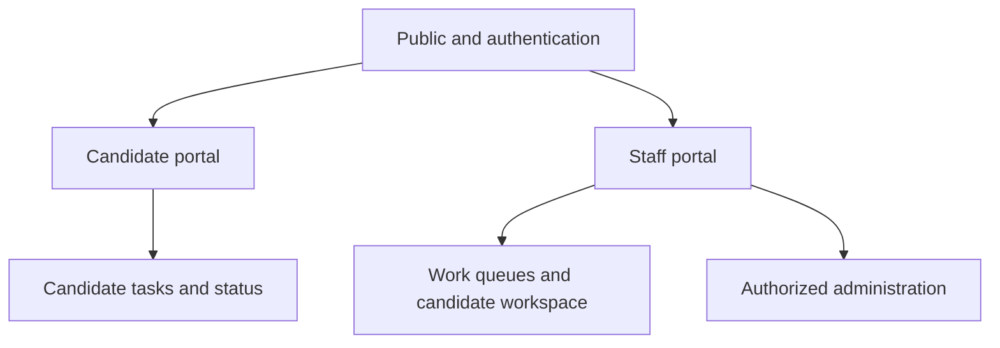
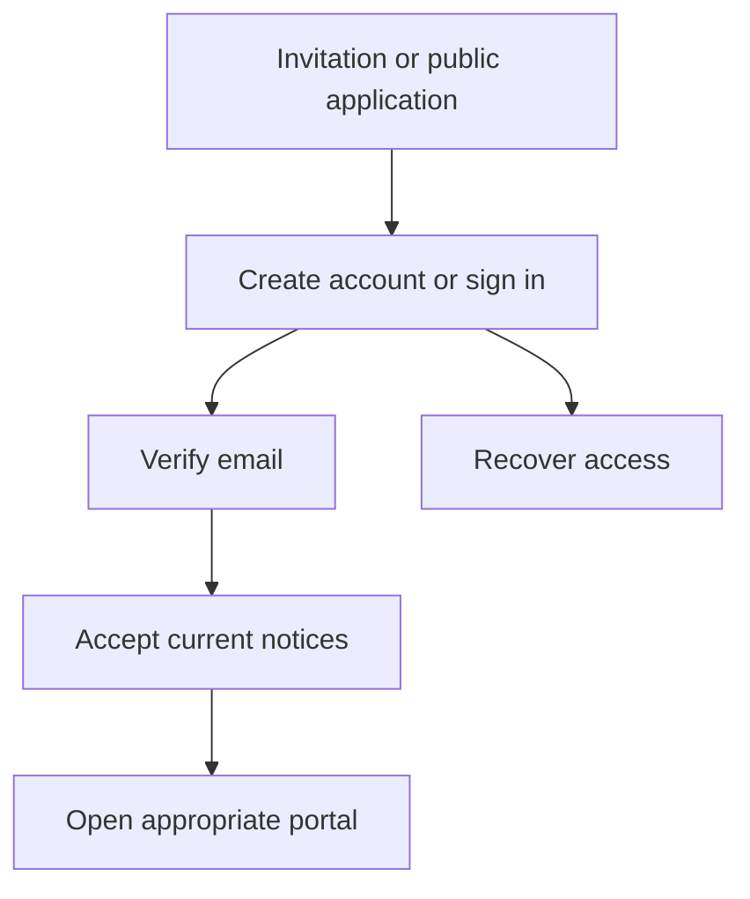
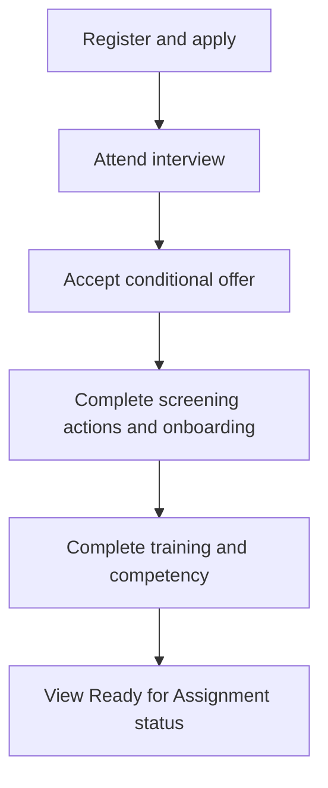
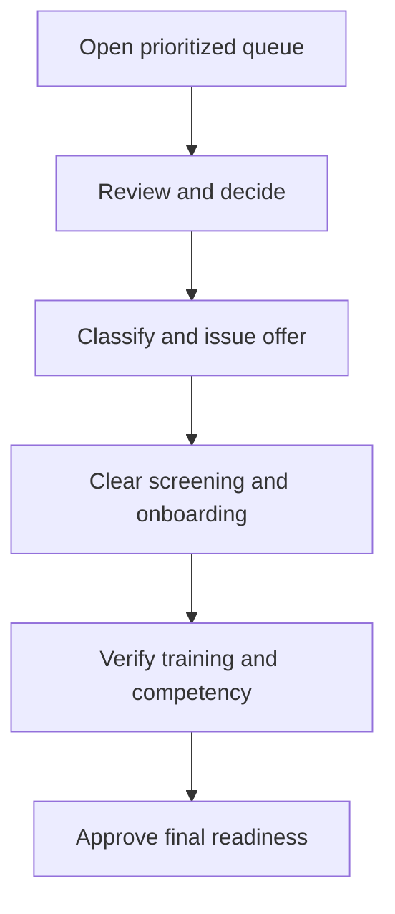
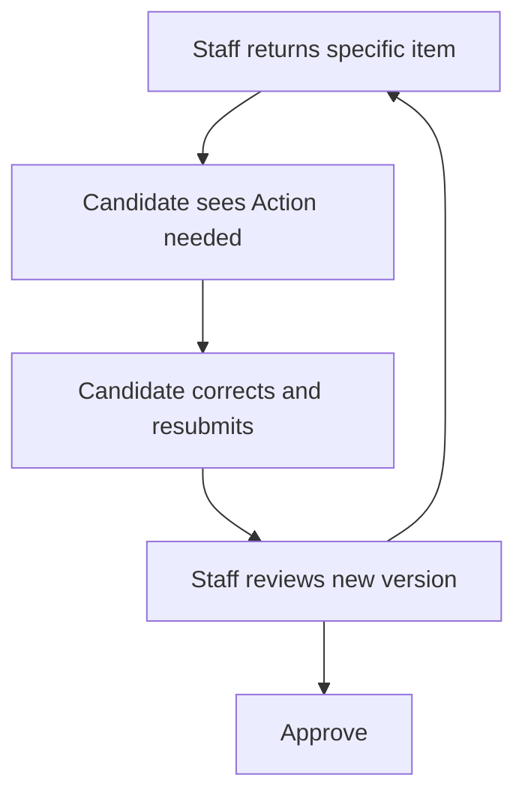

# Release 1 UI Flow

## 1. Purpose

This document defines the routes, screens, navigation, actions, page states, and permission boundaries for Release 1 of the PSA Workforce Hiring System.

It covers two authenticated experiences:

- Candidate portal.
- Internal staff portal.

Release 1 ends at **Ready for Assignment**. The interface must not include client assignment, scheduling, EVV, timesheets, payroll, billing, or leave administration.

## 2. Experience Principles

1. Show each user what requires attention now.
2. Use plain-language candidate messages; do not expose internal adjudication or staff notes.
3. Keep controlled workflow statuses read-only. Users act through named commands.
4. Explain every blocked transition with specific unmet requirements.
5. Separate general personnel data from restricted identity, financial, screening, and medical data.
6. Preserve drafts and warn before a user loses unsaved work.
7. Make completion, return, rejection, expiration, and hold states visually distinguishable without relying on color alone.
8. Require explicit confirmation for consequential actions.
9. Show dates, owners, and next steps consistently.
10. Meet WCAG 2.2 AA expectations on desktop, tablet, and mobile.

## 3. Shared Status Language

### Candidate-facing status

The candidate sees a simplified status projection rather than internal workflow details.

| Candidate status | Meaning shown to candidate |
|---|---|
| Application started | Finish and submit your application. |
| Application received | Your application was submitted successfully. |
| Under review | The agency is reviewing your application. |
| Action needed | Complete the listed item to keep moving forward. |
| Interview | Review or schedule your interview. |
| Offer available | Review and respond to your conditional offer or agreement. |
| Screening in progress | Required checks are being completed. |
| Onboarding | Complete your assigned forms and documents. |
| Training | Complete the assigned orientation or training. |
| Competency evaluation | An evaluator must complete required task assessments. |
| Final review | The agency is completing a final compliance review. |
| Ready for Assignment | You completed the Release 1 hiring requirements. |
| On hold | Progress is temporarily paused; follow the displayed instructions. |
| No longer active | The application has ended. Contact information is shown when appropriate. |

Candidate pages must not reveal classification analysis, interview scores, screening-report contents, internal denial reasons, reviewer identities, or staff-only notes.

### Staff-facing high-level stage

Staff may see the canonical stage plus module statuses:

- Prospect
- Application Incomplete
- Application Submitted
- Prescreen Review
- Interview
- Selection Decision
- Conditional Offer
- Screening and Clearance
- Onboarding
- Training
- Competency Evaluation
- Final Compliance Review
- Ready for Assignment

Exception states include Withdrawn, Not Selected, Offer Declined, Screening Review Required, Pre-Adverse Action, Dispute Pending, Ineligible, On Hold, and Archived.

## 4. Global Information Architecture

### Route conventions

- Candidate records use nonsequential public identifiers.
- Staff URLs may identify a candidacy but never expose SSNs or provider identifiers.
- Return URLs must be validated before redirecting.
- Unauthorized and nonexistent records return indistinguishable safe responses where record discovery would create a privacy risk.
- Browser history must not contain sensitive form values.
- Implemented (M1.5, ADR-0011): authenticated pages live in `(account)` route groups whose layouts only redirect anonymous browsers to sign-in and show other audiences the same 404 as an unknown page; each page authorizes again. Redirects use a registered-destination list; anything else goes to `/`.

## 5. Public and Authentication Screens

| Route | Screen | Main actions | Important states |
|---|---|---|---|
| `/` | Public landing page | Start application, candidate sign in, staff sign in | Normal, service notice |
| `/positions` | Open positions | Filter and open a position | Loading, no positions, error |
| `/positions/[positionId]` | Position detail | Start application | Open, closed, no longer accepting |
| `/apply/[positionId]` | Start-application handoff (M2.1) | Confirm and continue to candidate sign-in | Accepting, no longer accepting, not found |
| `/apply/invite/[token]` | Invitation acceptance | Verify invitation, create/sign into account | Valid, expired, already used, revoked |
| `/sign-in` | Candidate sign in | Sign in, recover access | Invalid credentials, locked, verification needed |
| `/staff/sign-in` | Staff sign in | Sign in, complete MFA | Invitation required, MFA challenge, locked |
| `/verify-email` | Email verification | Verify or resend | Sent, verified, expired token |
| `/recover` | Account recovery | Request secure recovery | Generic confirmation only |
| `/reset-password/[token]` | Password reset | Create new password | Valid, expired, used |
| `/access-denied` | Safe denial page | Return to dashboard, contact support | No record details |

M2.1 notes:
- **The `[positionId]` route parameter** is the nonsequential `public_reference` of a hiring cycle (one opening of a reusable position; `DATA_MODEL.md` §5.0). Draft, cancelled, archived, never-opened, malformed, and unknown references return one indistinguishable not-found page. A closed formerly public reference shows one generic "no longer accepting applications" page.
- **The list** shows only currently accepting openings. Filters are limited to an allowlisted location and worker-path filter, page size is bounded, and ordering is fixed.
- **Start application** links to `/apply/[positionId]`. That page re-checks availability without the cache and, on confirmation, sets a short-lived signed handoff cookie, then continues to candidate sign-in or `/candidate/applications/new`. M2.1 renders only an accurate placeholder there and creates no person, candidacy, or application; M2.2 replaces it.

### Authentication flow

Staff accounts are invitation-only. Staff pages require the current role and scope to be re-evaluated server-side on every request.

## 6. Candidate Portal Shell

### Primary navigation

Candidate navigation contains:

- Home
- Application
- My Tasks
- Documents
- Messages
- Profile
- Help

Training appears as a top-level item only after training is assigned. The current stage and next action remain visible on the dashboard and in a compact mobile summary.

### Header

The header includes:

- Agency identity.
- Current candidate name.
- Notification indicator.
- Language/accessibility entry point when configured.
- Account menu with profile, security, help, and sign out.

No restricted identity values appear in global navigation, page titles, browser tabs, analytics labels, or URLs.

## 7. Candidate Screens

### 7.1 Candidate home

**Route:** `/candidate`

The dashboard is the candidate’s source of truth.

It displays:

- Candidate-facing status.
- One prominent next-action card.
- Due date and estimated completion time when known.
- Progress summary by application, offer, screening, onboarding, training, and competency.
- Recent candidate-visible messages.
- Help contact information.

It does not display a misleading percentage when requirements are still being generated. Use counts such as “4 of 6 assigned tasks complete.”

Primary actions:

- Continue current task.
- Review returned item.
- View all tasks.
- Contact support.

### 7.2 Start application

**Route:** `/candidate/applications/new`

The candidate selects an available position or confirms the position from an invitation.

Before creating a candidacy, the system checks for:

- An active candidacy for the same position or hiring cycle.
- A possible duplicate person record.
- A closed position.

Duplicate detection must not reveal another person’s data. Staff review possible matches.

### 7.3 Application wizard

**Route:** `/candidate/applications/[candidacyId]/[section]`

Recommended sections:

1. Personal information.
2. Contact and address.
3. Position interest and availability.
4. Employment and experience.
5. Education, licenses, and certifications.
6. Eligibility and required disclosures.
7. References.
8. Attachments.
9. Review and certification.

The section navigation shows Not started, In progress, Complete, and Needs correction.

Required behavior:

- Save draft automatically after a short idle period and on section navigation.
- Display a visible saved timestamp.
- Validate only fields relevant to the current section during draft save.
- Validate the complete application before submission.
- Preserve returned-field comments beside the relevant field.
- Allow candidates to replace, but not silently overwrite, a submitted attachment.
- Provide a printable review page before certification.

### 7.4 Application submission

**Route:** `/candidate/applications/[candidacyId]/review`

The page displays:

- Section completion summary.
- Missing-field links.
- Uploaded attachment list.
- Current certification language and version.
- Attestation checkbox and typed/electronic signature control.

Submission opens a confirmation dialog explaining that the submitted version will be frozen. After success, show a receipt with submission date and candidate reference number.

### 7.5 Candidate tasks

**Route:** `/candidate/tasks`

Filters:

- Action needed.
- Upcoming.
- Submitted or under review.
- Completed.

Each task card contains:

- Plain-language title.
- Status.
- Due date.
- Required action.
- Safe reason when returned.
- Link to the exact task.

Candidate tasks may include scheduling an interview, responding to an offer, signing an authorization, uploading a requested document, completing an onboarding form, completing training, responding to a dispute notice, or acknowledging a hold instruction.

### 7.6 Interview scheduling

**Route:** `/candidate/interviews/[interviewId]`

The candidate may:

- Review format, location/link, date, time, timezone, and preparation instructions.
- Select a permitted time when self-scheduling is enabled.
- Confirm attendance.
- Request rescheduling or cancellation with a reason.

The candidate cannot see interviewer scorecards or recommendations.

### 7.7 Offer or agreement

**Route:** `/candidate/offers/[offerId]`

The candidate sees only the currently issued version and may:

- Review worker-path label, position, compensation/payment terms, contingencies, and expiration.
- Download the candidate copy.
- Ask a question.
- Accept and sign.
- Decline with an optional candidate-visible reason.

The system must prevent signing an expired, withdrawn, superseded, or unapproved version. A 1099 agreement is never shown until classification approval is complete.

### 7.8 Screening actions and status

**Route:** `/candidate/screening`

The screen displays candidate-appropriate items such as:

- Authorization or disclosure requiring action.
- Appointment instructions.
- Document request.
- General status: Not started, Action needed, In progress, Complete, or Contact HR.
- Candidate response window for a permitted dispute or adverse-action process.

The page must not expose raw criminal history, registry details, drug-test findings, adjudication notes, or internal risk codes.

### 7.9 Onboarding checklist

**Route:** `/candidate/onboarding`

The checklist is generated from the final classification.

W-2 examples may include:

- Employment forms.
- Identity and work-authorization steps.
- Tax withholding.
- Payment setup.
- Policies and acknowledgments.

Approved 1099 examples may include:

- Contractor agreement.
- Tax certification.
- Payment setup.
- Required insurance or business evidence when configured.
- Contractor policies and acknowledgments.

Each item opens a dedicated task page with instructions, form fields, upload requirements, signature, save, submit, and returned-item comments.

### 7.10 Documents

**Route:** `/candidate/documents`

The candidate sees only documents released to them or uploaded by them.

Columns or cards show:

- Document name.
- Category.
- Version.
- Uploaded or signed date.
- Status.
- Expiration when candidate action is relevant.

Sensitive previews are masked by default. Download requires authorization and may require recent authentication. Rejected files remain in history but are clearly marked and cannot be mistaken for the approved version.

### 7.11 Training

**Route:** `/candidate/training`

The screen groups assignments by:

- Required now.
- Scheduled.
- Completed.
- Remediation required.

Each course shows title, due date, delivery method, progress, attempts allowed, score/status where candidate-visible, expiration, and launch instructions.

External training links must return through a controlled completion process; a browser redirect alone does not prove completion.

### 7.12 Competency status

**Route:** `/candidate/competencies`

The candidate sees:

- Task or capability name.
- Evaluation appointment or next step.
- Candidate-facing result: Complete, Additional practice required, Restricted, or Pending.
- Remediation instructions released by staff.

Internal scoring notes and evaluator-only evidence are hidden.

### 7.13 Messages

**Route:** `/candidate/messages`

Messages are case-related communications, not unrestricted chat. The candidate may read notifications, respond when enabled, and open the related task.

Email and SMS notifications contain minimal information and link back to the authenticated portal for sensitive details.

### 7.14 Candidate profile and security

**Routes:** `/candidate/profile`, `/candidate/security`

The candidate may update permitted contact details and authentication settings. Changes to verified identity fields require a controlled correction request. The page shows active sessions and supports secure sign out from other sessions where available.

### 7.15 Withdrawal

**Route:** `/candidate/applications/[candidacyId]/withdraw`

Withdrawal requires confirmation and explains consequences. The system records the reason selection, optional comment, date, and candidate identity. Reactivation is a request, not an automatic reversal.

## 8. Staff Portal Shell

### Primary navigation

Staff navigation is permission-aware and may contain:

- Dashboard
- Work Queue
- Candidates
- Interviews
- Compliance
- Training and Competency
- Reports
- Administration

Hiding navigation does not replace authorization. A direct route request must be authorized again.

### Global staff tools

- Scoped candidate search.
- Notifications and assigned tasks.
- Branch/team scope selector when the user has multiple scopes.
- Help and support.
- Current role/access display.

Search results show minimal identifying information until a record is opened and authorized. Restricted values are not searchable through general search.

## 9. Staff Dashboard and Work Queues

### 9.1 Dashboard

**Route:** `/staff`

Dashboard cards are role and scope specific:

- My work due today.
- Overdue items.
- Unassigned applications.
- Candidates stalled by stage.
- Offers expiring soon.
- Screening items requiring authorized review.
- Onboarding returns.
- Training or competency overdue.
- Final reviews awaiting decision.
- Readiness holds and upcoming expirations.

Managers may see aggregate pipeline measures. Aggregates must not allow a user to drill into records outside their scope.

### 9.2 Unified work queue

**Route:** `/staff/work`

Filters:

- Assigned to me, my team, unassigned.
- Stage and task type.
- Due date and overdue status.
- Branch, position, and hiring cycle.
- W-2, approved 1099, or classification pending.
- Hold, returned, disputed, or escalation state.

Table columns:

- Candidate reference and permitted display name.
- Current stage.
- Next staff action.
- Owner.
- Due date/age.
- Priority or safe risk indicator.
- Blocking-item count.

Bulk action is limited to low-risk operations such as assignment or reminder scheduling. Decisions, approvals, screening dispositions, signatures, and readiness approvals are never bulk actions.

## 10. Candidate Workspace for Staff

**Route:** `/staff/candidates/[candidacyId]`

The candidate workspace uses a stable summary header and permission-aware tabs.

### Summary header

- Candidate display name and reference.
- Position and branch.
- Canonical stage.
- Final classification or Pending Review.
- Candidate-visible status.
- Owner.
- Active hold indicator.
- Next action and due date.

Controlled statuses are labels, not editable dropdowns.

### Workspace tabs

| Tab | Purpose | Typical roles |
|---|---|---|
| Overview | Timeline, progress, next actions, blockers | Scoped staff |
| Application | Submitted versions, returned fields, attachments | Recruiter, HR |
| Recruiting | Prescreen, interviews, scorecards, selection | Recruiter, designated staff |
| Classification | Proposal, evidence, analysis, decision | Classification reviewer, limited status for others |
| Offer | Drafts, approvals, issued versions, response | Recruiter, HR, manager |
| Screening | Cases, provider status, adjudication | Compliance; status-only for others |
| Onboarding | Requirement checklist and item review | HR, compliance |
| Training | Assignments, completions, expirations | Trainer, HR, compliance |
| Competency | Task evaluations, remediation, restrictions | Trainer/evaluator, compliance |
| Final Review | Readiness calculation and approval | Compliance, designated manager |
| Documents | Authorized document index | Varies by category and sensitivity |
| Communications | Candidate-visible communications | Recruiter, HR, compliance |
| Audit | Authorized business history | Compliance, manager, assigned auditor |

A user who lacks access to a tab must not infer its record count or content from badges, APIs, exported page data, or error messages.

## 11. Staff Workflow Screens

### 11.1 Create or invite candidate

**Routes:** `/staff/candidates/new`, `/staff/invitations/new`

Collect only minimal contact information, position/hiring cycle, source, branch, and assigned recruiter. Show possible duplicates before creation without revealing unauthorized details.

Actions:

- Save prospect.
- Send invitation.
- Copy secure invitation only when policy permits.
- Resend, revoke, or expire invitation.

### 11.2 Application review

**Route:** `/staff/candidates/[id]/application`

The reviewer can compare versions, inspect authorized attachments, record structured review items, and either accept for prescreen or return specific fields for correction.

Return action requires:

- Candidate-visible explanation.
- Selected fields/sections.
- Due date when appropriate.
- Confirmation preview of what the candidate will see.

### 11.3 Prescreen

**Route:** `/staff/candidates/[id]/recruiting/prescreen`

Display configured questions, source evidence, minimum requirements, and authorized exception controls. Outcomes are Pass, Additional Information, Not Selected, or On Hold.

The page must identify which prerequisites block Interview. Overrides require permission, reason, and confirmation.

### 11.4 Interview management

**Routes:** `/staff/interviews`, `/staff/candidates/[id]/recruiting/interviews/[interviewId]`

Functions:

- Create, schedule, reschedule, or cancel.
- Assign interviewers.
- Record attendance or no-show.
- Complete versioned scorecard.
- Submit recommendation.
- Request an additional interview.

Submitted scorecards become immutable; a correction creates an amendment or new version.

### 11.5 Selection decision

**Route:** `/staff/candidates/[id]/recruiting/decision`

Display completed interview prerequisites, recommendations, open concerns, position, compensation/payment proposal, and proposed worker path.

Actions:

- Select candidate.
- Not select.
- Request another interview.
- Place on hold.

The final dialog shows the resulting stage and candidate-visible message before confirmation.

### 11.6 Worker classification review

**Route:** `/staff/candidates/[id]/classification`

The screen separates proposal from decision.

Sections:

- Proposed W-2 or 1099 path.
- Requester and date.
- Structured analysis factors.
- Supporting documents.
- Reviewer notes and rationale.
- Prior decisions.

Only an authorized reviewer who did not make the proposal may approve or reject the 1099 path. Rejecting 1099 requires selecting Route to W-2 or End Consideration. Contractor agreement generation remains disabled until approval.

### 11.7 Offer preparation and approval

**Route:** `/staff/candidates/[id]/offers/[offerId]`

Steps:

1. Select approved template and version.
2. Enter permitted offer variables.
3. Preview the exact candidate document.
4. Submit for approval when required.
5. Issue with expiration and candidate instructions.
6. Monitor delivery and response.

Revising an issued offer creates a new version and supersedes the old one. Withdrawing requires a reason and confirmation.

### 11.8 Screening workspace

**Route:** `/staff/candidates/[id]/screening`

The general view shows requirement name and safe status. Authorized compliance users may open a restricted case page.

Restricted case functions:

- Verify authorization/disclosure completion.
- Initiate an order or record approved external evidence.
- Track provider status and appointments.
- Review result metadata and restricted evidence.
- Record disposition.
- Initiate pre-adverse action.
- Track response/dispute period.
- Record final action or clearance.

Unknown provider statuses go to Review Required. They never automatically clear a requirement.

### 11.9 Onboarding review

**Route:** `/staff/candidates/[id]/onboarding`

The page groups items by candidate action, staff review, approved, returned, expired, waived where permitted, and blocked.

Opening an item shows current version, safe metadata, evidence, candidate certification/signature, review history, and available commands. Approval and return are explicit commands. Rejection/return requires a reason; a waiver requires separate authorization and legal basis/configuration.

### 11.10 Training management

**Route:** `/staff/candidates/[id]/training`

Authorized users may:

- Generate or add assignments.
- Schedule instructor-led sessions.
- Record attendance and assessment results.
- Import approved completion evidence.
- Assign remediation.
- Correct through a new version.

The screen identifies training that expires before or soon after expected readiness.

### 11.11 Competency evaluation

**Route:** `/staff/candidates/[id]/competencies/[evaluationId]`

The evaluator sees task criteria, permitted evidence types, prior attempts, training prerequisites, and the current evaluation form.

Outcomes:

- Pass.
- Fail with remediation.
- Restricted from task.
- Permitted only with supervision when configured.

Submission records evaluator, timestamp, result, evidence, and signature/attestation. Submitted evaluations are immutable; corrections use an amendment.

### 11.12 Final compliance review

**Route:** `/staff/candidates/[id]/final-review`

This page is a decision workspace, not a manual checklist.

It displays the server-calculated readiness result grouped by:

- Classification.
- Offer/agreement.
- Identity/tax/payment requirements.
- Screening and TB.
- Policies and acknowledgments.
- Training.
- Competency and capability restrictions.
- Active holds.
- Required approvals.

Every item shows Satisfied, Missing, Expired, Failed, Pending Review, Disputed, Not Applicable, or Blocked, with the authoritative source and date.

Actions:

- Refresh calculation.
- Open an authorized blocking item.
- Return deficiencies to an owner.
- Place a hold.
- Submit first approval when dual approval is configured.
- Approve Ready for Assignment.

Approval requires recent authentication, confirmation, and a fresh server calculation inside the transaction. If any requirement changes after the page loaded, the approval fails safely and shows the changed items.

### 11.13 Ready for Assignment summary

**Route:** `/staff/candidates/[id]/readiness`

Display:

- Current readiness status.
- Effective date.
- Approved capabilities and restrictions.
- Approver(s).
- Requirement snapshot reference.
- Upcoming expiration alerts.
- Active or historical holds.

There is no client-assignment action in Release 1. The only forward message is that the worker is available for a future assignment module.

## 12. Administration Screens

Administration routes are permission-specific:

| Route | Function |
|---|---|
| `/staff/admin/users` | Invite, disable, unlock, and inspect staff account status |
| `/staff/admin/roles` | Assign roles and scopes with approval history |
| `/staff/admin/positions` | Manage positions and hiring cycles (M2.1; sub-routes below) |
| `/staff/admin/requirements` | Version requirement definitions and applicability |
| `/staff/admin/templates` | Version forms, notices, offers, messages, and signatures |
| `/staff/admin/training` | Manage course and competency catalogs |
| `/staff/admin/reference-data` | Manage approved configurable lists |
| `/staff/admin/integrations` | View non-secret provider health and environment status |
| `/staff/admin/audit-access` | Manage approved auditor assignments |

System administrators do not receive routine access to candidate business records through these pages. Secret values are write-only or managed outside the UI.

M2.1 position administration sub-routes:

- `/staff/admin/positions`: positions in scope, with a link to the hierarchy.
- `/staff/admin/positions/hierarchy`: organization, branch, and team panels.
- `/staff/admin/positions/new`
- `/staff/admin/positions/[positionId]`: the position, its description versions, and its hiring cycles.
- `/staff/admin/positions/[positionId]/descriptions/[versionId]`
- `/staff/admin/positions/[positionId]/cycles/new`
- `/staff/admin/positions/[positionId]/cycles/[cycleId]`

Every page re-authorizes on the server and shows only actions the current principal holds. Windows are shown as "opens (inclusive) / closes (exclusive)" in the display timezone.

Publishing a new requirement or document template requires effective dating and an impact preview showing which in-progress candidacies will be affected.

## 13. Reports and Exports

**Route:** `/staff/reports`

Release 1 reports may include:

- Pipeline by stage.
- Stage aging.
- Outstanding candidate actions.
- Screening cases requiring authorized attention.
- Expiring compliance items.
- Training and competency completion.
- Ready-for-Assignment roster and restrictions.
- Audit activity for an approved scope.

Reports apply the viewer’s current scope and field permissions. Export requires a separate permission, purpose selection, bounded date range, confirmation, audit event, and secure delivery. Restricted details are excluded unless explicitly authorized.

## 14. Shared Page-State Standard

Every screen must define these states where applicable:

| State | Required behavior |
|---|---|
| Initial loading | Use accessible progress text or skeletons without exposing stale data |
| Empty | Explain why there is no content and the permitted next action |
| Validation error | Place summary at top and link each error to its field |
| Authorization denied | Show a safe message without confirming restricted record existence |
| Not found | Offer a safe return path |
| Stale version | Preserve user input, show what changed, and require reload/review |
| Provider unavailable | Keep local state safe and show retry or staff follow-up path |
| Upload scanning | Mark file unavailable until checks finish |
| Partial completion | Identify complete and remaining items |
| Success | Confirm the action, timestamp, resulting status, and next step |
| System error | Provide correlation/reference number without technical or sensitive detail |

M1.5 provides the shared `AccessState` component (authentication required, denied, not found, reauthentication required, session no longer eligible, system error) with fixed safe text, a focused level-1 heading, one status/alert announcement, and fixed same-origin actions. `src/app/not-found.tsx` uses it for every unknown or hidden route.

## 15. Confirmation and High-Risk Action Standard

The following actions require a confirmation dialog summarizing consequences:

- Submit or withdraw an application.
- Return a submitted item.
- Record Not Selected or Ineligible.
- Approve/reject 1099 classification.
- Approve, issue, withdraw, accept, or decline an offer.
- Record a screening disposition.
- Begin or finalize adverse action.
- Approve or waive a requirement.
- Submit competency outcome.
- Place or remove a hold.
- Approve Ready for Assignment.
- Export restricted data.
- Change role/scope or disable an account.
- Activate, inactivate, or retire organization configuration (organization, branch, team, position), publish a job description, or publish, open, close, cancel, or archive a hiring cycle (M2.1).

High-risk dialogs include the record reference, exact command, resulting status, required reason, and authentication challenge when configured. A generic “Are you sure?” dialog is insufficient.

## 16. Notifications

Candidate notifications may be sent for:

- Invitation and verification.
- Application receipt or correction request.
- Interview invitation or change.
- Offer issuance, reminder, or expiration.
- Screening action needed.
- Onboarding task assigned or returned.
- Training assigned or overdue.
- Candidate-permitted dispute/adverse-action milestones.
- Final status or hold instructions.

Staff notifications may be sent for new assignment, overdue work, returned candidate action, provider failure, disputed screening, expiring requirement, final review availability, and active hold escalation.

Notification content contains minimal sensitive information. The authenticated portal contains the details. Notification history records template version, channel, recipient, delivery status, and related record.

## 17. Accessibility and Responsive Behavior

- All actions are keyboard operable with visible focus.
- Every input has a persistent programmatic label and clear instructions.
- Errors are announced and linked to the affected controls.
- Status icons include text; color is supplemental.
- Dialog focus is trapped and returned correctly.
- Tables offer responsive card or horizontal-scroll behavior without losing labels.
- Uploaded-document controls support keyboard and mobile file selection.
- Signature alternatives are accessible and do not require drawing with a pointer.
- Time and date displays include timezone where ambiguity is possible.
- Session-timeout warnings are accessible and allow safe extension.
- Candidate pages prioritize mobile layouts; staff workspaces prioritize desktop while remaining usable on tablet.

## 18. Key End-to-End UI Journeys

### Candidate happy path

### Staff happy path

### Returned-item loop

## 19. UI Acceptance Criteria

The Release 1 UI design is correctly implemented when:

- A candidate always has a clear current status and next action.
- A candidate can complete the happy path on a mobile device.
- Candidate pages never expose internal notes, scores, restricted screening details, or other records.
- Staff can work from prioritized queues without manually searching every record.
- Staff see only tabs, fields, actions, and record scopes permitted by authorization policy.
- Controlled statuses cannot be edited directly.
- Every blocked transition lists specific unmet requirements.
- W-2 and approved 1099 candidates receive the correct distinct tasks.
- A pending or rejected 1099 proposal cannot expose a contractor agreement.
- High-risk actions require meaningful confirmation and, when configured, recent authentication.
- Submitted and approved items preserve version and review history.
- Restricted documents are masked by default and access is authorized and audited.
- Stale-page conflicts do not overwrite newer decisions.
- All major screens implement loading, empty, error, unauthorized, and success states.
- Core candidate and staff journeys pass keyboard and automated accessibility checks.
- No Release 1 screen offers client assignment, scheduling, timesheet, payroll, billing, or leave functionality.

## 20. Initial Prototype Order

Build low-fidelity prototypes in this sequence:

1. Candidate dashboard and task list.
2. Candidate application wizard and submission receipt.
3. Staff dashboard, work queue, and candidate workspace shell.
4. Application review, prescreen, interview, and selection screens.
5. Classification and offer screens.
6. Candidate screening-status and onboarding checklist screens.
7. Staff screening and onboarding review screens.
8. Training and competency screens.
9. Final compliance review and readiness summary.
10. Administration and reports.

Validate candidate terminology and staff decision flows before applying final visual styling.

## 21. Next Design Document

The next artifact is `docs/SECURITY_AND_PRIVACY.md`. It will define threat boundaries, data handling, encryption, session security, document protection, audit controls, retention, incident response, and secure development requirements.
